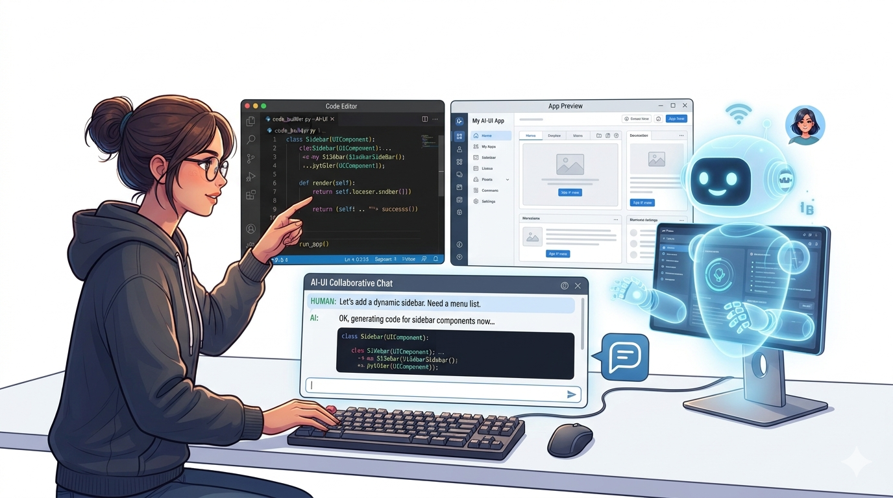
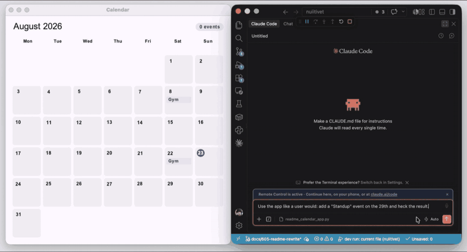
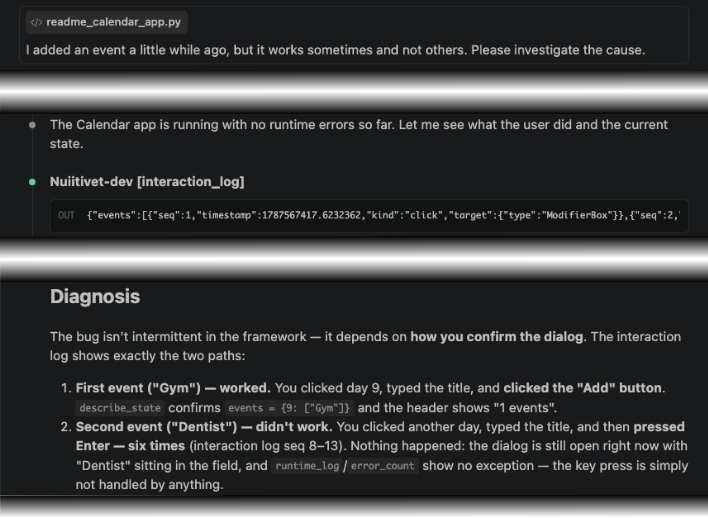
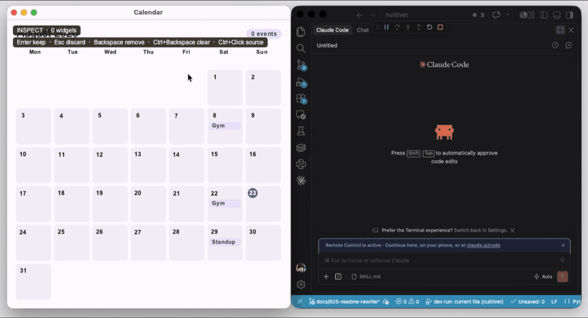
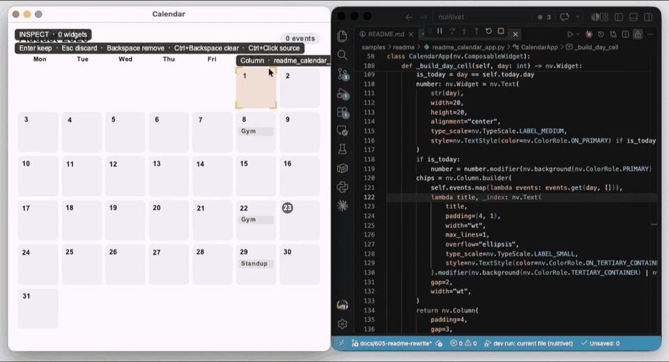
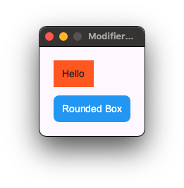

# Nuiitivet



**AI friendly Desktop UI framework for Python.**

[](https://pypi.org/project/nuiitivet/)
[](https://pypi.org/project/nuiitivet/)
[](LICENSE)

---

## What Nuiitivet is

Large language models lowered the bar for building an app. Nuiitivet is a
framework built for the case that follows from it: **making a desktop app
together with an AI.**

Not just having the model write code, but a development loop the two of you
share: **what gets written becomes a screen immediately, you and the assistant
can talk about that screen, and it gets fixed on the spot.** And when you would
rather fix it yourself, the screen takes you straight to the code that built
it.

And because the desktop is the premise, the problems only desktop apps run
into already have answers: **worker threads that dispatch onto the UI
thread**, **OS integration from file dialogs to the tray icon**, and
**shipping an executable**. What is still missing is listed plainly in
[5. Current limitations](#5-current-limitations).

---

## 1. Building with an AI

Getting an AI to write code is something any framework can do. What Nuiitivet
has is the loop that comes after. Here it is, piece by piece.

All of it turns on when you launch through the dev runner.

```bash
python -m nuiitivet.dev run app.py
```

### 1.1 Hot reload, state intact

Every save **hot reloads** the app: the window is rebuilt **in place**, no
restart. And the state your `Observable`s hold **survives** — the screen you
reached with twelve clicks is not thrown away because you saved a file.

Reloads also go through with a VS Code **F5** debug session attached. Your
breakpoints stay.

And when a save does not compile, the reload is skipped and the old screen
stays alive — the assistant can tell, so it never mistakes a stale screen for
your latest code.

### 1.2 The assistant can see it, and drive it

The dev runner also starts the **dev bridge** — an MCP server alongside your
app. Through it, the assistant can:

- **See** — the widget tree, the live `Observable` values behind it, a screenshot
- **Act** — click, type, scroll, send keys. Targets are named by `key` / `label`
  rather than coordinates, so they survive a layout change
- **Wait** — for async work to settle, instead of racing it

Together, that is an E2E test the assistant runs for you. Ask it to use the
app like a user would — below, it drives the app, checks the result, and finds
a bug on the way.



One tool is left, and it points the other way — at what already *happened*:

- **Read** — the app's logs, the exceptions swallowed to keep the app alive,
  and the UI actions **you** took. That last one keeps your steps out of
  prose:
  - **Reporting a bug** — walk into it once by hand; the repro steps are
    already in the log
  - **Directing an E2E test** — run the flow once by hand; the demonstration
    *is* the instruction

How far that goes: even "it works sometimes and not others" is enough. Below,
the log holds each attempt, so the assistant diffs them and finds the one
step that differed — without the user ever putting the steps into words.



### 1.3 You point at something

Naming a location in prose is the weak link. An inner widget with no `key`
and no distinctive text is hard; **a gap, where nothing was painted at all**,
is nearly impossible.

`Ctrl+Shift+C` (`Cmd+Shift+C` on macOS) enters inspect mode. **Click to
designate a widget, drag to designate an area.** Each designation gets a
numbered badge, and the assistant sees the same numbers — so "fix the second
one" simply works.



### 1.4 Skills keep it idiomatic

Plainly: **the assistant does not know Nuiitivet.** There is not enough of it in
the training data. Worse, it looks like Flutter / SwiftUI / Compose / Rx — on purpose, as
[1.6](#16-intuitive-to-write-intuitive-to-read) explains — so left alone the
assistant **imports habits from elsewhere** — wrapping things in a
`SizedBox`, hunting for `setState`.

The two bundled skills exist for that.

- **`nuiitivet-app`** — keeps the code idiomatic. Ships with a linter
- **`nuiitivet-debug`** — teaches launching the app and working the dev bridge,
  down to checking the tree before spending a screenshot

Both live under [skills/](skills/). Copy the ones you want into your
assistant's skills directory — for Claude Code, `.claude/skills/` in your
project.

Even so, you will get results you do not like. That is what the next part is
for.

### 1.5 You take over

**`Ctrl+Click`** in inspect mode **opens the code that built that widget, in
your editor.**



VS Code works as installed. For another editor, pass its URL scheme:

```bash
python -m nuiitivet.dev run app.py --editor "cursor://file{file}:{line}:1"
```

Which only works if what you land on is readable.

### 1.6 Intuitive to write, intuitive to read

Nuiitivet looks like other frameworks on purpose. The parts that were already
intuitive elsewhere are kept, so you write in a grammar you know:

- **Flutter** — the widget tree and `build()`; a screen is a value you assemble
- **SwiftUI / Compose** — modifiers that chain
- **CSS** — `padding`, `gap`, `width` as short parameters
- **WPF** — `Grid` layout, `*`-style weight sizing (`"wt"` here), and
  ReactiveProperty for state (that one is a desktop matter, so it waits for
  [2.1 ReactiveProperty-style state](#21-reactiveproperty-style-state))

Where it departs from them, it is to keep the code readable. The clearest
case is nesting. Written Flutter-style, decoration piles up as wrappers.

```python
# the nesting grows
Padding(
    padding=EdgeInsets.all(12),
    child=SizedBox(
        width=200,
        child=Text("Hello"),
    ),
)
```

In Nuiitivet, those are parameters.

```python
nv.Text("Hello", padding=12, width=200)
```

Decoration and behavior are attached as **modifiers** rather than wrapped
around, and they chain with `|`.

```python
nv.Button("OK").modifier(
    nv.tooltip("Submit") | nv.clickable(...) | nv.background("#2196F3")
)
```



Event handlers like `on_click()` are written **imperatively**, not
declaratively. Read a value, change it, branch on the result — that is a
procedure, and it reads best as one.

```python
def handle_increment(self):
    print(f"Current count: {self.count.value}")
    self.count.value += 1
    if self.count.value % 10 == 0:
        print("Milestone reached!")
```

**Logic to UI declaratively. UI to logic imperatively.** Each half is written
the way a person already thinks about it — that is what makes it intuitive.

---

## 2. Built for the desktop

**Nuiitivet is aiming at being desktop-specialised**, and most of what that
takes has landed. File dialogs, the menu bar, the tray icon — the OS
integration a desktop app leans on shipped piece by piece, and
[2.4](#24-the-os-is-part-of-the-app) keeps the checklist. What remains open is
listed in [5. Current limitations](#5-current-limitations).

What makes the specialisation real:

- **ReactiveProperty-style state management** — MVVM from WPF, as-is
- **Worker threads, dispatched onto the UI thread** — the answer to running
  heavy work locally, which is a desktop-only problem
- **Shipping an executable**
- **OS integration** — file dialogs, OS file drop, menu bar, notifications,
  tray icon, multiple windows

### 2.1 ReactiveProperty-style state

If you built desktop apps on WPF with ReactiveProperty, this is the part that
makes the move easy.

Set a value on an `Observable` and the UI bound to it **follows on its own**.
You never write the code that pushes a value into a widget.

```python
class CounterApp(nv.ComposableWidget):
    def __init__(self):
        super().__init__()
        self.count = nv.Observable(0)

    def increment(self):
        self.count.value += 1

    def build(self):
        return nv.Column(
            [
                nv.Text(self.count),          # bound directly
                nv.Button("Increment", on_click=self.increment),
            ]
        )
```


All that goes inside `build()` is the UI declaration. State and UI cannot drift
apart, because **the state is the UI's single source of truth.** With the
ViewModel pattern you separate at the class level rather than the method level.
**MVVM carries over.**

State derived from several values is declared as a formula — the equivalent of
WPF's `ReadOnlyReactiveProperty`.

```python
# total is declared as a + b; it recalculates whenever either one changes
self.total = self.count_a.combine(self.count_b).compute(lambda a, b: a + b)
```

And Rx-style operators slot in, with the result bound straight to the UI.

```python
# search 0.3 s after typing stops; if they type again, the earlier answer is dropped
self.results = self.query.debounce(0.3).switch_map(self._search, initial=[])
```

The function handed to `switch_map` runs **off the UI thread**, so the window
keeps painting while it searches. The `build()` side never learns it was async;
it binds an ordinary `Observable`.

`map` / `combine` / `compute` / `debounce` / `throttle` / `filter` /
`switch_map`, along with the async and threading details, are covered in the
[State Management guide](docs/guide/state-management/index.md).

### 2.2 Heavy work runs on your machine

This is a desktop-only problem. In a web app the heavy work sits inside the
server, so it never comes up. Importing a 100,000-row CSV freezes the screen if
you run it on the UI thread — and if you run it on a worker, you now have to get
the result back onto the UI thread.

In Nuiitivet, **a write to an `Observable` from a worker thread is marshalled
onto the UI thread for you.** You never hand-write that code.

Reporting progress, staying indeterminate until the total is known, cancelling
with a `CancelToken`, leaving the screen mid-run, and a worker that raises — all
of them have an answer ([Background Work](docs/guide/state-management/background_work.md)).

### 2.3 Ship an executable

There are recipes for PyInstaller and Nuitka ([Packaging](docs/guide/packaging.md)).
One executable, onto a machine with no Python on it.

### 2.4 The OS is part of the app

A desktop app is more than its window. It opens the OS file dialog, puts a
menu in the menu bar and an icon in the tray, raises notifications, accepts a
file dragged in from Finder or Explorer. That layer is kept here as a
checklist, so the distance to a complete desktop specialisation stays visible:

- [x] File dialogs (`nv.FileDialog`) — [File Dialogs](docs/guide/window/file_dialogs.md)
- [x] File drop from the OS (`drop_target` modifier) — [Interaction modifiers](docs/guide/modifiers/interaction.md)
- [x] Menu bar (`nv.MenuBar`) — [Menu Bar](docs/guide/window/menu_bar.md)
- [x] Desktop notifications (`nv.Desktop.notify`) — [Notifications](docs/guide/window/notifications.md)
- [x] Tray icon (`nv.TrayIcon`) — [Tray Icon](docs/guide/window/tray_icon.md)
- [x] Multiple windows (`nv.App` / `nv.Window`) — [Multi-Window](docs/guide/window/multi_window.md)
- [x] Window chrome customisation — [Chrome](docs/guide/window/chrome.md)
- [ ] Mouse cursor shapes
- [ ] OS accessibility — screen readers and VoiceOver cannot inspect the UI

The unchecked items are tracked in
[issues](https://github.com/yuksblog/nuiitivet/issues).

---

## 3. Getting started

### 3.1 Requirements

- Python 3.10 or higher
- macOS / Windows / Linux

Main libraries used for drawing and rendering: pyglet, PyOpenGL, skia-python,
materialyoucolor. See [LICENSES/](LICENSES/) for third-party licenses.

### 3.2 Installation

```bash
pip install 'nuiitivet[dev]'
```

With uv, `[dev]` is only needed while developing, so keep it in the dev group:

```bash
uv add nuiitivet
uv add --dev 'nuiitivet[dev]'
```

`[dev]` is the extra the [dev bridge](docs/guide/ai_pair_programming/dev_bridge_mcp.md)'s
MCP server needs. Plain `nuiitivet` is enough to *run* an app, but building with
an AI effectively requires the extra — install it up front.

### 3.3 Your first app

- Pull in the design system with `import nuiitivet.material as nv`
- Subclass `ComposableWidget` to build a UI component
- Hand it to `App` and run

The counter from [2.1](#21-reactiveproperty-style-state), complete and runnable:

```python
import nuiitivet.material as nv


class CounterApp(nv.ComposableWidget):
    def __init__(self):
        super().__init__()
        self.count = nv.Observable(0)

    def increment(self):
        self.count.value += 1

    def build(self):
        return nv.Column(
            [
                nv.Text(self.count),
                nv.Button("Increment", on_click=self.increment),
            ],
            gap=20,
            padding=20,
        )


def main():
    # pass the class itself — it is a factory, so hot reload can rebuild it
    app = nv.App(nv.Window(content=CounterApp))
    app.run()


if __name__ == "__main__":
    main()
```

### 3.4 Into the loop

`python app.py` works, but during development, use the dev runner. Everything
described above — hot reload, the dev bridge, inspect mode, the jump to source
— turns on here.

```bash
python -m nuiitivet.dev run app.py
```

See [AI pair-programming](docs/guide/ai_pair_programming/index.md) for the full
workflow.

---

## 4. Documentation

For a deep dive into Nuiitivet's design, visit the **[docs site](https://yuksblog.github.io/nuiitivet/)**.
Browse runnable examples in **[samples/](samples/)** — the apps shown in this
README live there as runnable modules under [samples/readme/](samples/readme/).

### Core Concepts

| Guide | Summary |
| ----- | ------- |
| [Layout](docs/guide/layout/index.md) | Build UIs with widgets and parameters. |
| [State Management](docs/guide/state-management/index.md) | Reactive `Observable` state that auto-updates the UI. |
| [Modifiers](docs/guide/modifiers/index.md) | Attach decoration and behavior to widgets. |
| [UI Design System](docs/guide/design-system/index.md) | Theming and design tokens. |

### Building Screens

| Guide | Summary |
| ----- | ------- |
| [Overlay](docs/guide/overlay/index.md) | Dialogs, loading, and overlays. |
| [Navigation](docs/guide/navigation/index.md) | Screens, routes, and transitions. |
| [Window & Chrome](docs/guide/window/index.md) | Window sizing, custom chrome, and OS integration — dialogs, menu bar, tray, notifications. |

### Material Design

| Guide | Summary |
| ----- | ------- |
| [Material App](docs/guide/design-system/material_app.md) | App entry point and structure. |
| [Material Theme](docs/guide/design-system/material_theme.md) | Color schemes generated from a seed. |
| [Material Widgets](docs/guide/design-system/material_widgets.md) | Catalog of built-in widgets. |

### Going Further

| Guide | Summary |
| ----- | ------- |
| [Concurrency](docs/guide/concurrency.md) | Choosing a concurrency tool, and safe UI updates from background work. |
| [AI pair-programming](docs/guide/ai_pair_programming/index.md) | The development loop, the MCP dev bridge, and the skills. |
| [Packaging](docs/guide/packaging.md) | Ship your app to users. |

---

## 5. Current limitations

There are two kinds. **Constraints rooted in the design**, which will not change
easily, and **things simply not built yet**. They mean different things when you
are deciding whether to adopt this, so they are kept separate.

### Rooted in the design

- **A display is required.** `App.run()` opens an OS window, so a truly headless
  environment — no display at all — is not supported.
- **A GPU is recommended, not required.** By default rendering goes through an
  OpenGL/GPU context; on GPU-less or remote setups it falls back to CPU raster
  rendering, which you can also select explicitly
  ([Renderer Selection](docs/guide/window/renderer_selection.md)).

### Not built yet

The OS-integration checklist — what has shipped and what has not — lives in
[2.4 The OS is part of the app](#24-the-os-is-part-of-the-app). None of the
open items is technically out of reach — they just have not been built yet,
and all of them are tracked in
[issues](https://github.com/yuksblog/nuiitivet/issues).

---

## 6. License

Nuiitivet is licensed under the Apache License 2.0. See [LICENSE](LICENSE) for
more info.
