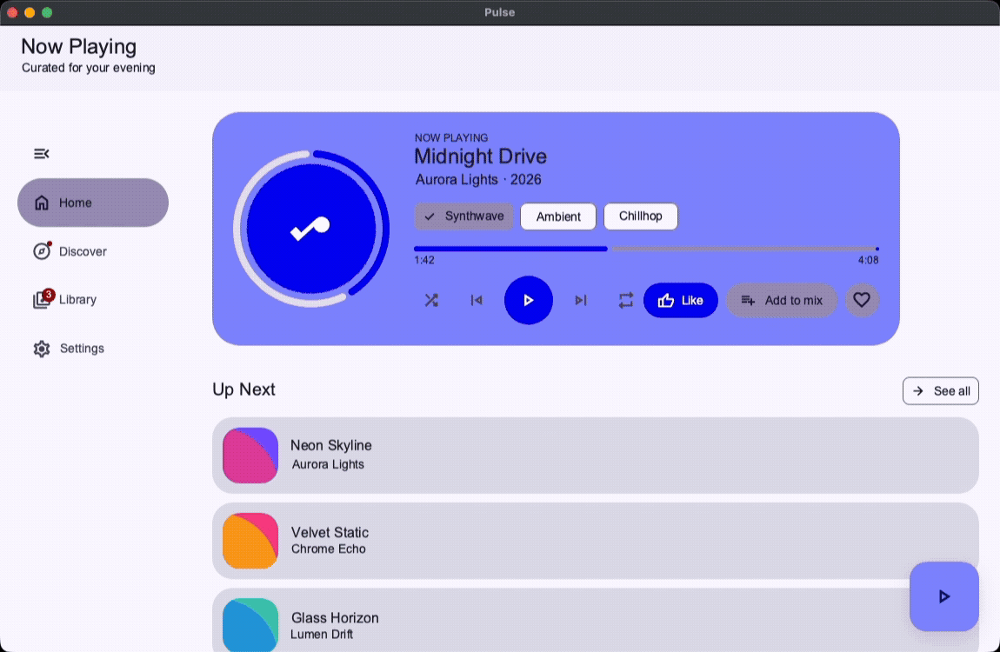
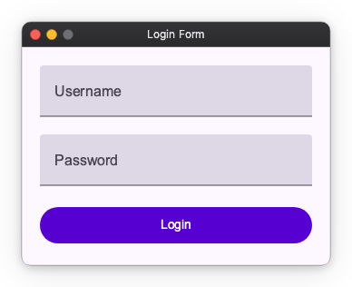
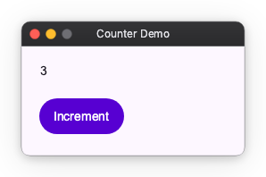
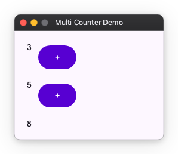

# Nuiitivet



An intuitive UI framework for Python.

[](https://pypi.org/project/nuiitivet/)
[](https://pypi.org/project/nuiitivet/)
[](LICENSE)

## 1. Why Nuiitivet?

I have just one thing to say: I want to write UI intuitively.

### 1.1 Declarative UI

Nuiitivet offers a declarative UI that blends the best parts of frameworks like Flutter, SwiftUI, and WPF.

At its core, you build UIs by composing widgets, just like in Flutter.

```python
login_form = Column(
    [
        # Username and Password fields
        TextField(
            value="",
            label="Username",
            width=300,
        ),
        TextField(
            value="",
            label="Password",
            width=300,
        ),
        # Login Button
        Button(
            "Login",
            on_click=lambda: print("Login clicked"),
            width=300,
        )
    ],
    gap=20,
    padding=20,
)
```



What sets Nuiitivet apart from Flutter is that size, alignment, and spacing are specified as widget parameters. Treating them as parameters of a widget — rather than as widgets in their own right — feels more natural, and it lets you avoid the deep nesting hell that Flutter tends to fall into.

```python
# Writing in Flutter style often leads to deep nesting
Padding(
    padding=EdgeInsets.all(12),
    child=SizedBox(
        width=200,
        child=Text("Hello"),
    ),
)
```

```python
# With Nuiitivet, you can specify them directly
Text(
    "Hello",
    padding=12,
    width=200,
)
```

Nuiitivet also adopts modifiers from SwiftUI and Jetpack Compose.
Instead of wrapping a widget, you attach decoration and behavior so they feel like they grow out of the widget — and they chain together naturally with `|`.

```python
Button("OK").modifier(
    tooltip("Submit") | clickable(...) | background("#2196F3")
)
```

For why modifiers exist and what kinds are available, see [docs/guide/modifier.md](docs/guide/modifier.md).

### 1.2 Data Binding

Dynamic UIs need state management.
With **data binding**, you declare *what the UI shows* in terms of your state — once — and that link stays live. Change the state, and every bound part of the UI follows on its own. You never write the code that pushes a value into a widget, and the UI can't drift out of sync with your state, because your state *is* the UI's single source of truth.

That mechanism is `Observable`. It binds directly to the UI like Signals (SolidJS, MobX), and it also carries operators like `throttle()` and `debounce()` like Rx — the best of both worlds. (It's inspired by WPF's ReactiveProperty.)

Let me walk you through three things I like about it.

#### 1. Complete separation of state and UI

When you set a value on an `Observable`, the bound UI updates automatically. Inside build(), all you ever write is the UI declaration.

```python
class CounterApp(ComposableWidget):
    def __init__(self):
        super().__init__()
        self.count = Observable(0)

    def increment(self):
        self.count.value += 1

    def build(self):
        return Column(
            [
                # Count display
                Text(self.count),
                # Increment button
                Button(
                    "Increment",
                    on_click=self.increment,
                )
            ]
        )
```



With the ViewModel pattern, you can take this even further — separating cleanly at the class level rather than the method level.

#### 2. Declarative data flow

State derived from multiple values can be declared as a formula. Below, `total` is defined as the sum of `count_a` and `count_b`; whenever either one changes, it's recalculated automatically. On the UI side, you just drop in `total` as is.

```python
self.count_a = Observable(0)
self.count_b = Observable(0)

# total is declared as a + b; it recalculates automatically when a or b changes
self.total = self.count_a.combine(self.count_b).compute(lambda a, b: a + b)
```



#### 3. Async in the same style

This is where the ReactiveProperty heritage really shines. You can slot in an Rx-style operator like `debounce()` and then bind the result straight to the UI. Even something like a search box — "thin out the keystrokes, then process" — is a single line.

```python
self.query = Observable("")

# debounce like Rx, then bind the result to the UI like Signals
self.results = self.query.debounce(0.3).map(search_api)
```

The full guide to Observable is in [docs/guide/observable.md](docs/guide/observable.md).

### 1.3 Event Handlers

Event handlers like on_click() are written imperatively.
A handler does procedural things — popping up a dialog, branching on its result — so writing it imperatively feels natural.

```python
class CounterApp(ComposableWidget):
    count = Observable(0)

    # Write procedures in event handler
    def handle_increment(self):
        # 1. Output log
        print(f"Current count: {self.count.value}")
        # 2. Increment count
        self.count.value += 1
        # 3. Milestone check
        if self.count.value % 10 == 0:
            print("Milestone reached!")
        
    def build(self):
        return Column(
            [
                Text(f"count: {self.count.value}"),
                Button(
                    "Increment",
                    on_click=self.handle_increment,  # Execute on click
                )
            ]
        )
```

Logic → UI declaratively, UI → logic imperatively. What matters in both directions is that it stays intuitive to write — and that's the one thing Nuiitivet stands for.

## 2. First Steps

### 2.1. Requirements

- Python 3.10 or higher
- macOS / Windows / Linux(not tested)

Main internal libraries used (drawing/rendering):

- pyglet
- PyOpenGL
- skia-python
- material-color-utilities

See [LICENSES/](LICENSES/) for third-party licenses.

### 2.2. Installation

You can install it easily with pip.

```bash
pip install nuiitivet
```

### 2.3. Your First App

To create an application with Nuiitivet, follow these steps:

- Import your UI design system with `import nuiitivet.material as nv`
- Inherit from `ComposableWidget` to create a UI component
- Pass the UI component to `App` and start the application

```python
import nuiitivet.material as nv

class CounterApp(nv.ComposableWidget):
    def __init__(self):
        super().__init__()
        self.count = nv.Observable(0)

    def handle_increment(self):
        # 1. Output log
        print(f"Current count: {self.count.value}")
        # 2. Increment count
        self.count.value += 1
        # 3. Milestone check
        if self.count.value % 10 == 0:
            print("Milestone reached!")
        
    def build(self):
        return nv.Column(
            [
                nv.Text(self.count),
                nv.Button(
                    "Increment",
                    on_click=self.handle_increment,
                )
            ],
            gap=20,
            padding=20,
        )

def main():
    # Create counter app
    counter_app = CounterApp()
    
    # Start with App
    app = nv.App(content=counter_app)
    app.run()

if __name__ == "__main__":
    main()
```

## 3. Documentation

For a deep dive into Nuiitivet's design, visit the **[docs site](https://yuksblog.github.io/nuiitivet/)**.
Browse runnable examples in **[samples/](samples/)** — every snippet in this README lives there as a runnable module under [samples/readme/](samples/readme/).

### Core Concepts

| Guide | Summary |
| ----- | ------- |
| [Layout](docs/guide/layout.md) | Build UIs with widgets and parameters. |
| [Observable](docs/guide/observable.md) | Reactive state that auto-updates the UI. |
| [Modifier](docs/guide/modifier.md) | Attach decoration and behavior to widgets. |
| [UI Design System](docs/guide/ui_design_system.md) | Theming and design tokens. |

### Material Design

| Guide | Summary |
| ----- | ------- |
| [Material App](docs/guide/material_app.md) | App entry point and structure. |
| [Material Theme](docs/guide/material_theme.md) | Color schemes generated from a seed. |
| [Material Widgets](docs/guide/material_widgets.md) | Catalog of built-in widgets. |
| [Navigation](docs/guide/navigation.md) | Screens, routes, and transitions. |
| [Dialogs & Overlays](docs/guide/dialogs.md) | Dialogs, loading, and overlays. |

### Going Further

| Guide | Summary |
| ----- | ------- |
| [Window & Chrome](docs/guide/window.md) | Window sizing, position, and custom chrome. |
| [Async & Threading](docs/guide/threading.md) | Safe UI updates from background work. |
| [Packaging](docs/guide/packaging.md) | Ship your app to users. |

## 4. License

Nuiitivet is licensed under the Apache License 2.0. See the LICENSE file for more info.
