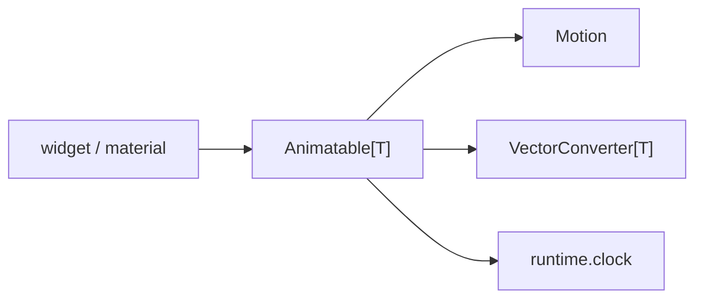

# Animation System Design

An animation is a value that moves toward a target. `Animatable[T]` owns the
current `value` and the `target`; assigning `target` starts or redirects the
motion, and `value` is an observable that widgets bind like any other.
Nothing in a widget drives a timeline by hand.

## Components

- `Animatable[T]` owns value and target and the ticking lifecycle, and
  delegates the maths.
- `Motion` creates and advances a mutable `MotionState` and defines what a
  retarget means.
- `VectorConverter[T]` maps a domain value to and from a `list[float]`, so one
  motion implementation animates a float, an RGBA tuple or any other type.
- `runtime.clock` schedules the per-frame tick.

The dependency runs one way: the primitives know nothing about widgets.

Widget code uses three entry points: assign `target`, `subscribe(...)` to
request a redraw or perform a side effect, and `map(...)` to derive a
read-only value for a property binding. `_state` and `_ticker` are internal.

## Motion

A `Motion` provides `create_state`, `step(state, dt) -> done` and
`retarget(state, target)`. The state carries `value`, `target`, `start`,
`elapsed`, `velocity` and `done`, all vectors of one dimension; a dimension
mismatch raises `ValueError`.

Retargeting never reverses or restarts from the original start; the two motion
families differ only in what they keep:

| Family | On retarget |
| --- | --- |
| Linear, Bezier (time-based) | `start` becomes the current value, `elapsed` resets to zero. |
| Spring (physics) | `target` is replaced; the current velocity is kept. |

A time-based motion with `duration <= 0` completes immediately, and a negative
`dt` is clamped to zero.

## Ticking

Assigning `target` converts it to a vector, creates or retargets the state and
schedules a tick on `runtime.clock` at one sixtieth of a second; scheduling is
idempotent. Without a `motion`, the value jumps to the target and nothing
ticks. Each tick steps the motion and publishes the converted value. On
completion the exact target is published, the state snaps to it and the ticker
is unscheduled, so an idle animation costs no frames, the property the
on-demand loop in [RENDERING_PIPELINE.md](RENDERING_PIPELINE.md) depends on.

`stop()` leaves a quiescent state: the ticker unscheduled, the target set to
the current value, the velocity zeroed, `done` true.

## Ownership

`Animatable` exposes `subscribe(cb)` and `map(transform)`. A subscription made
by a binding host is disposed by the host; a subscription made by hand is
disposed by the widget that made it, on unmount. A widget that loops by
periodic retarget (a `LoadingIndicator` adding to its target on a timer) owns
the timer too. Cleanup order on unmount: dispose subscriptions, unschedule
timers, `stop()` any animatable that may still be ticking, clear references.
If mount can change the effective state (theme, focus, an external
observable), the widget re-syncs its targets on mount.

## Consuming an Animation in a Widget

| Pattern | Use for | Rule |
| --- | --- | --- |
| Bind the `Animatable` (or a `map`) to a property | Plain value propagation | `map` is pure; heavy work in it runs on every publish. |
| `subscribe` and update imperatively | Several properties, conditional logic, external sync | A geometry change calls `mark_needs_layout()`, not only `invalidate()`. |
| Read `value` late, in `paint()` / `layout()` | A custom widget that keeps no mirrored state | Paired with a `subscribe` that requests the frame; `paint()` and `layout()` never assign `target`. |

Two distinctions decide the wiring. A **visual-only** animation needs a
repaint; a **layout-affecting** one, a change of measured size or child
placement, needs layout and repaint, and a widget that requests only repaint
paints new visuals over stale geometry. And a retarget from state must be
guarded with an epsilon: assigning the same target every frame does no visible
work and keeps the clock awake.

A side effect in `paint()` or `layout()`, a `target` assignment above all, is
the cause of a frame that never settles; state changes belong in event
callbacks.
