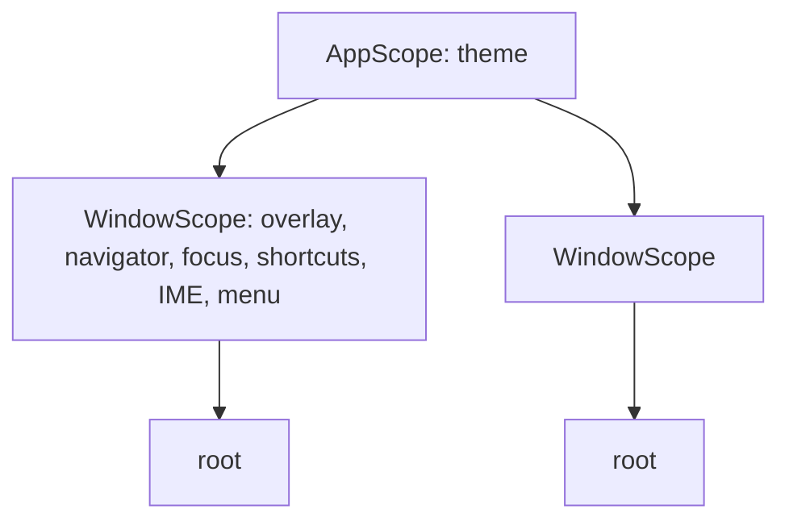

# App and Window

`App` is the process: the event loop, the theme source and the registry of
windows, owning no pixels. `Window` is one OS window with its widget tree,
overlay, navigator, focus state and menu bar. `App(Window(content=...))` is
the only shape: `App` takes its main window plus the app-level options
(`theme`, `exit_policy`), and every window-flavoured keyword (`title`,
`width`, `chrome`, `menu`, `parent`, ...) lives on `Window`. A forwarding
constructor on `App` was rejected because it would have to mirror every
future `Window` parameter forever; the signature is the scope split made
visible.

## A Window Is Imperative

Windows are opened and closed by verbs on objects, like
`Navigator.of(context).push(...)` and overlay handles, not declared as a
function of state as SwiftUI and Compose scenes are. A window cannot be a
child in a layout tree, so a widget-tree API could not be truthful.

One object is one window lifetime. The constructor builds a model with no OS
window; `open()` realises it, builds and mounts the tree and registers it
with the app; `close()` unmounts, destroys the OS window and unregisters. A
closed `Window` is finished, and showing the same content again means
constructing a new one. State that must outlive a window lives in app-layer
`Observable`s passed into the content, the framework's ordinary state idiom.
This is the Electron, WPF and WinForms semantics; Qt's close-hides is the
outlier. Hiding is a separate axis on an open window, `hide()` / `show()`,
defined in [TRAY_ICON.md](TRAY_ICON.md). Lifecycle state only moves forward,
created to open to closed, and `open()` before `app.run()` is allowed: such
windows are realised when the loop starts.

`accepts_first_mouse` is macOS-only. By default the click that activates an
inactive window is also delivered, matching Windows and Linux, through a
Cocoa `acceptsFirstMouse:` patch on the pyglet view; `False` restores
activate-only for a window where an accidental first click could commit
something.

## Parent, Child and Modality

`Window(parent=..., modal=True)` declares the relation at construction, as
Qt, Electron and Tk do. A child stacks above its parent and follows it in
minimise and restore, best-effort per platform; closing a parent closes its
children first, transitively. `modal=True` blocks pointer and keyboard input
to the parent chain while the child is open, window-modal rather than
app-modal, so sibling top-level windows stay interactive.

pyglet supports several windows but exposes no parent-child stacking,
modality or keep-above, so modality is enforced by nuiitivet: the gates sit
in the window's `_dispatch_*` methods, below every OS event path, where a
blocked window consumes keyboard input and drops pointer input. The OS may
still raise the parent above its modal child, and the framework re-raises
the child on parent activation, best-effort. A synthetic action from the
dev bridge does not rely on the silent gates; it raises, naming the blocking
window.

## Exit Policy

`ExitPolicy` has three values. `LAST_WINDOW_CLOSED`, the default, returns
from `run()` when no window remains; `MAIN_WINDOW_CLOSED` closes every
window when the main window closes; `EXPLICIT` returns only on
`app.exit()`, so an app with zero open windows keeps running, the policy for
a tray-resident app, which must keep some way to reopen a window from
app-held state. Under every policy `app.exit()` closes all windows, children
before parents. Unregistration on close is where the policy fires. A hidden
window still counts as open.

## Operations Are Methods, Typed by Protocols

An intent names the *what*, the content that `Overlay` and `Navigator`
present; a method names the verb. App and window operations carry no
content, so they are plain methods: `Window.of(context).close()`,
`App.of(context).exit()`. A wrapping intent would only restate the method
name as a class, so there are no window- or app-scoped intents and no
`dispatch` entry points. Menu-bar standard items call these same methods on
the window that owns the menu, so window management and exit stay on one
code path.

The ViewModel boundary is typed by `AppProtocol` and `WindowProtocol`
(`runtime/protocols.py`), exported on the public root beside
`NavigatorProtocol` and `OverlayProtocol`. `App.of` returns the app itself
declared as `AppProtocol`; `Window.of` returns the full `Window` for the
View layer, and a ViewModel narrows it by annotating its parameter. There is
no proxy object, and a ViewModel written against the protocols runs against
hand-written fakes with no tree and no app. An operation addresses the object
it was resolved through, so `Window.of(context)` pins the target to the
context's own window.

`App.render_to_png(path)` is the one window-flavoured operation kept on
`App`, delegating to the main window: it is the headless counterpart of
`run()`, and the operation every sample's docs harness performs.

## Everything Resolves per Window

Every open window's tree is `AppScope > WindowScope > root`. A
`.of(context)` lookup stops at the nearest matching scope, so an app-wide
lookup succeeds from any window while a window-scoped one never crosses
windows. `Overlay.of` and `Navigator.of` fall back to the context's window
scope when the ancestor walk fails, since the overlay stack is a sibling of
the content rather than an ancestor, never to a process-wide default, which
would silently cross windows. The scopes are passive carriers: they make
`App` and `Window` findable and do nothing else.

Each window has one overlay stack and one root navigator, built by `open()`;
dialogs, menus and tooltips are confined to their window, which is why
secondary windows exist. Each window keeps its own focus state, and the OS
decides which window key events enter. Shortcut bindings are tree-anchored
([KEYBOARD_SHORTCUTS.md](KEYBOARD_SHORTCUTS.md)), so a `MOUNT` binding fires
only for keys delivered to its own window; a command that must work from
every window is registered in each window's tree or on each window's menu.
IME state is per window: each `Window` owns an `IMEManager` holding its
caret rect and geometry, so two windows never race each other's candidate
placement ([TEXT_EDITING.md](TEXT_EDITING.md)).

The menu bar is per window, `Window(menu=...)`. On Windows and Linux each
window renders its own bar; on macOS the global bar follows the focused
window, and a window with `menu=None` shows the main window's menu, so a
single-menu app declares nothing per window ([MENU_BAR.md](MENU_BAR.md)).

The theme is app-wide: `App(..., theme=...)` supplies every window, and
`App` subscribes to the `ThemeManager` once and fans invalidation out to
every open window; the scopes wire no callbacks. `Window(theme=...)` is a
reserved seat: when implemented, a window-local theme shadows the app theme
for that window's tree only, and `set_theme` stays app-scoped.

## Tooling

Each `Window` holds its own root factory, and a hot reload rebuilds every
open window's tree through it. A closed window stays closed; a reload never
resurrects one. Window ids are process-monotonic and never reused, stable
across reloads, so the dev bridge addresses a window by id: `status` lists
the open windows, and the tree, state and action tools take `window=<id>`
defaulting to the main window, a deterministic default since an
agent-launched app does not reliably hold OS focus.

## Ownership

`runtime/window.py` holds `Window`, which implements the entire host
protocol a tree mounts against (layout, invalidation, redraw scheduling,
focus and interaction state, input dispatch, overlay and navigator
construction, menu bar, lifecycle), and `WindowScope`. `runtime/app.py`
holds `App` with the window registry, the `ThemeManager`, `run()`,
`ExitPolicy` and `AppScope`. `backends/pyglet/runner.py` owns process-wide
setup and the loop, and `_realize_window` turns one open `Window` into an OS
window: pyglet window, event wiring, per-window GPU state, IME patch. A
window opened while running is realised through the app's realise hook,
which registration triggers. Nothing below the host protocol knows which
window hosts it; multi-window concerns end at `Window`.
