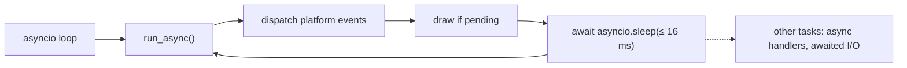

# Asyncio Integration

The framework owns the asyncio runtime, so application code writes `await`
without managing an event loop. Concurrency is single-threaded: an async task
or handler runs on the UI thread, and the thread rules of
[CONCURRENCY_MODEL.md](CONCURRENCY_MODEL.md) apply to it unchanged.

## The Event Loop

The pyglet backend's `ResponsiveEventLoop` is the integration point.
`run()` calls `asyncio.run(self.run_async())`, and `run_async()` pumps pyglet
while yielding to asyncio: it dispatches platform events, draws a frame when
one is due or requested, and sleeps in short `await asyncio.sleep(...)` slices
of at most 16 ms so other tasks run between frames. That is what makes an
awaited sleep or I/O cooperative with rendering.

A synchronous loop remains as a fallback, forced by `NUIITIVET_PYGLET_SYNC=1`
or taken when an asyncio loop is already running in the process. Under it,
anything that needs a running loop, awaiting an overlay handle above all, is
unavailable. `NUIITIVET_PYGLET_MAX_STEP` caps the blocking step time of that
loop.

## Async Handlers

A UI event handler may be sync or async. `widgeting.callbacks.invoke_event_handler`
calls it; a returned awaitable is wrapped and scheduled with
`loop.create_task(...)`. The wrapper detaches the current observable batch
context (`detach_batch()`), because the batch belongs to the synchronous
dispatch that started the task, and a task that outlives it must not flush
someone else's batch. An exception in the task is caught and logged; it does
not stop the loop. Callers that need to cancel the handler later, on unmount,
keep the returned task.

Every task is born in `widgeting.callbacks.spawn_task`. With no loop running
it returns a `PendingTask` and keeps the coroutine: the main window is mounted
when the `App` is constructed, before the runner has a loop, so a root widget's
async `on_mount` is spawned with nothing to run it. `run_async()` starts the
kept work in spawn order as it enters the loop. Cancelling a `PendingTask`
before then closes the coroutine, so a widget unmounted before the loop runs
no work. Where no loop will come, the work is closed and logged once per
owner: when the runner leaves the loop, under the synchronous fallback loop,
and after a headless `render_to_png`.

Under the test harness a coroutine spawned with no loop raises
`UnschedulableAsyncWork` instead of waiting, since a test that goes on would
be asserting on a handler that never ran.

## Awaiting an Overlay

`Overlay.show(...)` returns an `OverlayHandle`, awaitable through an asyncio
future per entry, so a dialog reads as `result = await overlay.dialog(...)`.
Awaiting requires a running loop. Closing, dismissing or disposing the entry
completes the future with an `OverlayResult`, and the await never hangs: an
entry removed without an explicit close, by navigation or unmount, completes
with `OverlayDismissReason.DISPOSED`. A caller branches on `result.reason`
rather than on cancellation.

Widget disposal fits the same flow: a widget is disposed after its exit
animation finishes, parent before child. A subscription made from an awaited
workflow tends to outlive the synchronous scope that made it, so it goes
through `bind(...)`, which the host disposes, rather than a bare
`subscribe()`, which the caller must dispose.
