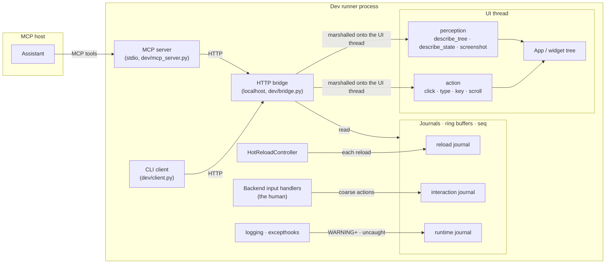

# Dev Bridge

> Status: Implemented
> User guide: [docs/guide/ai_pair_programming/dev_bridge_mcp.md](../guide/ai_pair_programming/dev_bridge_mcp.md)
> Related design: [HOT_RELOAD.md](HOT_RELOAD.md) (the reload the bridge closes a loop over), [DEV_MODES.md](DEV_MODES.md) (the human's side of the same session)

## 1. Goal

Hot reload lets an author *edit* a live app; the dev bridge lets a tool *see*
and *drive* it. Together they close a perception–action loop: edit (reload) →
see (`describe_tree`, `screenshot`) → act (`click`, `type`, `key`) → verify →
edit again. The tool is an AI assistant working in turns over MCP, and every
choice below follows from that reader: it reasons over text, it pays for
tokens, it cannot watch the app between its turns, and it shares the app with
a human who edits and clicks while it is thinking.

## 2. Structure

The MCP server and the CLI are thin clients of one HTTP bridge. The bridge
owns the two things that matter: it is only ever open inside a dev session,
and everything it does to the tree happens on the UI thread. The journals are
the other direction of flow — the app telling the assistant what happened while
it was not looking.

## 3. The bridge

A localhost-only HTTP server on an ephemeral port, started by the dev runner
alongside hot reload. It refuses to start without an active dev session, so a
production launch never opens it. The bound port is published to a discovery
file under the project root (`.nuiitivet/dev-bridge.json`), which is how every
client finds the app without configuration.

Widget-tree mutation is UI-thread-only, so each request that touches the tree
is marshalled onto it with the same primitive hot reload uses for the watcher
thread — a clock callback drains a queue ([HOT_RELOAD.md
§9](HOT_RELOAD.md#9-threading)). The HTTP worker thread waits for the result.

## 4. Perception

- **`describe_tree`** walks the mounted tree into compact JSON: per node its
  type, its human identity (`key` / `label` / `text` / `title`), its rect in
  root coordinates, and the interactive state it publishes. This is the
  semantic, low-token view the assistant reasons over and resolves action
  targets from; it is the default, and `screenshot` is the exception.
- **`screenshot`** renders the mounted tree on an offscreen raster surface
  rather than reading back the framebuffer, so a defect in the GPU path or the
  swap chain never appears in it. It answers a *human-reported* visual
  discrepancy the tree cannot explain, which is why the tool guidance reserves
  it.
- **`describe_state`** exists for one bug: "the value updated but the UI did
  not", or the reverse. The tree reports the *output*; this reports the live
  `Observable` values reachable from the same tree — the same in-tree
  observables the reload snapshot preserves — in the same nested shape, pruned
  to nodes that hold state, so the two views join node-for-node. Because
  semantic widget state (a checkbox's `checked`, a field's text) is already
  `Observable`-backed, it surfaces without per-widget work. It is read-only by
  design: poking values from outside is not a perception. Values are length-
  and depth-capped so no single one can bloat the dump, and `Animatable`
  attributes are excluded unless asked for, since framework animation state is
  noise for every question but "is the animation itself the bug".

## 5. Action

`click`, `type`, `key` and `scroll` synthesize the same input the real backend
delivers, entering at the app's dispatch — *below* the backend's input
handlers, which is what keeps them out of the interaction journal (§6) and out
of the dev input layers ([DEV_MODES.md](DEV_MODES.md)). A target is a stable
identifier (`key` / `label`) resolved to a rect centre, so a script survives
layout changes; raw coordinates are a fallback. Every verb settles the app
(reactive work flushed, relayout done) before returning, so the next
`describe_tree` sees the consequence. An action whose target is scrolled out of
its region or covered by an overlay fails rather than landing elsewhere.

## 6. Journals

The bridge is assistant-initiated: the assistant reads and acts on its own
turns and cannot see what happened between them. In a pair session that gap is
the normal case — the human saves, clicks through a screen, and the app logs an
error while the assistant is mid-task. Three journals fill it, and they share
one model:

- **Pull, not push.** An assistant acts in turns and MCP is request/response,
  so each journal is a bounded, thread-safe ring buffer read on demand. A
  monotonic `seq` on every entry lets a client tell whether anything happened
  since its last look.
- **A signal, not a firehose.** Each journal records the cheapest thing that
  answers its question, and leaves the content to the perception surfaces.

### 6.1 Reload journal

Answers "did the code change under me?". The worst case is a *failed* reload:
the previous UI keeps running against code the assistant is no longer reading.
The controller records every reload — success with the reloaded module names,
or failure with a capped traceback. Each entry also carries `changed`, the
modules whose source *content* changed, detected by per-file hash: the watcher
fires on mtime, which an autosave or a formatter bumps with identical bytes, so
an empty `changed` marks a no-op save the assistant can ignore, and a non-empty
one names the file the human edited (the reloader reloads every user module on
any change, so the module list alone cannot). The diff itself is deliberately
not recorded.

### 6.2 Interaction journal

Answers "did the human drive the app under me?" — a bug reproduced, a screen
navigated, and now a cached `describe_tree` is of a stale screen with no
record of how the app got here. Two choices are load-bearing:

- **A mirror of the action vocabulary, not a semantic taxonomy.** It records
  exactly the inbound of `click` / `key` / `type` / `scroll`: a click resolved
  to a widget identity (never a coordinate), a shortcut or navigation key, a
  content-free text marker, a scroll. Whatever the human did that the
  assistant must reproduce, it reproduces through those same verbs, so this
  set is necessary and sufficient to replay a path, and it grows only when the
  vocabulary does. Semantic events (navigate, dialog open, submit) are states
  derivable from the clicks plus the tree, and are not recorded.
- **Recorded at the real-input layer, so the human only.** The recorder hangs
  off the backend's input handlers, which the assistant's synthesized actions
  bypass, so the journal needs no real/synthetic tagging. Typed content never
  enters it: a bare printable key is dropped and a burst of text collapses to
  one marker, because recording keystrokes would leak field text.

**Scroll** is the verb whose *volume* is the problem: a wheel emits dozens of
events per gesture, and one entry each would bury every click. Three defences,
none a timer:

- Only what a region consumed is recorded; an event nothing scrolled on is
  dropped, which also inherits the scrollable's own refusals as a jitter
  deadband.
- A gesture coalesces by replacing the tail: a scroll on the same region in
  the same direction replaces the newest entry with an accumulated delta, and
  anything else starts a new one. That bounds the count structurally — never
  more scroll entries than transitions between other events — without an idle
  timeout, which would restore the unbounded count for continuous reading, the
  case coalescing exists for. Splitting on direction keeps the delta monotonic,
  so down-then-up cannot net to "did not scroll". "Same region" is the
  handler's object identity, held weakly, because two keyless siblings resolve
  to the same identity and merging them would sum two regions' deltas.
- No event counter: the accumulated notches already say how far.

An entry carries the delta in the `scroll` action's sign convention, so it
replays verbatim, and the region's own metrics (`offset`, `at_end`, `axis`) so
the log reads like an action result. The consuming region names the gesture,
not the raw wheel: a horizontal region driven by a vertical wheel is normal.

### 6.3 Runtime journal

Answers "what did the app emit?". When an assistant-driven action triggers a
callback that raises, the framework swallows the exception to keep the app
alive and logs it — to a console the assistant cannot read. The next
`describe_tree` then shows an unchanged tree: *that* nothing happened, not
*why*. A capture installs a `logging` handler (WARNING and above, any thread;
asyncio reports an unretrieved task exception by logging it, so those land
here too) and the thread and interpreter exception hooks, which Python does not
route through `logging`; both chain to the previous hook so console output is
unchanged.

De-duplication is not the journal's: it lives at the emit sites, which already
log each distinct failure once, and the callback boundary keys by distinct
exception so a new error from the same handler after a hot-reload fix still
surfaces. A process-wide verbose switch lifts that for a session that needs
every occurrence.

## 7. Clients

- **CLI** (`python -m nuiitivet.dev <verb>`): one-shot subcommands that
  discover the running app and issue plain HTTP with no dependency beyond the
  standard library, for a shell without an MCP host.
- **MCP server** (`python -m nuiitivet.dev mcp`): the same bridge as MCP tools
  over stdio, the transport every host supports. It holds no app logic — each
  tool forwards to a freshly discovered client, inheriting the bridge's
  dev-session gate — and starts even when no app is running, reporting "no
  running app" per call, so a host may launch the server first. The `mcp` SDK
  is an optional dependency; importing without it raises an error that names
  the extra to install.

**Usage guidance is part of the surface.** The server and tool descriptions
steer the model: `status` as the cheapest health check, `describe_tree` for
reasoning and target resolution, `screenshot` only for a human-reported visual
discrepancy, the journals before trusting a cached tree. A tool the model uses
wrongly is a tool badly described.

## 8. Limitations

- **The interaction journal records the action-verb primitives only.**
  Promoting selected semantic events to first-class entries, and whether the
  reload and interaction journals should unify under one activity surface, are
  open.
- **The interaction journal is wired at the pyglet backend's input handlers.**
  A second backend would drive the same recorder from its own real-input path;
  the recorder and journal are backend-agnostic.

## 9. Implementation map

| Design area | Module |
| --- | --- |
| bridge (localhost, dev-session gate, UI-thread marshalling, discovery) | `dev/bridge.py` |
| CLI client | `dev/client.py`, `dev/__main__.py` |
| MCP server (bridge as MCP tools, stdio) | `dev/mcp_server.py` |
| perception (`describe_tree` / `describe_state` / `screenshot`) | `_interaction/perception.py`, re-exported by `dev/perception.py` |
| action (`click` / `type` / `key` / `scroll`, target resolution) | `_interaction/action.py`, bound to the overlay observer by `dev/action.py` |
| reload journal | `dev/journal.py`, recorded by `dev/controller.py` |
| interaction journal and recorder | `dev/interaction.py`, driven from the backend input handlers |
| runtime journal and capture | `dev/runtime_journal.py`, `dev/runtime_capture.py` |
