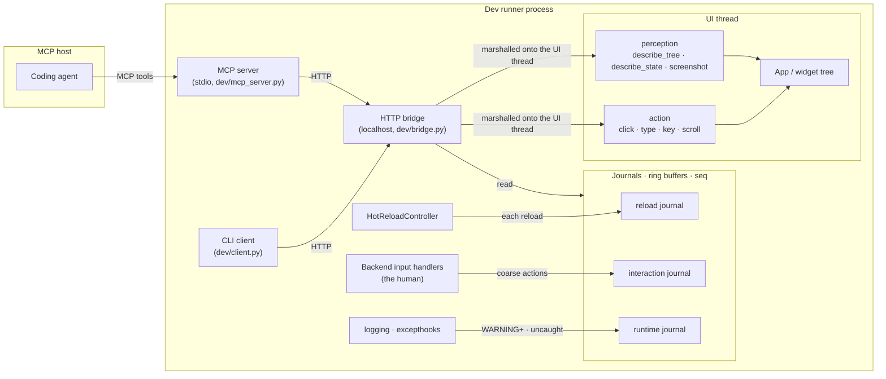

# Dev Bridge

Hot reload ([HOT_RELOAD.md](HOT_RELOAD.md)) lets an author edit a live app;
the dev bridge lets a tool see and drive it. Together they close a
perception-action loop: edit, see (`describe_tree`, `screenshot`), act
(`click`, `type`, `key`), verify, edit again. The tool is a coding agent
working in turns over MCP, and every choice below follows from that reader:
it reasons over text, it pays for tokens, it cannot watch the app between
its turns, and it shares the app with a human who edits and clicks while it
is thinking. The human's side of the same session is
[DEV_MODES.md](DEV_MODES.md).

## Structure

```mermaid
flowchart LR
    subgraph host[MCP host]
        agent[Coding agent]
    end
    subgraph devproc[Dev runner process]
        direction TB
        mcp["MCP server<br/>(stdio, dev/mcp_server.py)"]
        cli["CLI client<br/>(dev/client.py)"]
        bridge["HTTP bridge<br/>(localhost, dev/bridge.py)"]
        subgraph ui[UI thread]
            app[App / widget tree]
            perception["perception<br/>describe_tree · describe_state · screenshot"]
            action["action<br/>click · type · key · scroll"]
        end
        subgraph journals[Journals · ring buffers · seq]
            rj[reload journal]
            ij[interaction journal]
            rtj[runtime journal]
        end
        controller["HotReloadController"]
        input["Backend input handlers<br/>(the human)"]
        logs["logging · excepthooks"]
    end
    agent -- "MCP tools" --> mcp
    mcp -- HTTP --> bridge
    cli -- HTTP --> bridge
    bridge -- "marshalled onto the UI thread" --> perception
    bridge -- "marshalled onto the UI thread" --> action
    bridge -- read --> journals
    perception --> app
    action --> app
    controller -- "each reload" --> rj
    input -- "coarse actions" --> ij
    logs -- "WARNING+ · uncaught" --> rtj
```

The MCP server and the CLI are thin clients of one HTTP bridge. The bridge
owns the two things that matter: it is only ever open inside a dev session,
and everything it does to the tree happens on the UI thread. The journals
are the other direction of flow, the app telling the agent what happened
while it was not looking.

## The Bridge

A localhost-only HTTP server on an ephemeral port, started by the dev runner
alongside hot reload. It refuses to start without an active dev session, so
a production launch never opens it. The bound port is published to a
discovery file under the project root (`.nuiitivet/dev-bridge.json`), which
is how every client finds the app without configuration. Widget-tree
mutation is UI-thread-only, so each request that touches the tree is
marshalled onto it with the primitive hot reload uses for the watcher
thread, a clock callback draining a queue, and the HTTP worker thread waits
for the result.

## Perception

`describe_tree` walks the mounted tree into compact JSON: per node its type,
its human identity (`key` / `label` / `text` / `title`), its rect in root
coordinates and the interactive state it publishes. This is the semantic,
low-token view the agent reasons over and resolves action targets from; it
is the default, and `screenshot` is the exception.

`screenshot` renders the mounted tree on an offscreen raster surface rather
than reading back the framebuffer, so a defect in the GPU path or the swap
chain never appears in it. It answers a human-reported visual discrepancy
the tree cannot explain, which is why the tool guidance reserves it.

`describe_state` exists for one bug, "the value updated but the UI did not"
or the reverse. The tree reports the output; this reports the live
`Observable` values reachable from the same tree, the same in-tree
observables the reload snapshot preserves, in the same nested shape pruned to
nodes that hold state, so the two views join node for node. Semantic widget
state, a checkbox's `checked` or a field's text, is `Observable`-backed
already, so it surfaces without per-widget work. It is read-only: poking
values from outside is not a perception. Values are length- and depth-capped
so no single one bloats the dump, and `Animatable` attributes are excluded
unless asked for, since animation state is noise for every question but "is
the animation itself the bug".

## Action

`click`, `type`, `key` and `scroll` synthesise the input the real backend
delivers, entering at the app's dispatch, below the backend's input
handlers, which is what keeps them out of the interaction journal and out of
the dev input layers. A target is a stable identifier (`key` / `label`)
resolved to a rect centre, so a script survives layout changes; raw
coordinates are a fallback. Every verb settles the app, reactive work
flushed and relayout done, before returning, so the next `describe_tree`
sees the consequence. An action whose target is scrolled out of its region or
covered by an overlay fails rather than landing elsewhere.

## Journals

The bridge is agent-initiated: the agent reads and acts on its own turns and
cannot see what happened between them, and in a pair session that gap is the
normal case. Three journals fill it, on one model. **Pull, not push**: an
agent acts in turns and MCP is request/response, so each journal is a
bounded, thread-safe ring buffer read on demand, with a monotonic `seq` on
every entry so a client can tell whether anything happened since its last
look. **A signal, not a firehose**: each journal records the cheapest thing
that answers its question and leaves the content to the perception surfaces.

### Reload Journal

Answers "did the code change under me?". The worst case is a failed reload:
the previous UI keeps running against code the agent is no longer reading.
The controller records every reload, success with the reloaded module names
or failure with a capped traceback. Each entry also carries `changed`, the
modules whose source content changed, detected by per-file hash: the watcher
fires on mtime, which an autosave or a formatter bumps with identical bytes,
so an empty `changed` marks a no-op save the agent can ignore, and a
non-empty one names the file the human edited, which the module list alone
cannot since the reloader reloads every user module on any change. The diff
itself is not recorded.

### Interaction Journal

Answers "did the human drive the app under me?": a bug reproduced, a screen
navigated, and now a cached `describe_tree` is of a stale screen with no
record of how the app got there. Two choices are load-bearing.

**A mirror of the action vocabulary, not a semantic taxonomy.** It records
exactly the inbound of `click` / `key` / `type` / `scroll`: a click resolved
to a widget identity a replay can find again, never a coordinate, a keyless
button named by the caption inside it; a shortcut or navigation key; a
content-free text marker; a scroll. Whatever the human did that the agent
must reproduce, it reproduces through those same verbs, so this set is
necessary and sufficient to replay a path, and grows only when the vocabulary
does. A semantic event (navigate, dialog open, submit) is a state derivable
from the clicks plus the tree, and is not recorded.

**Recorded at the real-input layer, so the human only.** The recorder hangs
off the backend's input handlers, which the agent's synthesised actions
bypass, so the journal needs no real/synthetic tagging. Typed content never
enters it: a bare printable key is dropped and a burst of text collapses to
one marker, because recording keystrokes would leak field text. The recorder
and journal are backend-agnostic; a second backend would drive the same
recorder from its own real-input path.

Scroll is the verb whose volume is the problem: a wheel emits dozens of
events per gesture, and one entry each would bury every click. Three
defences, none a timer. Only what a region consumed is recorded; an event
nothing scrolled on is dropped, which also inherits the scrollable's own
refusals as a jitter deadband. A gesture coalesces by replacing the tail: a
scroll on the same region in the same direction replaces the newest entry
with an accumulated delta, and anything else starts a new one, which bounds
the count structurally, never more scroll entries than transitions between
other events, without an idle timeout, which would restore the unbounded
count for continuous reading, the case coalescing exists for. Splitting on
direction keeps the delta monotonic, so down-then-up cannot net to "did not
scroll". "Same region" is the handler's object identity, held weakly, because
two keyless siblings resolve to the same identity and merging them would sum
two regions' deltas. No event counter: the accumulated notches say how far.
An entry carries the delta in the `scroll` action's sign convention, so it
replays verbatim, and the region's own metrics, so the log reads like an
action result.

### Runtime Journal

Answers "what did the app emit?". When an agent-driven action triggers a
callback that raises, the framework swallows the exception to keep the app
alive and logs it, to a console the agent cannot read; the next
`describe_tree` then shows an unchanged tree, that nothing happened, not why.
A capture wraps the log record factory (WARNING and above, any thread;
asyncio reports an unretrieved task exception by logging it, so those land
here too) and the thread and interpreter exception hooks, which Python does
not route through `logging`. Each chains to the previous one, so console
output is unchanged.

A handler on the root logger was rejected. Python writes a record to stderr
only while no handler exists, and `logging.basicConfig` does nothing once one
does, so a journal handler would silence an unconfigured app's tracebacks and
drop the app's own logging setup. De-duplication is not the journal's: it
lives at the emit sites, which log each distinct failure once, and the
callback boundary keys by distinct exception so a new error from the same
handler after a hot-reload fix still surfaces; a process-wide verbose switch
lifts that for a session that needs every occurrence.

## Clients

The CLI (`python -m nuiitivet.dev <verb>`) is one-shot subcommands that
discover the running app and issue plain HTTP with no dependency beyond the
standard library, for a shell without an MCP host. The MCP server
(`python -m nuiitivet.dev mcp`) exposes the same bridge as MCP tools over
stdio, the transport every host supports. It holds no app logic, each tool
forwarding to a freshly discovered client and inheriting the bridge's
dev-session gate, and it starts even when no app is running, reporting "no
running app" per call, so a host may launch the server first. The `mcp` SDK
is an optional dependency, and importing without it raises an error naming
the extra to install.

Usage guidance is part of the surface. The server and tool descriptions
steer the model: `status` as the cheapest health check, `describe_tree` for
reasoning and target resolution, `screenshot` only for a human-reported
visual discrepancy, the journals before trusting a cached tree. A tool the
model uses wrongly is a tool badly described.

## Implementation Map

| Design area | Module |
| --- | --- |
| bridge: localhost, dev-session gate, UI-thread marshalling, discovery | `dev/bridge.py` |
| CLI client | `dev/client.py`, `dev/__main__.py` |
| MCP server | `dev/mcp_server.py` |
| perception | `_interaction/perception.py`, re-exported by `dev/perception.py` |
| action and target resolution | `_interaction/action.py`, bound to the overlay observer by `dev/action.py` |
| reload journal | `dev/journal.py`, recorded by `dev/controller.py` |
| interaction journal and recorder | `dev/interaction.py`, driven from the backend input handlers |
| runtime journal and capture | `dev/runtime_journal.py`, `dev/runtime_capture.py` |
