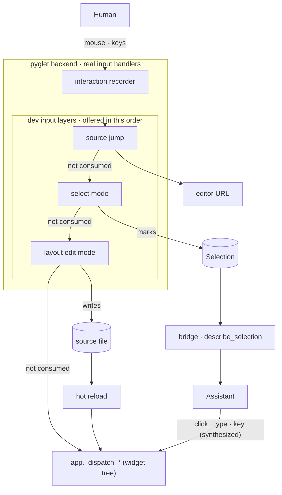

# Dev Modes

> Status: Implemented (select mode, source jump, layout edit mode)
> User guide: [docs/guide/ai_pair_programming/dev_bridge_mcp.md](../guide/ai_pair_programming/dev_bridge_mcp.md) — the gestures themselves are the guide's business
> Related design: [DEV_BRIDGE.md](DEV_BRIDGE.md) (the assistant's side of the session), [HOT_RELOAD.md](HOT_RELOAD.md) (what applies a layout-mode edit)

## 1. Goal

Every bridge surface runs assistant → app. The dev modes run the other way:
they let the **human point at a widget** and have something happen to it —
a mark the assistant can read, an editor opened on the line that built it, or
its source rewritten by a drag. Prose is an expensive channel for a location,
and for two cases it barely works at all: an anonymous inner node no phrase
identifies, and a *gap* with no widget to name.

Three gestures share one input layer and one prefix:

| Gesture | Chord | Kind | Effect |
| --- | --- | --- | --- |
| Select mode | `Ctrl+Shift+D` | latched mode | marks widgets and regions for the assistant (a *designation*) |
| Layout Edit mode | `Ctrl+Shift+E` | latched mode | a corner drag rewrites `width` / `height` / `size` in the source |
| Source jump | `Ctrl+Shift+Click` | modeless | opens the widget's construction site in the editor |

`Ctrl+Shift` is the dev runner's prefix: every chord it claims starts with it,
so an app never has to guess which are taken. The letters name what the human
does in the mode — `D` *designates*, `E` *edits* — and sit side by side under
the left hand while the right is on the mouse; every mention of a chord in the
HUD and the guide carries its verb, so the letter is learned with the word.

## 2. Structure

The layers sit on the backend's *real* input handlers — the same place the
interaction recorder hangs — and the assistant's synthesized actions enter
below them at the app's dispatch. That is what makes a designation
unforgeable: nothing the assistant does can reach a mode. What each mode
produces leaves by a different door — the selection through the bridge, the
jump through the platform's URL opener, a layout edit through the file and the
reload that follows.

### 2.1 The input layer

- **Order.** The jump is offered every event ahead of the modes, because it
  works in any state; then select mode, then layout edit mode. A layer that
  consumes an event ends the walk.
- **Two modes, one switch rule.** Each mode lets the *other's* chord pass, and
  the entering mode closes the other — select mode commits, layout edit mode drops
  its drag. The rule holds whatever order the layers run in, and neither mode
  needs the other to exist. While a mode is latched, every other key is
  consumed, so a mode never leaks a keystroke into the app.
- **The jump is not a mode** because nothing persists between one jump and the
  next; a held chord shows brackets on the hover, a click opens the editor,
  and the state that was there before is untouched.
- **Shared mechanics** (`dev/gesture.py`): the prefix chord, the
  click-versus-drag threshold, the geometry pick, the ancestor walk. The
  modes are thin over these; what differs is what they do with the target.

## 3. Select mode: designation

Select mode records what the human pointed at, as nodes and as regions, and
the bridge serves the result to the assistant, with a roll-up on `status` and
a content-free marker on the interaction journal so the assistant notices a
designation without being told.

- **One `Selection` per app, shared three ways.** The mode writes it from the
  UI thread, the reload controller re-resolves it after a rebuild, and the
  bridge reads it on HTTP worker threads, so it carries its own lock. Nodes
  and regions live in one ordered list because they share one on-screen
  numbering.
- **A session is undoable as a unit.** Entering snapshots the marks; commit
  keeps what the session did and cancel restores the snapshot, so a cancel
  scopes to one session rather than to everything, and clearing is undoable
  because it happens inside one. A reload remaps the snapshot alongside the
  live marks, or cancelling after a rebuild would restore members whose
  referents are gone.
- **Reload re-resolution.** Members are held weakly and keyed on object
  identity — two anonymous siblings resolve to the same identity dict, so
  keying on that would make picking the second remove the first. A rebuild
  evaporates them, and that is the normal case: "point at it, then have the
  assistant fix it" puts a reload in the middle of nearly every use. They are
  matched back by the same key-preferring structural path state restore uses
  ([HOT_RELOAD.md §7.4](HOT_RELOAD.md#74-state-snapshot-restore)), and misses
  are counted rather than silently shortening the list.

### 3.1 Picking what the eye sees

`hit_test` cannot serve the picker: it returns the deepest *hit-participating*
widget, and the node a human means is often one that participates in none — a
plain `Text`, a spacing `Container`. The picker (`pick_at`) is geometry-only,
and three gaps had to be closed for geometry to agree with the eye:

- **Descent is narrowed, not filtered afterwards.** The picker descends
  through the same children the keyboard traverses, so it stops where the eye
  does, and only then checks occlusion. The order matters: the occlusion check
  deliberately does not treat a `None` hit as an obstruction (that is what
  keeps a non-interactive target reachable), so an entirely non-interactive
  hidden subtree — two `Text` pages in a `Deck` — is invisible to it.
- **An empty overlay is not in the way.** Every App wraps its content in an
  `Overlay` that stays mounted at full window size and paints nothing while
  idle; it contains every point and sits on top. `is_visually_empty()`, opted
  into by name like the other visual probes, is how anything reading the tree
  geometrically gets the answer `Overlay.hit_test` already gives.
- **A clip is published.** `Box` has always honoured `clip_content` when hit
  testing, but the clip was invisible to the occlusion check, and a point
  trimmed away lands on nothing — which is not an obstruction. The idiom that
  exposes it is ordinary: a decorative shape laid out far larger than its
  parent and clipped to a corner. `Box.visual_clip_rect()` closes it.

**Reporting uses the visible rect, not the visual rect.** "Where is this node"
and "what of it is on screen" are different questions, and a designation
answers the second. The visual rect stays as it is, since an action must aim
at the node's actual origin; the visible rect intersects it with every ancestor
clip, and the payload and the on-screen brackets both use it, so the box on
the glass and the rect handed to the assistant are the same claim.

### 3.2 Regions

A region is the half node picking cannot express: an area with no widget in
it. Only the rect is stored; its `container` (the innermost enclosing node,
plus that node's immediate children) and `contents` are derived on every read,
which is what carries a region across a reload with no restore step and makes
it a continuing observation point rather than a single-use note.

A rectangle carries two readings the geometry cannot separate: "the gap
between these things" wants the enclosing owner, "these things" wants what the
box crosses. So the two readings get one field each, neither collapsed into
the other, and the caller — which knows what the human *said* — chooses. An
earlier form dropped a match nested inside another match, which answers
"which widget did you name?" and is a different question: a band drawn down a
column reported only the column, the one thing the human already knew.
`contents` intersects rather than requiring containment, because humans drag
rough boxes, and is scoped to the container's subtree, which is what makes
intersection workable: the ancestor chain trivially overlaps and drops out
without a special case. An empty `contents` is a signal, not a failure.

### 3.3 Privacy

A designation may carry rects and on-screen text, unlike the interaction
journal, which records neither. The journal records *ambiently*, without
item-by-item consent; a designation is an explicit act of disclosure, the same
ground on which a screenshot may. The journal marker stays content-free, and
the payload is served only on an explicit request.

## 4. Construction sites

Every designation is followed by the same question: *which line built this?*
In an app that passes no `key=` — most apps — the alternative is a chain of
anonymous types twenty levels deep and a grep.

The dev runner wraps `Widget.__init__` — the single chokepoint every widget
passes through — and walks the frames out of the package to the first user
frames. The wrap is installed by the runner and never by the framework, so a
production launch pays nothing, not even a flag check on the construction
path. Python's runtime frames make this cheaper than Flutter's
`--track-widget-creation`, which needs a compile-time transform to learn the
same thing.

- **Never stale.** Sites are captured at construction and a reload rebuilds
  everything, so there is no invalidation step to get wrong.
- **Interned.** Sites are shared far more than they are distinct — one helper
  builds fourteen cards — so a per-widget field becomes a pointer into a small
  table.
- **A short chain, not one location.** "Change every tile" wants the helper
  and "change this one" wants the call site, and only the caller knows which
  was meant; the innermost frame is flagged as the one place an editor can
  open.
- **The exact call, not the line.** Each frame records the span of the call
  that was executing, so an editor of the file can find the `Call` node: a
  line can hold several, and chained calls share a start. The frame an edit
  targets is the innermost user frame *outside any `__init__`*, since inside
  a constructor the executing call is `super().__init__(...)` rather than the
  call a human recognises as building the widget.
- **Direct or owned.** A frame also records whether it built the widget
  *directly*. A label a button builds for itself, in its constructor or during
  layout, has no user call of its own, so a pointer on it means the nearest
  ancestor a user call did build — the button. That owner is what layout edit mode
  edits.

## 5. Source jump

`Ctrl+Shift+Click` opens the hovered widget's construction site. It does not
designate — reading several widgets' code in a row must not leave a mark per
widget — and it does not leave a latched mode, which is only safe because the
overlay repaints on every state change: returning from the editor shows the
badge that says the mode is still on. The hover caption carries `file:line`
and the HUD lists the gesture, which is what let this be a modifier rather
than a button; a pressable control would need hit testing inside a registry
that deliberately has none.

- **By URL scheme, not CLI.** The editor is handed a URL
  (`vscode://file/path/to/app.py:171:1`) through the platform's standard
  opener. The `code` shim boots the Electron binary as Node to send one IPC
  message, an order of magnitude slower than the URL; a CLI fallback would hand
  the slow path to exactly the people who had to configure something. The
  line rides inside the URL, so nothing on the way can drop it — the macOS
  `open --args` route was rejected for dropping exactly that when the editor
  was already running.
- **The route is chosen by an install check, not by probing the scheme**,
  since probing waits on the opener, on the UI thread, for an answer that
  never changes. The check is a proxy for a registered handler, so
  `--editor vscode` exists to assert what the check cannot see.
- **`--editor` is a URL template**, `"cursor://file{file}:{line}:1"`, not a
  command. What goes stale is the built-in list, and it goes stale by way of
  VS Code forks whose URLs differ only in the scheme, so one line catches up
  onto the fast route. The path is substituted absolute, slash-separated and
  percent-encoded, so no template author has to know how a Windows path
  becomes a URL.
- **Validated at startup, success announced.** A URL is the one route that
  cannot report its own failure: openers succeed whether or not anything is
  registered. A malformed template is refused at launch rather than arriving
  as silence on the first click, and a successful jump names the file, which
  is the only evidence the click was received — what makes "nothing happened"
  readable as an editor problem.

None of this is checkable in CI, which is headless where the question is where
the cursor landed; each platform's opener was confirmed against a real editor.

## 6. Layout Edit mode

The sibling of select mode with the opposite division of labour: the human
drags a widget and the **dev runner edits the source itself** — no assistant,
no turn. A corner drag writes `width` / `height` / `size` into the call that
built the widget; a body drag moves the widget's element within its
container's `children` list, into another container's, or into a grid cell —
or, when it keeps the widget's place, rewrites the container's alignment. The
hot reload that follows is the apply step. The tree is never mutated: what is
on screen always came from the code, and during the gesture only the overlay
moves.

- **No commit.** Every release writes, so `Ctrl+Z` is what "I did not mean
  that" reaches for. Undo is the inverse span, and it refuses when the text it
  expects has moved under a hand edit; `Ctrl+Shift+Z` reapplies it under the
  same check, and a new edit drops what was undone.
- **Delete is a key, not a drag.** `Delete` / `Backspace` on the selection
  removes its expression — the move's leaving half, under the move's gates —
  with no confirmation, since `Ctrl+Z` is the confirmation for every write.
  Only the expression goes: a handler it referenced stays, and cleaning up
  after it is the assistant's job, like inserting or unwrapping. A widget in a
  `GridItem` takes the item with it, since one without a child cannot be
  built.
- **Text is one literal.** `Enter` on the selection — or a second click on
  it — opens a field over its text; `Enter` writes the string into the
  literal the call was given (`text=` / `label=`, else its first argument),
  spelled as it was, and `Esc` or a click away cancels. A name, an f-string,
  a call, or a call that takes no text is a refusal. The field is painted by
  the overlay and never enters the tree, like everything else the mode shows;
  it takes typed text and the input method's composition from the runner the
  way a text field does, and publishes its caret so the candidate window
  opens beside it. Its caret, selection, composition and clipboard keys are
  the operations `EditableText` runs (`widgets/text_editing.py`), so the
  field behaves like the app's own fields and neither grows a second editor.
- **The selection is held by the pointer.** A click selects, and `W` / `S`
  walk the selection so a container can be grabbed through its children. That
  is the selection's only job, so it lasts exactly as long as the pointer stays
  on the selected widget and its grab zones, and inside that rect the
  children's hover is overridden. The alternatives were rejected by feel:
  hover-always-wins loses the container before its corner can be reached, and
  drawing selection and hover as two outlines at once makes the mode read like
  select mode's marks.
- **Span surgery.** The edit re-parses the file and matches the `Call` node
  the site recorded (§4), then replaces the literal's span or inserts the
  keyword after the last argument; nothing around it is reformatted. A site
  under an install directory is refused rather than written to.
- **Refusals are badges, not marks.** A value that is a name or expression, a
  keyword that may come through `**kwargs`, a constructor without the keyword,
  a call that cannot be located: nothing is written and the badge names the
  reason. Layout Edit mode never touches the `Selection`; a refusal is not handed
  to the assistant.
- **Landing values are measured, not guessed.** The `auto` band is the
  widget's own intrinsic size measured at the proposed width, and the `wt`
  band is what the parent's own allocation would give it, so a snapped value
  matches the reload to the pixel. `auto` outranks `wt` where the bands
  overlap; `Alt` at release suppresses snapping. An axis whose landing equals
  what is declared is not rewritten.
- **A drag is not a coordinate.** A corner drag resolves to one of the three
  size spellings, a body drag to a slot among the siblings — the sibling gap
  the pointer is over, read from the rects layout gave them — or, in a grid,
  to the cell under the pointer, read from the tracks layout computed. What is
  written is a landing value, a list position or a cell, never a delta.
- **A nudge is the drag, driven by keys.** During a corner drag `W` / `A` /
  `S` / `D` move the grabbed corner a pixel, and from the first press the
  pointer is theirs: the hand's motion and the release point are ignored, and
  the snap bands close to the exact size — `auto` and `wt` are written only
  when the corner sits on them, since a key that could not choose the pixel
  beside them would adjust nothing. The release still writes, so nothing
  else changes — ghosts, undo, the check. The keys a drag
  answers to are one vocabulary under the left hand, which is why the stack's
  layer keys are `W` / `S` and the arrows are the selection walk alone.
- **The container under the pointer decides the reading.** The deepest
  container under the pointer, looking past the dragged subtree, is where the
  drag lands: the widget's own container gives the in-place reading, any other
  makes the drag a move into it, and none at all keeps the in-place reading so
  a drag past the end of a list still lands at its end. "Deepest" rather than
  "the one the pointer left" is what lets a widget move into a sibling
  container nested inside its own.
- **In a `Stack` the layer decides, not the point.** A point over a stack
  names every layer under it at once, so the mode picks one layer and reads
  within it as if nothing lay on top. A drag that started inside the stack
  reads its own layer: a stack child aligns, a child of a column in a layer
  reorders in that column, even under a layer that covers it. A drag arriving
  from outside reads the top layer — into it when it can take a child, else
  onto the stack, on top, which is the end of its list — so the empty box
  most stacks put underneath is never the landing. The layer holds while the
  pointer is anywhere in the stack, and the point only picks the slot. Since
  no default can name the layer a point means, the overlay lists the stack's
  layers with the landing marked, and `W` / `S` or a digit moves it: a layer
  that takes a child is read within, any other gives the widget its place in
  the stack — the z-order edit a stack has no gesture for — and past the top
  is a new layer. The choice holds until the pointer leaves the stack.
- **The axis decides the in-place reading.** In a `Column` or `Row` the
  dominant axis of the travel at release decides: along the main axis is a
  reorder, across it is alignment. In a wrapping flow every travel that
  leaves the slot is a reorder, row by row, and travel that keeps it is
  alignment — for a `Flow`, only when the cross axis dominates.
- **Staying put is alignment, and the alignment is the container's.** A drag
  that does not change the widget's place — its own slot or cell, a `Stack`
  or a `Container` with no order — snaps the widget to `start` / `center` /
  `end` on each axis of the box its container aligns it in, and writes the
  container's keyword (`alignment`, `cross_alignment`, `item_alignment`), so
  every child of the container moves and the ghost shows each one where the
  new value puts it. Writing the container's value rather than a per-child
  wrapper is what keeps one rule for every container, and aligning a whole
  column is what a drag most often means; a per-child override is asked for
  in words. A `CrossAligned` the human wrote is theirs: a drag on its child
  rewrites that value, other wrapped children stay where they are, and the
  mode never adds or removes one — `GridItem` is the only wrapper it writes.
  An axis the widget already fills has no alignment to write; a widget that
  fills every axis is a badge.
- **A reorder moves a span.** The runner locates, through the container's
  site, the list literal that owns the children's order — `children` itself,
  or the list a comprehension or a `ForEach` iterates, inline or bound once to
  a name in the enclosing scope and never mentioned again — and moves the
  child's element there, with one of its separators, so the formatting
  survives. The gate is that a layout index must name a source span: a
  concatenation, a spread, a filtered comprehension, items from a call or a
  view model, a name bound twice or used again, each leave the order somewhere
  the runner cannot see, and are refused by name. Tree indices are never
  trusted past that gate.
- **A move between containers is two lists, one edit.** The element leaves
  the source list with one of its separators, enters the destination with one
  of the destination's, and its continuation lines take the destination's
  indentation; the two lists may be in different files, which are written
  together and undone together, the second refusing when either has moved.
  Both `children` must be list literals written in place: a child built from
  data is a template with no expression of its own, and a data-driven list has
  nowhere to put one. The only child of a `Container` or `Box` leaves as its
  `child` argument, taken off the call with one separator, and an empty box
  takes one back the same way; the box stays through both, since an edit that
  exists is not refused for being a box. A box with a child is passed over by
  the destination walk — replacing it would be a choice, not a move — so a
  drop on it lands in the list around it. Only the source can tell — the tree sees the same
  children either way — so it is read once when the drag starts and once per
  container the pointer enters, and the badge says it while the pointer is
  there, before release. Sizing is not fixed up
  — `"wt"` moves as written and the badge notes when its axis changed
  meaning — since the corner is one drag away.
- **A grid drop is a cell, and the wrapper is the destination's.** A `Grid`
  places by `GridItem(child, row=…, column=…)` or by area name, never by
  order, so inside a grid the in-place reading is a cell change — the item's
  indices or area rewritten, a span keeping its length — and a move across a
  grid's edge adds or removes the wrapper: only the item's child leaves, and
  what enters is wrapped at the cell, or in the area the grid declares there.
  The wrapper is spelled the way the grid is (`nv.Grid` gives `nv.GridItem`)
  and never imported, so a bare `Grid` in a module that does not bind
  `GridItem` refuses. An occupied cell is allowed — overlap is the grid's
  business — and the caption names who is there; the keywords an unwrap drops
  are named after the write, not refused.
- **Write, reload, check.** The ghost is a prediction: after the reload the
  edit log finds the instances rebuilt at the site and compares their rect —
  or, for a move, the class at the slot or in the cell — with it, and a miss,
  a site that now builds nothing, or a failed reload becomes the badge.
- **Shared sites.** One helper builds fourteen cards; the edit is to the
  helper and changes them all. What makes that honest is the ghost: every
  instance of the site gets one before release, and the caption carries the
  count.

## 7. Overlays

Each mode paints on the glass, never into the tree — the same paint-only,
live-frames-only constraint as the action overlay — so `describe_tree` never
sees a bracket and `screenshot` never contains one. Four colour families,
because one visual language for opposite directions would mislead:

| Colour | Means |
| --- | --- |
| indigo (action overlay) | the assistant did this |
| amber (select mode) | the human means this |
| teal (layout edit mode) | a change about to be made to a file |
| rose (source jump) | a jump, not a mark — under a held chord inside select mode, amber brackets would read as a designation about to be made |

In layout edit mode the candidate's corner brackets *are* the grab zones, the ghost
is a dashed outline captioned with the landing values — or, for a reorder, an
insertion line in the slot, captioned with the sibling it lands before, plus a
tint over the list it would land in, its own or another's; in a grid a deeper
tint over the cell instead of a line; for an alignment a dashed rect per child
the value moves, the dragged one captioned.

The badge is the only place a human can learn the keys, and a box that lists
them all is noise nobody reads. So:

- **A key is shown only while pressing it would do something.** Every key
  still appears in some state; a test walks them.
- **The ways out stay on the first line.** The line that says the mode is on
  says how to get off.
- **The `Stack` layer keys sit beside the layer list**, where the eye is
  mid-drag.
- **One box at the bottom; it dodges, never hides.** A badge that vanished
  would leave the mode's state in doubt. It flips sideways only when narrower
  than half the window, and returns on a wider margin than it left on, so it
  never flickers.

## 8. Implementation map

| Design area | Module |
| --- | --- |
| dev input layers (order, prefix chord) | `backends/pyglet/runner.py` |
| mechanics shared by the layers (chord, click/drag, pick, ancestor walk) | `dev/gesture.py` |
| select mode, selection, overlay | `dev/select_mode.py`, `dev/selection.py`, `dev/selection_overlay.py` |
| geometry picker, visible rect | `_interaction/perception.py` (`pick_at`, `find_obstruction`) |
| construction sites | `dev/source.py` |
| source jump, editor launch | `dev/source_jump.py`, `dev/editor.py` |
| layout edit mode: mode, landing values, slots and gates, span surgery, overlay | `dev/layout_edit_mode.py`, `dev/landing.py`, `dev/reorder.py`, `dev/source_edit.py`, `dev/layout_edit_overlay.py` |
| the badge both modes share: what it says, where it sits, how it is drawn | `dev/hud.py` |
| the editing operations the text field shares with `EditableText` | `widgets/text_editing.py` |
| edit log and reload request | `dev/source_edit.py` (`EditLog`), `dev/controller.py` |
