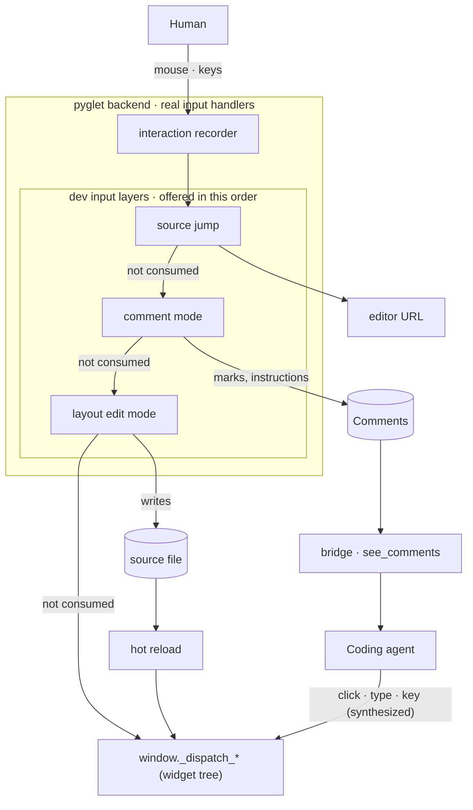

# Dev Modes

Every bridge surface ([DEV_BRIDGE.md](DEV_BRIDGE.md)) runs agent to app. The
dev modes run the other way: they let the human point at a widget and have
something happen to it, a mark the agent can read, an editor opened on the
line that built it, or its source rewritten by a drag. Prose is an expensive
channel for a location, and for two cases it barely works: an anonymous inner
node no phrase identifies, and a gap with no widget to name.

Three gestures share one input layer and one prefix:

| Gesture | Chord | Kind | Effect |
| --- | --- | --- | --- |
| Comment mode | `Ctrl+Shift+C` | latched mode | marks widgets and regions for the agent, with an instruction typed on the mark |
| Layout edit mode | `Ctrl+Shift+E` | latched mode | a drag rewrites size, order or alignment in the source |
| Source jump | `Ctrl+Shift+Click` | modeless | opens the widget's construction site in the editor |

`Ctrl+Shift` is the dev runner's prefix: every chord it claims starts with
it, so an app never has to guess which are taken. The letters name what the
human does, `C` comments and `E` edits, and sit under the left hand while the
right is on the mouse; every mention of a chord in the HUD and the guide
carries its verb, so the letter is learned with the word.

## Structure

```mermaid
flowchart TB
    human[Human]
    agent[Coding agent]
    subgraph backend[pyglet backend · real input handlers]
        recorder[interaction recorder]
        subgraph layers[dev input layers · offered in this order]
            jump[source jump]
            comment[comment mode]
            layout[layout edit mode]
        end
    end
    dispatch["window._dispatch_* (widget tree)"]
    comments[(Comments)]
    editor[editor URL]
    file[(source file)]
    reload[hot reload]
    bridge[bridge · see_comments]

    human -- "mouse · keys" --> recorder --> jump
    jump -- "not consumed" --> comment -- "not consumed" --> layout -- "not consumed" --> dispatch
    agent -- "click · type · key (synthesized)" --> dispatch
    jump --> editor
    comment -- marks, instructions --> comments --> bridge --> agent
    layout -- writes --> file --> reload --> dispatch
```

The layers sit on the backend's real input handlers, where the interaction
recorder hangs, and the agent's synthesised actions enter below them at the
window's dispatch. That is what makes a comment unforgeable: nothing the
agent does can reach a mode. What each mode produces leaves by a different
door, the comments through the bridge, the jump through the platform's URL
opener, a layout edit through the file and the reload that follows.

The jump is offered on every event ahead of the modes, because it works in
any state; then comment mode, then layout edit mode, and a layer that
consumes an event ends the walk. Each mode lets the other's chord pass, and
the entering mode closes the other, comment mode committing and layout edit
mode dropping its drag; the rule holds whatever order the layers run in, and
neither mode needs the other to exist. While a mode is latched every other
key is consumed, so a mode never leaks a keystroke into the app. The jump is
not a mode because nothing persists between one jump and the next. The
mechanics the layers share, the prefix chord, the click-versus-drag
threshold, the geometry pick and the ancestor walk, live in `dev/gesture.py`;
the modes are thin over them.

## Comment Mode

Comment mode records what the human pointed at, as nodes and as regions, and
what they wrote on each mark, and the bridge serves the result to the agent,
with a roll-up on `status` and a content-free marker on the interaction
journal so the agent notices a comment without being told. A comment is a
mark with an optional instruction: a bare number is a whole comment, and the
human says what it means in chat, by number.

One `Comments` buffer per app is shared three ways, written by the mode on
the UI thread, re-resolved by the reload controller after a rebuild, and read
by the bridge on HTTP worker threads, so it carries its own lock. Nodes and
regions live in one ordered list because they share one on-screen numbering.

A session is undoable step by step and as a unit: every change inside a
session is a step back, and cancel is every step at once, so a cancel scopes
to one session and clearing is safe to reach for. Undo stops at the session's
start, since what an earlier session kept is not this one's to take back. The
keys are layout edit mode's, and `Backspace` is left unbound rather than
meaning "remove a mark", because next door it deletes a widget from the
source, and one key must not be harmless in one mode and destructive in its
sibling.

Writing is offered once per new mark, and the badge is the handle after
that: `Enter` on a mark just made opens its field, and any other `Enter`
leaves. A second click on the marked widget already means "unmark it", and a
region has no widget to click; `Enter` while the pointer is on a mark would
make the `Enter` that leaves, pressed right after writing, reopen the field.
The offer belongs to the mark: it ends when the field has been opened, the
mark is gone or a newer mark takes it over, never on a key that does nothing
here, since the human saw nothing happen and `Enter` must still mean what the
badge says. The field is the one layout edit mode opens over a text literal,
so neither mode grows a second editor; a click elsewhere keeps the text here
and drops it there, because only there is a file behind the field. It takes
several lines, `Shift+Enter` breaking one.

Once a session is committed with marks in it, the badge's home says what to
type in chat, the skill, then `see_comments` for an agent without it, until
the agent has read the comments; a hot reload, which changes nothing the
agent has not seen, does not bring it back. The fallback is the tool's name
rather than a sentence, because "see the comments" reads to an agent as code
comments or review comments.

Members are held weakly and keyed on object identity, because two anonymous
siblings resolve to the same identity dict, and keying on that would make
picking the second remove the first. A rebuild evaporates them, and that is
the normal case: "point at it, then have the agent fix it" puts a reload in
the middle of nearly every use. They are matched back by the same
key-preferring structural path the state restore of
[HOT_RELOAD.md](HOT_RELOAD.md) uses, and misses are counted rather than
silently shortening the list.

### Picking What the Eye Sees

`hit_test` cannot serve the picker: it returns the deepest hit-participating
widget, and the node a human means is often one that participates in none, a
plain `Text` or a spacing `Container`. The picker (`pick_at`) is
geometry-only, and three gaps had to close for geometry to agree with the
eye. Descent is narrowed, not filtered afterwards: the picker descends
through the same children the keyboard traverses, so it stops where the eye
does, and only then checks occlusion; the occlusion check does not treat a
`None` hit as an obstruction, which keeps a non-interactive target reachable,
so an entirely non-interactive hidden subtree, two `Text` pages in a `Deck`,
is invisible to it. An empty overlay is not in the way: every window wraps
its content in an `Overlay` that stays mounted at full size and paints nothing
while idle, and `is_visually_empty()`, opted into by name like the other
visual probes, is how anything reading the tree geometrically gets the answer
`Overlay.hit_test` already gives. And a clip is published: `Box` honours
`clip_content` when hit testing, but the clip was invisible to the occlusion
check, and `Box.visual_clip_rect()` exposes it, since a decorative shape laid
out far larger than its parent and clipped to a corner is an ordinary idiom.

Reporting uses the visible rect, not the visual rect. "Where is this node"
and "what of it is on screen" are different questions, and a mark answers the
second: the visible rect intersects the visual rect with every ancestor clip,
and the payload and the on-screen brackets both use it, so the box on the
glass and the rect handed to the agent are the same claim. An action still
aims at the visual rect, the node's actual origin.

### Regions

A region is the half node picking cannot express: an area with no widget in
it. Only the rect is stored; its `container`, the innermost enclosing node
plus that node's immediate children, and its `contents` are derived on every
read, which carries a region across a reload with no restore step and makes
it a continuing observation point rather than a single-use note.

A rectangle carries two readings the geometry cannot separate: "the gap
between these things" wants the enclosing owner, "these things" wants what
the box crosses. So each reading gets one field, and the caller, which knows
what the human said, chooses. Dropping a match nested inside another match
was rejected: it answers "which widget did you name?", a different question,
and a band drawn down a column reported only the column, the one thing the
human already knew. `contents` intersects rather than requiring containment,
because humans drag rough boxes, and is scoped to the container's subtree,
which is what makes intersection workable: the ancestor chain trivially
overlaps and drops out without a special case. An empty `contents` is a
signal, not a failure.

### Privacy

A comment may carry rects, on-screen text and the human's own words, unlike
the interaction journal, which records none of them. The journal records
ambiently, without item-by-item consent; a comment is an explicit act of
disclosure, the same ground on which a screenshot may. The journal marker
stays content-free, and the payload is served only on an explicit request.

## Construction Sites

Every mark is followed by the same question: which line built this? In an
app that passes no `key=`, most apps, the alternative is a chain of anonymous
types twenty levels deep and a grep.

The dev runner wraps `Widget.__init__`, the one chokepoint every widget
passes through, and walks the frames out of the package to the first user
frames. A frame under an install directory is skipped like the package's
own: after a hot reload the tree is rebuilt from the clock callback, and a
site that kept that frame would spend a slot on a line nobody can edit. The
wrap is installed by the runner and never by the framework, so a production
launch pays nothing, not even a flag check on the construction path. Python's
runtime frames make this cheaper than Flutter's `--track-widget-creation`,
which needs a compile-time transform to learn the same thing.

Sites are never stale, captured at construction and rebuilt with everything
else on reload, so there is no invalidation step to get wrong. They are
interned, since one helper builds fourteen cards, so a per-widget field is a
pointer into a small table. A site is a short chain, not one location: "change
every tile" wants the helper and "change this one" wants the call site, and
only the caller knows which; the innermost frame is flagged as the one place
an editor can open. Each frame records the span of the exact call that was
executing, not the line, since a line can hold several calls and chained
calls share a start; the frame an edit targets is the innermost user frame
outside any `__init__`, because inside a constructor the executing call is
`super().__init__(...)` rather than the call a human recognises. A frame also
records whether it built the widget directly: a label a button builds for
itself has no user call of its own, so a pointer on it means the nearest
ancestor a user call did build, the button, and that owner is what layout
edit mode edits.

## Source Jump

`Ctrl+Shift+Click` opens the hovered widget's construction site. It does not
mark, since reading several widgets' code in a row must not leave a mark per
widget, and it does not latch, which is only safe because the overlay
repaints on every state change: returning from the editor shows the badge
that says the mode is still on. The hover caption carries `file:line` and
the HUD lists the gesture, which is what let this be a modifier rather than a
button; a pressable control would need hit testing inside a registry that
has none.

The editor is handed a URL (`vscode://file/path/to/app.py:171:1`) through
the platform's standard opener, not a CLI. The `code` shim boots the
Electron binary as Node to send one IPC message, an order of magnitude
slower than the URL, and a CLI fallback would hand the slow path to exactly
the people who had to configure something; the line rides inside the URL,
so nothing on the way can drop it, where the macOS `open --args` route was
rejected for dropping exactly that when the editor was already running. The
route is chosen by an install check, not by probing the scheme, since
probing waits on the opener, on the UI thread, for an answer that never
changes; `--editor vscode` asserts what the check cannot see. `--editor` is
a URL template, `"cursor://file{file}:{line}:1"`, not a command, because
what goes stale is the built-in list, by way of VS Code forks whose URLs
differ only in scheme, so one line catches up; the path is substituted
absolute, slash-separated and percent-encoded, so no template author has to
know how a Windows path becomes a URL. A malformed template is refused at
launch rather than arriving as silence on the first click, and a successful
jump names the file, the only evidence the click was received, since an
opener succeeds whether or not a handler is registered.

The editor boots from a cleaned environment. An editor's extension host sets
`ELECTRON_RUN_AS_NODE`, and on Windows the scheme handler is a relaunch of
the editor binary, so every app a coding agent started would boot that
handler as Node, which exits while the jump reports success. `ShellExecute`
takes no child environment, so on Windows the variables leave the app's own
environment for the duration of the call; spawning the handler through
`subprocess` with an explicit environment was rejected because it adds a
process start to every jump and `cmd /c start` splits a template's `&` into
a second command. None of this is checkable in CI, which is headless where
the question is where the cursor landed; each platform's opener was
confirmed against a real editor.

## Layout Edit Mode

The sibling of comment mode with the opposite division of labour: the human
drags a widget and the dev runner edits the source itself, with no agent and
no turn. A corner drag writes `width` / `height` / `size` into the call that
built the widget; a body drag moves the widget's element within its
container's `children` list, into another container's, or into a grid cell,
or, when it keeps the widget's place, rewrites the container's alignment. The
hot reload that follows is the apply step. The tree is never mutated: what is
on screen always came from the code, and during the gesture only the overlay
moves.

There is no commit. Every release writes, so `Ctrl+Z` is what "I did not mean
that" reaches for; undo is the inverse span, refusing when the text it expects
has moved under a hand edit, `Ctrl+Shift+Z` reapplies under the same check,
and a new edit drops what was undone. Delete is a key, not a drag: it removes
the selection's expression, the move's leaving half under the move's gates,
with no confirmation, since `Ctrl+Z` is the confirmation for every write.
Only the expression goes; a handler it referenced stays, and cleaning up is
the agent's job. Text is one literal: `Enter` on the selection opens the
shared inline field (`dev/inline_field.py`), painted by the overlay and never
in the tree, whose caret, selection, composition and clipboard keys are the
operations `EditableText` runs (`widgets/text_editing.py`), so the field
behaves like the app's own; `Enter` writes the string into the literal the
call was given, spelled as it was, and a name, an f-string or a call is a
refusal.

The selection is held by the pointer: a click selects, `W` / `S` walk the
selection so a container can be grabbed through its children, and the
selection lasts exactly as long as the pointer stays on the selected widget
and its grab zones, where the children's hover is overridden. The
alternatives were rejected by feel: hover-always-wins loses the container
before its corner can be reached, and two outlines at once make the mode read
like comment mode's marks.

### What Is Written

The edit re-parses the file, matches the `Call` node the site recorded, then
replaces the literal's span or inserts the keyword after the last argument;
nothing around it is reformatted, and a site under an install directory is
refused. A refusal is a badge, not a mark: a value that is a name or
expression, a keyword that may come through `**kwargs`, a constructor without
the keyword, a call that cannot be located, each leaves the file alone and
names the reason. Layout edit mode never touches the `Comments`; a refusal is
not handed to the agent.

A drag is not a coordinate. A corner drag resolves to one of the three size
spellings, a body drag to a slot among the siblings or, in a grid, to the
cell under the pointer; what is written is a landing value, a list position
or a cell, never a delta. Landing values are measured, not guessed: the
`auto` band is the widget's own intrinsic size measured at the proposed
width, and the `wt` band is what the parent's allocation would give it, so a
snapped value matches the reload to the pixel; `auto` outranks `wt` where
the bands overlap, `Alt` at release suppresses snapping, and an axis whose
landing equals what is declared is not rewritten. A nudge is the drag driven
by keys: `W` / `A` / `S` / `D` move the grabbed corner a pixel, and from the
first press the pointer is theirs and the snap bands close to the exact
size, since a key that could not choose the pixel beside them would adjust
nothing. The keys a drag answers to are one vocabulary under the left hand,
which is why the stack's layer keys are `W` / `S` and the arrows are the
selection walk alone.

The container under the pointer decides the reading: the deepest container
under the pointer, looking past the dragged subtree. The widget's own
container gives the in-place reading, any other makes the drag a move into
it, and none keeps the in-place reading so a drag past the end of a list
still lands at its end; "deepest" rather than "the one the pointer left" is
what lets a widget move into a sibling container nested inside its own. In a
`Stack` the layer decides, not the point, since a point over a stack names
every layer under it: a drag that started inside reads its own layer, a drag
arriving from outside reads the top layer, into it when it can take a child,
else onto the stack on top, so the empty box most stacks put underneath is
never the landing; the overlay lists the layers with the landing marked, and
`W` / `S` or a digit moves it, past the top being a new layer. The axis
decides the in-place reading: in a `Column` or `Row` the dominant axis of
the travel at release, along the main axis a reorder and across it an
alignment; in a wrapping flow every travel that leaves the slot is a reorder
and travel that keeps it is alignment.

Staying put is alignment, and the alignment is the container's. A drag that
keeps the widget's place snaps it to `start` / `center` / `end` on each axis
of the box its container aligns it in, and writes the container's keyword
(`alignment`, `cross_alignment`, `item_alignment`), so every child moves and
the ghost shows each one. Writing the container's value rather than a
per-child wrapper keeps one rule for every container, and aligning a whole
column is what a drag most often means; a per-child override is asked for in
words. A `CrossAligned` the human wrote is theirs, rewritten by a drag on its
child, and the mode never adds or removes one; `GridItem` is the only wrapper
it writes.

A reorder moves a span. The runner locates, through the container's site,
the list literal that owns the children's order, `children` itself or the
list a comprehension or a `ForEach` iterates, inline or bound once to a name
never mentioned again, and moves the element with one of its separators so
the formatting survives. The gate is that a layout index must name a source
span: a concatenation, a spread, a filtered comprehension, items from a call
or a view model, a name bound twice or used again, each leaves the order
somewhere the runner cannot see and is refused by name; tree indices are
never trusted past that gate. A move between containers is two lists in one
edit, possibly two files, written together and undone together with the
second refusing when either has moved; both `children` must be list literals
written in place. The only child of a `Container` or `Box` leaves as its
`child` argument, and an empty box takes one back; a box with a child is
passed over by the destination walk, since replacing it would be a choice,
not a move. Only the source can tell, since the tree sees the same children
either way, so it is read once when the drag starts and once per container
the pointer enters, and the badge says it before release. Sizing is not fixed
up; `"wt"` moves as written and the badge notes when its axis changed
meaning, since the corner is one drag away.

A grid drop is a cell, and the wrapper is the destination's. A `Grid` places
by `GridItem(child, row=..., column=...)` or by area name, never by order, so
inside a grid the in-place reading is a cell change, and a move across a
grid's edge adds or removes the wrapper, spelled the way the grid is
(`nv.Grid` gives `nv.GridItem`) and never imported, so a bare `Grid` in a
module that does not bind `GridItem` refuses. An occupied cell is allowed,
since overlap is the grid's business, and the caption names who is there.

Write, reload, check: the ghost is a prediction, and after the reload the
edit log finds the instances rebuilt at the site and compares their rect, or
for a move the class at the slot or in the cell, with it; a miss, a site that
now builds nothing, or a failed reload becomes the badge. One helper builds
fourteen cards, and the edit is to the helper; what makes that honest is the
ghost, one per instance before release, with the count in the caption.

## Overlays

Each mode paints on the glass, never into the tree, the same paint-only,
live-frames-only constraint as the action overlay, so `describe_tree` never
sees a bracket and `screenshot` never contains one. The frame a mode asks
for leaves the tree clean: the renderer redraws the glass over the tree it
last painted, so a hover crossing a grid of small widgets costs the overlay
and not a tree walk per cell. Four colour families, because one visual
language for opposite directions would mislead:

| Colour | Means |
| --- | --- |
| indigo (action overlay) | the agent did this |
| amber (comment mode) | the human means this |
| teal (layout edit mode) | a change about to be made to a file |
| rose (source jump) | a jump, not a mark; under a held chord inside comment mode, amber brackets would read as a mark about to be made |

The badge is the only place a human can learn the keys, and a box that lists
them all is noise nobody reads. A key is shown only while pressing it would
do something, every key appearing in some state, which a test walks; the
ways out stay on the first line, so the line that says the mode is on says
how to get off; the `Stack` layer keys sit beside the layer list, where the
eye is mid-drag; and the one box at the bottom dodges and never hides, since
a badge that vanished would leave the mode's state in doubt, flipping
sideways only when narrower than half the window and returning on a wider
margin than it left on, so it never flickers.

## Implementation Map

| Design area | Module |
| --- | --- |
| dev input layers: order, prefix chord | `backends/pyglet/runner.py` |
| mechanics shared by the layers | `dev/gesture.py` |
| comment mode, the comment buffer, overlay | `dev/comment_mode.py`, `dev/comments.py`, `dev/comment_overlay.py` |
| geometry picker, visible rect | `_interaction/perception.py` (`pick_at`, `find_obstruction`) |
| construction sites | `dev/source.py` |
| source jump, editor launch | `dev/source_jump.py`, `dev/editor.py` |
| layout edit mode: mode, landing values, alignment, slots and gates, span surgery, overlay | `dev/layout_edit_mode.py`, `dev/landing.py`, `dev/align.py`, `dev/reorder.py`, `dev/source_edit.py`, `dev/layout_edit_overlay.py` |
| the badge both modes share | `dev/hud.py` |
| the inline field both modes open over the glass | `dev/inline_field.py` |
| the editing operations shared with `EditableText` | `widgets/text_editing.py` |
| edit log and reload request | `dev/source_edit.py` (`EditLog`), `dev/controller.py` |
