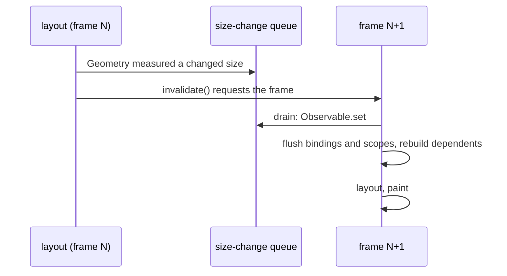

# Geometry: Container-Scoped Measured Size

An adaptive layout sometimes reacts to the size of one container, not the
window: a panel that reflows on its own width, a local breakpoint. A widget's
measured size is stored by `WidgetKernel.set_layout_rect` as a layout result,
and a widget cannot read its own size in `build()`, because the parent decides
it afterwards.

`Geometry` is a widget that measures its own box and publishes the result to
its subtree, read reactively through `Geometry.of(context)`. The window is the
root `Geometry` provider, so one read path serves the window and any nested
container.

## Why Not an Environment Value

The `.of(context)` convention, backed by `Widget.find_ancestor`, already
carries [Navigator](NAVIGATION.md) and [Theme](STYLE_THEME.md). A measured
size cannot ride the same kind of mechanism, because environment values differ
by where the value comes from:

| Source | Examples | Nature |
| :--- | :--- | :--- |
| **(A) Author-set** | theme, directionality, locale, text style | A literal the author supplies. Set once, inherited down, overridable per subtree. |
| **(B) System-provided at root** | density, colour scheme, safe area, orientation, text scale | Read-only, produced once at the window and inherited unchanged. Behaves like (A). |
| **(C) Layout-derived per node** | resolved size, available space | Produced by the layout of the node itself. Re-derived at every nesting level, and known only after the layout phase. |

A generic environment (SwiftUI `Environment`, Compose `CompositionLocal`,
Flutter `InheritedWidget`) carries (A) and (B): a value is pushed in at one
place and read below. (C) has no single value to inherit, since each
`Geometry` re-measures its own box, and it exists only after build. So size
gets a dedicated provider while theme, locale and density do not. Families (A)
and (B) belong to a general environment mechanism, a separate decision that
affects whether `Theme` migrates onto it. `Geometry` is built on the
`.of(context)` convention so that such a mechanism, if it comes, can surface
geometry through the same read path without an API break.

## The Publish Waits for the Next Frame

A frame is build, then layout, then paint, and the build flush (bindings,
scope recompositions) runs before layout. A container's size is known only
during layout, where an `Observable` write is forbidden
([RENDERING_PIPELINE.md](RENDERING_PIPELINE.md)). So `layout()` queues the
measurement on the post-layout queue (`widgeting.widget_size_change`), and the
app drains that queue at the start of the next frame, before that frame's
build flush.

The publish and the layout pass are serialised across frames, so nothing a
consumer can observe changes mid-pass. A rebuild driven from layout is
deferred by construction, which sidesteps the re-entrancy a synchronous
build-during-layout `LayoutBuilder` exposes to callers.

Deferring only the recomposition would not be enough. A write that propagates
synchronously runs every `bind_to` setter at once, and a lazy reader such as
`Text`'s label resolution picks up the new value the moment it is asked. A
`Text` bound to the size and laid out ahead of the `Geometry` in the same
`Column` would see the old value, a widget after it the new one, and the frame
would paint torn. So the write itself waits for the between-frames flush.

`ScrollViewport` publishes its metrics through the same queue, with one
refinement: the metrics are also recorded in plain synchronous fields during
layout, which paint, hit testing and offset clamping read within the same
frame. Only the `Observable` publish defers. The accepted cost is latency: a
reactive consumer sees a measurement one frame after the layout that produced
it, which is imperceptible.

## The Widget

`Geometry` wraps a single child and is transparent to layout: the child
receives the size `Geometry` receives. Descendants bind
`Geometry.of(context).size`, an `Observable[Size]`, mapping it into a value
widget or a `Deck` index; a `.value` read at build time is a snapshot that
never updates. The nearest provider wins, so a `Geometry` around a panel makes
its descendants react to the panel, not the window.

It is a widget, not a modifier: scope boundaries in nuiitivet are widgets
(`Navigator`, `Overlay`), and `.of(context)` needs a real ancestor node. It is
named `Geometry`, not `GeometryScope`: it measures its own box, and "scope"
over-claims. `Geometry.of` parallels `Theme.of` and `Navigator.of`, and
nesting overrides the same way.

## What It Publishes

`size` is one atomic `Observable[Size]`. Separate `width` and `height`
observables were rejected: a consumer could read a new width with an old
height. A reaction to one axis is a `computed` derived from `size`.

Constraints (min and max available space) are not published. nuiitivet has no
`BoxConstraints`-style model: a parent assigns a concrete allocated rect, and
the only bound in the pipeline is the one-way `max_width` / `max_height` hint
that `preferred_size(...)` receives during measurement. Exposing constraints
would add a concept the layout has nowhere else, a layout-model extension
rather than a small addition, and the resolved `size` already answers "how
much space do I have" for the filling case.

A context-free `App.window_size` for code outside the tree (a view model that
cannot call `.of(context)`) is left out until there is demand.

## Oscillation

Rebuilding a subtree can change the size the `Geometry` measures, which would
re-fire the update across frames. `Geometry` writes `size` only when the
measured value changed, so an equal size triggers no recomposition; the guard
is the framework's, not the caller's. A `Geometry` whose size is imposed by
its parent, such as one filling a panel, cannot feed back at all: rebuilding
its child does not change it. That is safer than a Flutter `LayoutBuilder`,
where the builder's output is what gets measured.

## The Window Is the Root Provider

The app wraps the content root in a `Geometry` (`Window._wrap_with_chrome_and_scope`),
so `Geometry.of(context).size` with no nearer provider is the window size. The
root provider needs no resize plumbing: it measures the window through the
normal layout pass, which a resize already triggers via `invalidate`.

An `App.of(context).size` was rejected because a second read path fragments
the first. An MD3 window size class is not provided: it would be a thin
wrapper over this read, and `Geometry` is already the container-scoped read
that a window size class is the coarser predecessor of.

## `on_size_changed`: the Push Counterpart

The declarative read fits a subtree that rebuilds on a size. It fits badly
where the size is consumed imperatively, by a view model or a plain
`Observable` the widget owns: pull semantics buy nothing there, while still
charging the `on_mount` timing rule, the subscription disposal and the
provider-scope concept.

`on_size_changed(callback)` reports a widget's own measured `Size` to that
widget:

| | Use for |
| --- | --- |
| `on_size_changed` | Push, to itself. Measurer and consumer are the same widget. |
| `Geometry` | Pull, from a scope. Descendants at any depth read an ancestor's size without the widgets between knowing. |

`Geometry` stays the mechanism for the provider-shaped problem, which push
cannot express. That split is part of why no size-class layer is needed.

It is not a provider: it creates no scope and is not resolvable via `.of()`.
Like `on_mount` / `on_unmount` it does not wrap the target; the callback is
registered on the widget itself and no node is added to the tree.

Dispatch is between frames, never during layout. A size callback is arbitrary
user code that may mutate the tree, so `set_layout_rect` does two things only:
it stores `_layout_rect`, a layout result, and appends the measurement to the
framework-internal queue (`widgeting/widget_size_change.py`). Nothing in the
tree is mutated and no `Observable` is written during layout. `Window._render_frame`
drains the queue at the start of the next frame, before the build flush, so
the effect lands one frame after the measurement. `Geometry` and the scroll
metrics publish through the same queue.

The one side effect the layout pass keeps is a frame request: queuing calls
`invalidate()`, because a draw-on-demand app would otherwise never reach the
flush and the callback would never run. `mark_needs_layout()` already does
the same from inside layout.

An in-frame dispatch, after layout and before paint, was implemented and
rejected. It removed the latency and made a one-shot `render_to_png` correct,
but it created a frame phase the framework does not otherwise have,
recomposition and mounting on an already-laid-out tree, to serve a tooling
concern. Snapshots instead settle explicitly at the entry point
(`Window._settle_pending_size_changes`, capped by
`_MAX_SNAPSHOT_SETTLE_PASSES`), which simulates the frames an interactive app
would have drawn. `Geometry` samples rely on the same settle.

The queue is keyed by widget and holds the latest measurement, so several
layout passes in one frame report once; the report carries size only, so a
widget that merely moves is silent; an equal size is de-duped per widget, the
oscillation guard restated for the push path; and the callback fires once
with the first measurement, so it alone can seed the state it drives.

That first call lands after the first paint, so an `Observable` seeded with a
value the initial size does not imply produces one transition on startup; the
de-dupe absorbs it when the seed matches. An eager first dispatch was
rejected: it would mean two dispatch rules for one feature, where the
mitigation is a sensible initial value in app code.
