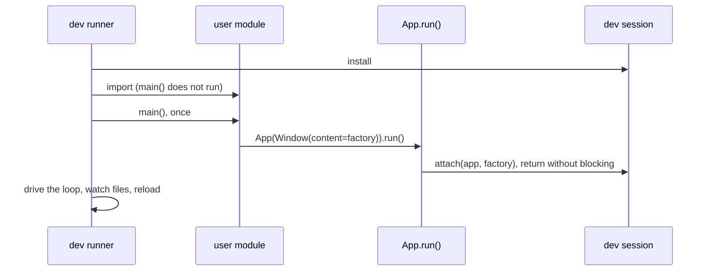

# Hot Reload

When a developer edits UI code and saves, the widget tree is rebuilt in
place and the change appears at once, while the window, the GL context, the
debugger session and the app's `Observable` state survive. The design is
optimised for the VSCode F5 experience: the app launches under the standard
`debugpy` adapter and a save reloads the tree, with no custom debug adapter
and no editor extension, because reloading modules and rebuilding a tree is
ordinary Python and breakpoints keyed by file and line keep firing in reloaded
code. The dev bridge that sees and drives the reloaded app is
[DEV_BRIDGE.md](DEV_BRIDGE.md); the layout edit mode that applies its edit
through this reload is [DEV_MODES.md](DEV_MODES.md).

## Principles

1. **Single codebase.** The same `main()` serves production and development;
   user code carries no dev/prod branch.
2. **Import is not execution.** Importing the user's module never starts the
   event loop or runs `main()`; the runner decides when execution happens.
3. **Reload via factory.** The tree is rebuilt by re-invoking a retained root
   factory, never by re-executing the user's module.
4. **Side effects once.** Global init, logging setup, DI wiring and window
   creation run once at startup and never again on reload, because `main()`
   is never re-invoked; initialisation that must run per tree build belongs
   in the factory.

## The Factory and the Handoff

`Window(content=...)` takes a root factory, a zero-argument callable
returning the root widget; a `Widget` subclass is a factory, and arguments
close over a `lambda`. A `Widget` instance is accepted too, but a tree cannot
be rebuilt from an instance, so hot reload is inert for that root and the dev
runner warns once.

The production and dev paths differ only inside `App.run()`. Under
`python -m yourapp`, `run()` blocks on the event loop. Under
`python -m nuiitivet.dev run yourapp/app.py`, the runner installs a
process-global dev session (`dev/session.py`), imports the user module under
its real name without running `main()`, then calls `main()` exactly once;
`App.run()` finds the session, hands it the app and the factory, and returns
without blocking, and the runner drives the event loop, the file watcher and
the reloads. The session is `None` in production, which is what keeps
`run()` blocking there.

The launch target is a file path or a dotted module (`--module`), and either
is imported under a real, stable name, never `__main__`, so `importlib.reload`
can re-run it and relative imports resolve. For a path the module name is
recovered by walking up while `__init__.py` files are present, and the
package root's parent goes on `sys.path`. `sys.argv` becomes the app's path
plus anything after a `--` separator, set before the import because a module
may parse arguments at import time, and it is never restored: the reload
re-imports user modules, and the runner's argv would break the next save.
`pdb` and `cProfile` do the same.

## What a Reload Rebuilds

Only the user's content tree is rebuilt; the window, chrome and theme are
preserved. `Window._rebuild_content_root(new_factory=None)` re-invokes the
factory, rebuilds the navigator and overlay stack and re-wraps it with the
preserved shell and scopes, returning the new root unmounted so the
orchestrator can snapshot old state and restore it before mount.
`Window._commit_content_root(new_root)` unmounts the old tree, clears the
interaction state that pointed into it (focus, hover and pressed targets,
pointer captures; otherwise the old tree leaks and stale focus bleeds into
the new one), installs and mounts the new root and forces a repaint.

On a save, the runner, on the UI thread:

1. **Snapshots** every mutable `Observable` value in the live tree by
   structural path, and the declarative navigation stack.
2. **Reloads** the user's modules in dependency order and re-fetches the
   factory.
3. **Rebuilds** the content root.
4. **Hands over** the overlay's intent-shown entries.
5. **Commits** the new root.
6. **Restores**: shows the overlay entries again, writes the snapshot values
   into the matching observables of the new tree, replays the navigation
   stack onto the rebuilt navigator, repaints.

Every widget and `Observable` is recreated by the factory; "preserving
state" means copying `Observable` values across, never carrying live objects.
An error in steps 2 or 3 keeps the previous tree; the orchestrator never
commits a broken one.

### User Modules, Reloaded in Dependency Order

A module is the user's, and reloadable, when its `__file__` lies under the
launched project root and outside the standard library and `site-packages`,
and a name blacklist (`nuiitivet`, `skia`, `pyglet`) applies on top, so the
framework and the C-extension modules are never reloaded even if a file sits
under the project root. The watcher's set is built from these modules'
`__file__` values, so a newly imported user module is watched automatically.

All user modules are reloaded on every change, leaves first. Reloading only
the saved file would leave a dependent's `from .widgets import W` bound to
the stale class, the classic `importlib.reload` ordering hazard. The graph is
approximated from each module's globals, imported submodules and the
`__module__` of imported classes and functions, and walked in DFS post-order;
a cycle is broken arbitrarily. Before reloading, each module's cached `.pyc`
is removed and `importlib.invalidate_caches()` called: `importlib.reload`
recompiles only when it judges the `.pyc` stale, by second-granularity mtime,
so a save in the same wall-clock second as the last compile would reload
stale bytecode.

The factory captured at startup resolves its module globals at call time, so
changes inside the widgets it builds are picked up on their own. A change to
the factory's own definition is picked up by re-fetching it by name from the
reloaded module, which requires a module-level named symbol; a `lambda` or a
locally defined factory cannot be re-fetched, so its own definition changes
are not observed while its widgets' still are.

### State Snapshot and Restore

The snapshot walks the mounted tree, `children` and `built_child` alike
(where `ComposableWidget` state lives), and records every mutable
`Observable` held as a widget attribute, keyed by a structural path: each
segment is the widget's `key` when it has one, otherwise its child index and
type, with the attribute name last. Restore walks the rebuilt tree the same
way. When the structure is unchanged, the common "tweak a padding" case,
every path matches. A widget with a `key`, the same identity the dev bridge
targets, keeps its path across a reorder or a sibling insertion; a keyless
widget that is added, removed or reordered leaves unmatched paths at the new
tree's initial value, a documented degradation. Only in-tree observables are
handled; a module-level observable is re-initialised by the reload.

### Navigation Stack Restore

The rebuilt tree starts a fresh navigator at its initial route, so pushed
routes would be lost. The navigator logs a restore descriptor for every
`push`: a declarative push of an intent against a `Navigator.intents(...)`
or `Navigator.routes(...)` table records the intent value plus its type's
qualified name; an imperative push of a widget instance records an opaque
marker, since the instance was built from the old code with no factory to
rebuild it, the same instance-versus-factory constraint as the root. The
initial stack is rebuilt by the factory and not logged.

`snapshot_navigation()` reads the log before the swap; `restore_navigation()`
replays each descriptor onto the fresh navigator after the commit, resolving
the intent by qualified name, because the reload redefines the intent class
and the live `type(intent)` no longer equals the new route-table key. Each
restored route is pushed without animation. Replay stops at the first
non-restorable entry, an opaque push or an intent whose route is gone,
leaving the rest collapsed.

### Overlay Entry Restore

The rebuilt window starts a fresh overlay, so every open entry would close.
An entry shown from an intent is shown again. The overlay records each entry
a presenter shows from an intent, the intent value, a replay function and
the handle, and the replay is framework code, which a reload does not
replace; `MaterialOverlay.dialog()`, `side_sheet()` and `bottom_sheet()`
record, with the placement arguments bound so a sheet keeps its side. An
entry shown from a widget is not recorded and closes. The record lives in
the core `Overlay`, so another design system only records its presenters;
keeping it in `MaterialOverlay` was rejected because each design system
would rebuild the handover.

`snapshot_overlay()` runs after a successful rebuild and before the commit,
and from then on disposing a recorded entry leaves its handle pending; a
snapshot before the rebuild would leave the handle pending forever when the
rebuild fails. `restore_overlay()` replays bottom to top after the commit and
before the `Observable` restore, so a re-shown entry gets its state back,
resolving the intent by qualified name as above. The new entry takes over
the old entry's future and the old handle points at the new entry, so an
`await` started before the reload receives the value chosen after it; that
coroutine still runs pre-reload code on pre-reload objects, so a value it
writes into a ViewModel of the old tree does not reach the screen, and the
objects cannot be carried over, being live instances of replaced classes. An
entry whose intent no longer resolves is dropped with `DISPOSED`, and the
entries above it are still restored, since overlay entries are independent
layers unlike a navigation stack. A re-shown entry plays its enter transition
again.

## Threading and Errors

Widget-tree mutation is UI-thread-only
([CONCURRENCY_MODEL.md](CONCURRENCY_MODEL.md)). The file watcher runs on a
background thread and only signals that a file changed; a clock callback on
the UI thread drains the signal and performs the reload. A save made while
stopped at a breakpoint, with the loop paused, is therefore queued and
applied on resume.

Editing is a half-broken-code activity, so a syntax or build error on save
never tears down the app or the debug session. The previous tree is kept and
the error is reported two ways: the full traceback on `stderr`, visible in
the VSCode debug console, and a best-effort banner over the still-running
UI, cleared on the next successful reload.

## Implementation Map

| Design area | Module |
| --- | --- |
| dev-session detection and handoff | `App.run()` (`runtime/app.py`), `dev/session.py` |
| content-subtree rebuild and commit | `Window._rebuild_content_root` / `_commit_content_root` (`runtime/window.py`) |
| launch-target resolution | `dev/loader.py` |
| user-module identification, dependency-ordered reload, `.pyc` invalidation | `dev/reloader.py` |
| state snapshot and restore | `dev/snapshot.py` |
| navigation stack and overlay entry restore | `dev/navigation_snapshot.py`, `dev/overlay_snapshot.py` |
| file watching, background thread to UI thread | `dev/watcher.py`, `dev/controller.py` |
| error banner | `dev/error_overlay.py` |
| CLI entry | `dev/__main__.py` |
