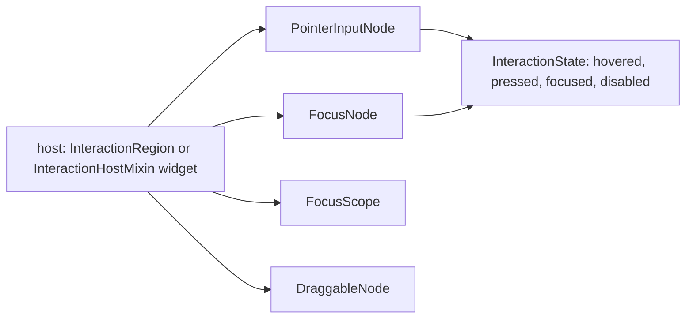

# Interaction Architecture

Pointer events, focus and keyboard input are handled by **nodes** hosted on a
widget. A host is an `InteractionRegion` or any widget with
`InteractionHostMixin`; the nodes on one host share one `InteractionState`.

- `PointerInputNode` turns hover, press and release into state flags and an
  `on_click` on a valid press-and-release, and requests focus for its host on
  press when a `FocusNode` is present.
- `FocusNode` holds focus, takes part in traversal and receives key and text
  events.
- `FocusScope` marks a subtree as one traversal group.
- `DraggableNode` handles drag start, deltas and end, with long-press
  initiation.

A host is composed in one of two ways. A modifier (`focusable()`,
`clickable()`) wraps an arbitrary widget in an `InteractionRegion` that hosts
the nodes. A standard control (`Button`, `Checkbox`, `TextField`) inherits
`InteractionHostMixin` and adds its nodes in `__init__`, so no wrapper deepens
the tree. Either way the widget reads visual state (hovered, pressed, focused,
disabled) from the one shared `InteractionState`.

A new capability is a new node on the same host; the drop target, scrolling,
semantics and context-menu concerns are shaped to fit that slot rather than a
new hosting mechanism.

## Focus

### Focusable Is Not Traversable

Holding focus and being a stop in the Tab sequence are two properties:

| Property | Carrier | Meaning |
| :--- | :--- | :--- |
| Focusable | owning a `FocusNode` | Can hold focus, receive keys and paint a focus ring. |
| Traversable | `FocusNode.traversable` (default `True`) | The global Tab sequence stops on it. |

`_collect_focus_nodes` collects only traversable nodes. A node with
`traversable=False` is still focusable: it can be focused programmatically,
typically by the `FocusScope` that owns it, it receives keys and its keys
bubble; Tab merely never lands on it. `Clickable` and `InteractiveWidget`
take `traversable` as a constructor argument, and `Clickable.set_traversable()`
flips it afterwards, because a widget does not always know at construction
that it belongs to a group: a `RadioButton` meets its `RadioGroup` when it is
mounted.

This split is what makes a group (a menu, a multi-handle slider) expressible.
Without it, every focusable part of a widget is unavoidably its own Tab stop.

### Traversal

Tab moves forward and Shift+Tab backward through the traversable nodes in
depth-first tree order. On Tab, the `FocusScope` enclosing the focused node is
consulted before the global sequence. `FocusNode.focused` syncs to
`InteractionState.focused` on the host, which drives the focus ring.

### What Tab Can Reach

Being mounted is not the same as being on screen. A `Collapsible` closes, a
`Deck` switches page, a route is pushed over another, a modal opens: the
content stays in the tree, keeping its state, while the user can no longer see
or click it. Tab stops at the same boundary the eye does, or the focus ring
vanishes and keystrokes go to an invisible widget. Two hooks express that at
two granularities:

| Hook | Granularity | Used by |
| :--- | :--- | :--- |
| `FocusTraversalBlocker.blocks_focus_traversal` | Hides the widget's whole subtree | disabled `Clickable`, closed `Collapsible`, `visible(False)` |
| `Widget.focus_traversal_children()` | Narrows to some of the children | `Deck` (the selected page), `Navigator` (the top route) |

The blocker cannot express "keep one of N children reachable", which is why
the second hook exists. `focus_traversal_children()` defaults to
`children_snapshot()`, so a container opts in only by narrowing it, and it
resolves the narrowing on every call: a `Deck`'s index addresses the
post-expansion child list, and a `ForEach` can change its item count at any
time.

A blocking overlay entry is handled one level up, in
`Window._focus_traversal_root`: while a modal is open the whole sequence starts
at that entry's content, so Tab is trapped inside the dialog instead of
walking out into the background. `Window._sync_overlay_focus_trap` moves focus
into the entry on open and gives it back to the invoker on close; no traversal
rule can do that half, since by then the dialog is already detached.

Everything follows from one walk. `Window._iter_focus_traversal` yields the
reachable widgets; `_collect_focus_nodes` filters it to traversable nodes, and
`_release_focus_if_blocked` searches it for the focused widget and drops focus
that is no longer there. `is_foreground` in
[KEYBOARD_SHORTCUTS.md](KEYBOARD_SHORTCUTS.md) asks the same hooks from the
other direction, so a `FOREGROUND` shortcut and a Tab stop buried in the same
hidden content agree about being out of reach. Off-screen children of a
`Scrollable` are reachable, which matches browser behaviour.

### Focus Source

Focus carries a `FocusSource` (`KEYBOARD` / `POINTER`), and MD3 suppresses
the focus ring when focus is pointer-driven
(`InteractiveWidget.should_show_focus_ring`).

The source can change without focus moving: dragging a slider that Tab
focused makes it pointer-driven, and Tab-ing between its handles makes it
keyboard-driven again. Since `request_focus` and `FocusNode._set_focused` both
short-circuit when nothing changes, `FocusNode.notify_focus_source(source)`
re-announces the source in that case; without it the ring state sticks at
whatever the last focus change said.

A widget that takes focus on its own has no source to report; a `Menu`
focusing its first item when it opens is the case. It inherits
`Window._last_input_source`, whether the last input was a key press or a
pointer press, so a mouse-opened menu does not come up wearing a keyboard focus
ring. The item is still focused, because the arrow keys need somewhere to
start; it does not look keyboard-driven until the keyboard drives it.

## Key Events

A key event goes to the focused `FocusNode`'s `on_key`. A handler that returns
`False` lets it bubble to the nearest ancestor `FocusNode`, and an event that
reaches the root falls to the window's default actions, Tab traversal among
them.

A `FocusNode` also receives the text-level events a text field needs, each
dispatched by the window to the focused node: `on_text` for a committed
character, `on_text_motion` for arrows, Home, End, Backspace and Delete, and
`on_ime_composition(text, start, length)` for a composition update, where
`start` and `length` mark the range the IME highlights inside `text`.

## Focus Traversal Groups

Some widgets own keyboard navigation inside themselves: `RangeSlider` between
its handles, `Menu` between its items. Both are one problem, a widget that
traverses its own parts and decides when Tab escapes, and both use one
primitive. A `FocusScope` marks a subtree as one group, the unit Tab enters and
leaves, and delegates to a `FocusTraversalPolicy` that enumerates the members
and tracks the current one.

The policy is small, so that real-node owners and virtual-stop owners
implement the same thing: `members()` in traversal order, `current_index()`,
`set_current(index)`, `entry_index(backwards)` for the member Tab enters at,
and `on_boundary(direction)` for a step past the last or before the first
member. Two member shapes are built in: `FocusNodePolicy`, whose members are
real child `FocusNode`s marked `traversable=False` so only the policy moves
focus between them (a menu's items), and `VirtualStopPolicy`, whose members
are stops the owner keeps for itself while focus stays on its own `FocusNode`
(a slider's handle indices).

Tab enters at the first member and Shift+Tab at the last by default, so
Shift+Tab into a `RangeSlider` lands on the far handle; a `RadioGroup` enters
at the selected radio. `FocusScope.move(step, wrap=)` roves to the adjacent
member; whether Tab roves is the scope's `tab_roves`: a slider roves on Tab, a
menu roves on the arrow keys and makes every Tab a boundary. At the boundary
the policy returns `False` to let Tab escape to the next outside stop or
`True` to consume it (a popup menu dismisses).

`Window._dispatch_key_press` consults the scope enclosing the focused node
before the global traversal, because the focused node may not be a Tab stop at
all (a menu item), and the "focused node is not in the list, restart from the
first stop" fallback would otherwise fire first. Scopes resolve innermost
first, so an open submenu answers for the focus inside it. When a scope lets
Tab escape and the focused node is not itself a stop, traversal resumes from
the scope owner's own stop (`Window._scope_owner_node`).

A group has one external Tab stop, except a popup menu, which has none: it is
entered by opening it, and its boundary dismisses it. An inline menu keeps
one stop, the surface, because WAI-ARIA makes a permanently visible menu a
single stop. A single-handle `Slider` is a one-member scope: Tab enters,
finds no second member and hands the key back to the global sequence.
Submenus are nested scopes. A disabled member has no `FocusNode` at all, so
the policies enumerate exactly the members the keyboard should reach.

Wrap versus stop-at-edge, and what roving moves, are per-widget decisions.
A `RadioGroup` follows the WAI-ARIA radio group: the arrows wrap and moving
focus moves the selection, which is why Tab enters at the selected radio; both
axes rove because a radio group is laid out as a `Row` or a `Column`. A button
group follows the WAI-ARIA toolbar: Left/Right stop at the ends, and roving
moves focus only, since its items are actions or independent toggles. A
`NavigationRail` mixes the two: it enters at the selected item and wraps like
a radio group, but roving moves focus only, because selecting a destination
navigates, too heavy to fire on every arrow press; only Up/Down rove, since a
rail is always a column. The rail's expand/collapse button is not a member but
an ordinary stop above the group, so the group's `FocusNode` and `FocusScope`
live on a dedicated item-group widget below that button; on the rail root they
would order the stops wrong and capture the button's focus.

A per-widget Tab interception (`RangeSlider` intercepting Tab through a
callback on its `FocusNode`) was rejected in favour of the scope: it was a
hand-rolled focus scope that served only virtual stops and could not express a
menu, whose members are real focus nodes that must not be Tab stops.

### Menu Keyboard Model

MD3 does not specify a menu's keyboard behaviour, and real applications
disagree: the WAI-ARIA APG example focuses the first item however the menu was
opened and closes on Tab, while desktop menus (Chrome, macOS, Windows)
highlight nothing until the user reaches for the keyboard. The model below is
a reading of the desktop convention and may change.

| Trigger | Behaviour |
| :--- | :--- |
| Opened with the pointer | Focus enters the menu but lands on the surface: no item is current, nothing is highlighted. Arrows, Tab, Escape and Enter reach the menu from there; Enter, with no current item, does nothing. |
| Opened from the keyboard | The first enabled item becomes current, with its ring; `Window._last_input_source` decides which case applies. |
| Up / Down | Rove the enabled items, wrapping. From "no item current" they enter at the first (Down) or last (Up). |
| Tab / Shift+Tab | Rove without wrapping; stepping past the end is the boundary. The first Tab in a pointer-opened menu lands on an item rather than closing the menu, because Tab is the key users press to be handed the focus. |
| Right / Left | Walk into and out of a submenu. |
| Escape | Dismiss. |

Whether Tab and the arrows should both rove, and whether "nothing is current"
is worth its complexity, is revisited when accessibility lands, since a screen
reader's expectations pull the other way.
