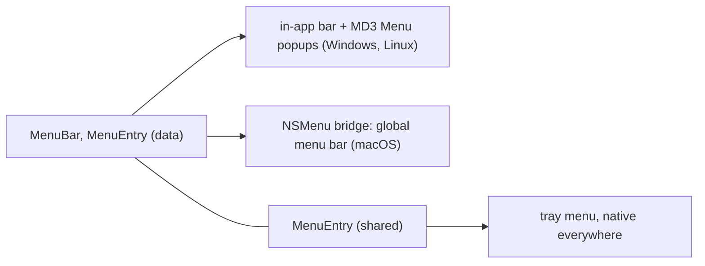

# Menu Bar Design

The menu is a declarative model registered on `Window`, `Window(menu=...)`
beside `title=` and `chrome=`, not a widget in the tree. On macOS the menu
lives outside the window, in the global bar, so a widget-tree API could not
be truthful on both platforms. One model feeds three surfaces:

Context and dropdown menus attached to widgets are the MD3 `Menu` /
`MenuItem` widgets, a different thing; the tray icon reuses `MenuEntry` and
is [TRAY_ICON.md](TRAY_ICON.md).

## The Model

`MenuBar(items, *, style)` is the root and `MenuEntry` the one item type:
an action (`on_select`), a submenu (`submenu=[...]`, top-level titles
included, nesting unlimited) or a separator. A non-separator has exactly one
of `on_select`, `submenu` or a standard-item role, and `submenu` excludes
`shortcut` and `checked`; a violation raises at construction, not at render.
The names avoid the MD3 widgets `Menu` / `MenuItem`. `MenuEntry` is
surface-neutral and lives in `nuiitivet/menus/`, shared with the tray;
`MenuBar` is bar-specific and lives in `nuiitivet/menubar/`.

These are plain data classes, not widgets, and that is what makes the macOS
bridge possible: `NSMenu` renders labels, accelerators and check marks, not
widget subtrees.

There is one activation path, `on_select`; built-in commands are standard
items, and there is no `intent=`. `label`, `enabled` and `checked` are
`Observable`-bindable, following `title=` on `Window`, and their changes
propagate live to whichever surface renders the model, a repaint for the
in-app bar and `setTitle:` / `setEnabled:` / `setState:` for `NSMenu`.
Structure is not observable: adding or removing items is wholesale
replacement through `window.menu`, which rebuilds the surface, rather than
diffing. `checked` must be writable, since activation toggles it.

A standard item is a `MenuEntry` factory carrying a `MenuRole`
(`quit()`, `close_window()`, `minimize()`, `maximize()`, `restore()`,
`full_screen()`), and activation calls the mapped `App` or `Window` method
through `MenuBarController` on every platform, so window management and app
exit stay on one code path. Standard items absorb the platform conventions:
labels ("Exit" against "Quit", "Maximize" against "Zoom"), default
accelerators, and placement, where on macOS `quit()` relocates to the
application menu. A callback that needs the window or the app references it
through an ordinary closure; the model is data outside the tree, so
`.of(context)` does not apply.

A shared entry acting on whichever pane is focused ("Save" over several
documents) is wired in the app: an app-owned `Observable` of the active pane,
written on focus change and read by the entry's `on_select`. SwiftUI's
`@FocusedValue` and WPF's `RoutedCommand` solve this with a framework
primitive through which the focused subtree publishes an action; nuiitivet
adds none, because the app-level observable matches the ViewModel
convention and keeps the wiring visible. Revisit only if deep pane nesting
makes tracking the active pane duplicate focus logic the framework already
has.

## Activation and Accelerators

Every route, a click, keyboard navigation, an accelerator or the native
macOS menu, funnels into `MenuBarController.activate(item)`: a checkable
item toggles `checked` first, then a standard item calls its role's method
and any other item its `on_select`, async callbacks scheduled as
`key_shortcut` schedules them. A disabled item never activates.

The item's `shortcut` is the single source of truth for display and firing,
and per platform exactly one mechanism fires. On Windows and Linux the bar
registers each shortcut with the shortcut system at `ShortcutScope.MOUNT`,
live while the bar is mounted and gated by `enabled`, and only displays the
accelerator itself. On macOS the shortcuts become `NSMenuItem` key
equivalents and the native menu fires them; the in-app bar does not render
there, so its bindings never register and no double fire is possible.
Declaring the same gesture with `key_shortcut()` as well is an authoring
error, handled by the shortcut system's ambiguity rule. Display strings come
from the shared `Shortcut` model, so `MOD_ACCEL` renders as `⌘` on macOS
and `Ctrl` elsewhere.

## Placement

With no explicit placement the window inserts the in-app bar at the top of
the content area, below the chrome, for `OSChrome` and `CustomChrome` alike;
the bar takes part in layout and the content shrinks. The slot is inserted
only when a menu is registered at construction, so a menu-less window
carries no extra widget.

`MenuBarArea` marks where the model should render instead, inside a
`CustomChrome` header for instance. A mounted area suppresses the automatic
insertion; with several, the first renders and the rest are inert, logged
once, because raising would break the mount of an otherwise valid tree and
hot reload with it. An area with no registered menu is zero-size, so a
conditional menu is allowed. The model stays on `Window` in every case; the
area moves only the pixels.

On macOS neither placement applies: the model goes to the global bar, the
automatic slot is zero-size and a mounted area collapses, so a header
written around a `MenuBarArea` degrades to a plain title bar with no
platform branching in app code.

## Windows and Linux: the In-App Bar

The bar (`menubar/bar.py`) renders the top-level items horizontally, and an
open menu is a popup through the overlay's anchoring, reusing the MD3 `Menu`
machinery for surfaces, keyboard traversal and submenus through an internal
adapter from `MenuEntry` data. The MD3 widgets' API is unchanged; their
colours come from the menu bar's own palette. Two contracts with the
overlay: the popup treats an unmount as a dismissal only when its entry's
result is settled (`OverlayHandle.done()`), since the overlay may remount
live entries, and it restores its focused row across such remounts, which
would otherwise drop the keyboard focus.

## macOS: the `NSMenu` Bridge

The bridge is built on pyglet's bundled `cocoapy` (`ObjCClass`,
`ObjCSubclass`), imported lazily and only on macOS, so no dependency is
added; pyobjc specifically is not. Two modules each split into pure
translation and a Cocoa layer. `menus/nsmenu.py` holds the surface-neutral
part shared with the tray: `key_equivalent` (`Shortcut` to key equivalent
and modifier mask) and `NSMenuBuilder` (`MenuEntry` to `NSMenu` trees with
live observable sync). `menubar/nsmenu.py` holds the bar-specific part:
`plan_menus` (application-menu synthesis and arrangement) and `NSMenuBridge`
(installing the model as the global bar).

The per-app `MenuBarFocusCoordinator` (`menubar/focus.py`) owns the one
bridge and keeps the global bar on the focused window's model, the main
window's standing in for a `menu=None` window, reinstalling on OS focus
change, model replacement and window close, coalesced onto the next clock
tick; a focus change that leaves the effective model unchanged reinstalls
nothing. Every window attaches when its backend window exists
(`Window._on_window_created`). While a window is attached its in-app slot
collapses, so on macOS an unfocused window's menu waits for focus rather
than rendering in-app.

The bridge translates one way: model to `NSMenu` tree on registration or
replacement, observable changes to targeted setter calls on the next clock
tick so off-thread writes land on the UI thread, and item activation to
`MenuBarController.activate`, which Cocoa delivers on the main thread with
no marshalling. The first menu is always the application menu: a `quit()`
found as a direct child of a top-level menu is relocated into it, one is
synthesised when the model has none, and a top-level action item degrades to
a menu holding that single entry, since the global bar has no direct-action
titles.

## Styling

The menu bar is not a Material component; m3.material.io defines popup menus
and no desktop bar. Like the scrollbar it is a generic framework widget, so
its model, style and theme data live in `nuiitivet/menubar/`, not under
`material/`, and its palette arrives through the `ThemeExtension` seam of
[STYLE_THEME.md](STYLE_THEME.md). `MenuBarThemeData` is registered by each
design system with `ColorSpec` tokens resolved at paint, covering both the
bar (background, item foreground, state layer, open-item highlight,
disabled) and the popup (container, label, accelerator, state layer,
disabled, divider); a bare `MenuBarThemeData()` is neutral literals, so the
bar renders with no design system registered, and the Material registration
uses MD3 role tokens, which is what makes the popups match MD3 `Menu`
widgets under a Material theme. `MenuBarStyle` is per-instance geometry plus
nullable colour overrides, attached to `MenuBar` because the model is always
present where `MenuBarArea` is optional. The popups reuse the MD3 `Menu`
widgets, but the adapter builds their `MenuStyle` from the theme data and
any `MenuBarStyle` overrides, so a non-Material design system gets popups in
its own palette. On macOS neither type applies; the OS renders the bar.
