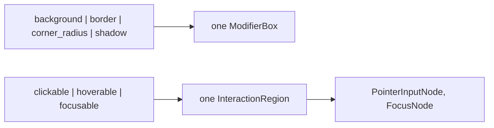

# Modifier System Design

A modifier wraps a widget to add a capability or a visual effect. It composes
behaviour flatly: a widget does not gain a behaviour by inheritance, and the
tree does not gain a nesting level per effect.

## The Model

A modifier is a function from a widget to a widget. `widget.modifier(m)`
returns the wrapped widget; `a | b` chains two modifiers, applied left to
right. A `ModifierElement` is one such function (`BackgroundModifier`); a
`Modifier` is a chain of them.

## Aggregation

A chain of paint modifiers does not become a chain of nodes. The first one
wraps the widget in a `ModifierBox`; each later one merges its property into
that box. `ModifierBox` is a framework-created wrapper, so merging into it is
safe; a user's own `Box` is left alone. Interaction modifiers fold the same
way into one `InteractionRegion`, which hosts the interaction nodes
(`PointerInputNode`, `FocusNode`) and the state they share. The nodes are
described in [INTERACTION_ARCHITECTURE.md](INTERACTION_ARCHITECTURE.md).

## Visibility

`visible(condition)` is a composition of three primitives, not a fourth
mechanism: `opacity()` for the fade, `passthrough_pointer()` so a hidden widget
takes no pointer input, and `block_focus_traversal()` so Tab does not land on
it. With a `transition`, an internal `Animatable` drives the opacity, scale and
translate of the pattern on enter and exit; input is blocked from the moment
the condition turns false, while the exit animation is still playing.

| | `opacity(0.0)` | `passthrough_pointer()` | `visible(False)` |
| --- | --- | --- | --- |
| Visually hidden | Yes | No | Yes |
| Receives input | Yes | No | No |
| Layout space | Reserved | Reserved | Reserved |

A hidden widget keeps its layout slot and stays mounted, so its local state
survives a hide and show. Collapsing the slot to zero was rejected for
`visible()`: a widget that changes the layout is a layout-aware widget
(`Collapsible`), not a paint effect.

## Layout

A modifier never changes layout. Size, spacing and alignment are the widget's
own parameters, so the layout of a tree is read from the tree alone. A
`padding()` or `size()` modifier was rejected: the reader would have to unwind
the chain to know a widget's size.
