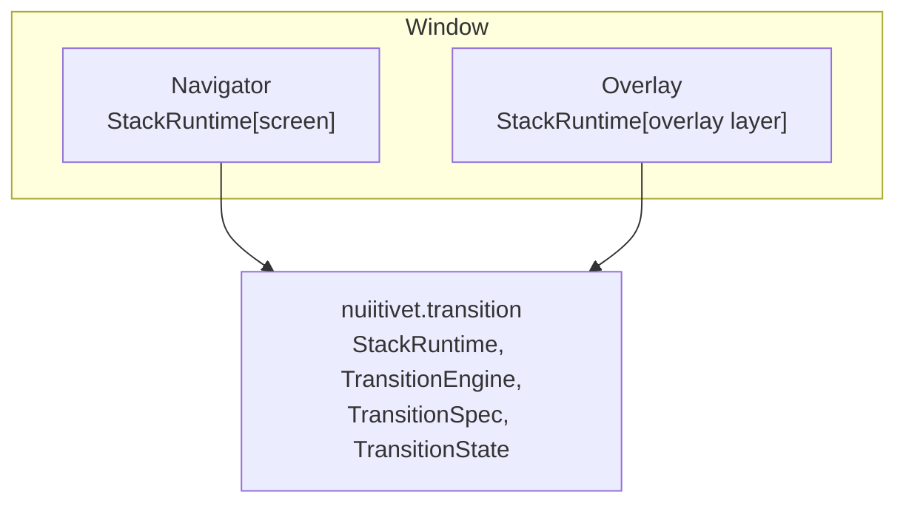

# Navigation System Design

## 1. Core Architectural Structure

### 1.1 Relationship Between Overlay and Navigator

`Navigator.push()` changes the screen. `Overlay.show()` puts a layer on top of it. The window stacks the two side by side, overlay above, and neither imports the other.



Both stacks come from `nuiitivet.transition`. The kernel tracks when an element enters, stays and exits, drives the progress, and says how it moves. It knows nothing of screens or layers: the stack holds any element with a `dispose()`.

The two stacks differ in what the top means. A navigator paints only its top screen; the screens beneath stay mounted, unpainted. An overlay paints every layer, newest on top.

A window scope owns one navigator and one overlay, side by side. A navigator also nests inside the content, because it keeps a history. An overlay does not nest, because modality has one scope. A region that needs its own modality nests the scope itself; the window is the only scope today.

The window takes its navigator through `content`, which may return a `Navigator`. A `navigator=` keyword was rejected: a navigator is built with its first screen, so the keyword would give the initial screen two routes into the window.

Building the overlay on a `Navigator` was rejected. Overlay layers pile up instead of replacing each other, and they must never enter the app's back stack.

### 1.2 Root Navigator Design

Fullscreen transitions are a common pattern, making a window-level Navigator essentially mandatory. Every `Window` provides one by default, reached through the same context lookup as a nested one.

```python
Navigator.of(context).push(...)              # Nearest Navigator, else the window's
Navigator.of(context, root=True).push(...)   # Always the window's
```

### 1.3 Context Lookup Pattern

To support independent Navigators (transition histories) per tab, we implement `Navigator.of(context)`.

- Implementation traverses up the parent chain.
- With no `Navigator` ancestor it falls back to the navigator owned by the `Window` that the context belongs to, found through the window scope wrapping every window root. That keeps the common case a single short call **and** keeps the answer scoped to one window — there is no process-global root, so two windows (or two Apps in one process) never collide.

```python
class Widget:
    def find_ancestor(self, widget_type: type["T"]) -> "T | None":
        """Find the nearest ancestor of the specified type."""
        current = self._parent
        while current is not None:
            if isinstance(current, widget_type):
                return current
            current = current._parent
        return None


class Navigator(Widget):
    @classmethod
    def of(cls, context: Widget, root: bool = False) -> "Navigator":
        """Find the Navigator that navigation from ``context`` should drive."""
        if not root:
            navigator = context.find_ancestor(Navigator)
            if navigator is not None:
                return navigator

        app = find_app(context)
        if app is None or app._navigator is None:
            raise RuntimeError(
                f"No Navigator found for {context.__class__.__name__}: it has no "
                "Navigator ancestor and is not attached to an App."
            )
        return app._navigator
```

### 1.4 Interface for ViewModels (Protocol)

To ensure ViewModels do not depend on the implementation details of `Navigator`, we provide
`NavigatorProtocol` (`nuiitivet.navigation.protocols`).

`MaterialNavigator` adds no public navigation API on top of core `Navigator`, so a single
core-level protocol serves both layers; `nv.NavigatorProtocol` is the same object as
`nuiitivet.NavigatorProtocol`.

```python
from __future__ import annotations

from typing import Any, Protocol

from nuiitivet.transition.spec import TransitionSpec
from nuiitivet.widgeting.widget import Widget


class NavigatorProtocol(Protocol):
    def push(self, screen: Widget | Any, *, transition: TransitionSpec | None = None) -> None:
        ...

    def pop(self) -> None:
        ...

    def can_pop(self) -> bool:
        ...
```

The protocol is deliberately narrow — it covers what a ViewModel calls, not the full
`Navigator` surface. A wider protocol would re-couple the ViewModel to the widget.

## 2. Intent System Design (Navigation Perspective)

### 2.0 What is the Intent System?

The Intent System declares a screen change as data, an "intent", rather than as a widget. The framework resolves the intent to a screen.

```python
# Caller side (Intent)
Navigator.of(self).push(ProductDetailIntent(product_id=123))

# Framework side (Resolution)
# - Look up the factory from routes using type(intent) as the key
# - Build the screen with factory(intent)
```

### 2.1 Intent Type System

Intents are defined as arbitrary dataclasses, requiring no base class or Protocol.

```python
from dataclasses import dataclass


@dataclass
class HomeIntent:
    pass


@dataclass
class ProductDetailIntent:
    product_id: int
```

### 2.2 Routing Table (routes)

`routes` maps an intent type to a factory. The factory returns the screen, or a `(screen, transition)` pair.

```python
routes = {
    HomeIntent: lambda intent: HomeScreen(),
    ProductDetailIntent: lambda intent: (ProductDetailScreen(intent.product_id), Transitions.empty()),
}

Navigator.of(self).push(ProductDetailIntent(product_id=123))
```

### 2.3 `push` and Transitions

`Navigator.push()` takes a widget or an intent. A widget may bring its transition:

```python
Navigator.of(self).push(SettingsScreen())
Navigator.of(self).push(SettingsScreen(), transition=Transitions.empty())
Navigator.of(self).push(SettingsIntent())
```

A transition belongs to the screen, not to the push. A spec carries `enter`, `exit_`, `enter_back` and `exit_back`, and the layer composer maps each screen through its own spec. A screen's `enter` runs when it is pushed, its `exit_` when another screen covers it, its `exit_back` when it pops, and its `enter_back` when the screen above it pops. So the transition given at push travels with the screen until the screen is disposed.

A screen given no transition gets the navigator's default: none for core `Navigator`, `MaterialTransitions.page()` for `MaterialNavigator`. The default is a subclass hook, not a constructor parameter. `Overlay` fixes its defaults the same way, per presenter method, and a screen that needs another motion passes `transition=`.

`transition=` with an intent raises `TypeError`. An intent is a restorable description, and a hot reload replays its factory; a per-call keyword would be lost on restore. The factory gives the transition instead.

The screen and its transition travel as a plain pair, not a class of their own. Naming the pair would pay off with a declarative back stack whose list elements need an identity for diffing; there is none. Internally the navigator wraps the pair in a `Route`, its stack element, which also unmounts the screen on disposal. `pop(transition=...)` is not offered: the motion of a pop is fixed by the specs of the two screens involved.

### 2.4 Handling Missing Intents

If an unregistered Intent is used, a `RuntimeError` is thrown to catch configuration errors early.

```python
Navigator.of(self).push(UnknownIntent())
# → RuntimeError: Intent 'UnknownIntent' not found in routes
```

### 2.5 `Navigator.intents(...)` Initialization Pattern

To enable ViewModels to request screen transitions based on Intents without depending on View (Widget) details, `Navigator.intents(...)` is provided as an Intent-based factory. It is passed directly to `App(Window(...))` so the resulting Navigator becomes the root Navigator.

```python
# App with intent-based navigation
App(
    Window(
        content=Navigator.intents(
            initial=HomeIntent(),
            routes={
                HomeIntent: lambda intent: HomeScreen(),
                DetailIntent: lambda intent: DetailScreen(intent.item_id),
                SettingsIntent: lambda intent: SettingsScreen(),
            },
        ),
        title="My App",
    ),
)
```

For the most common case of starting from a single screen, simply pass the screen to `App(Window(...))`:

```python
# App wraps the Widget in an implicit root Navigator
App(Window(content=HomeScreen()))
# Navigator.of(self).push(...) works anywhere.
```

Use `Navigator.routes([...])` when the navigator must start with a pre-populated stack (e.g. deep linking, state restoration):

```python
App(Window(content=Navigator.routes([HomeScreen(), DetailsScreen()])))
```

## 3. Back Button Handling

### 3.1 Event Propagation Priority

The default behavior for events equivalent to `Esc` / `Back` is processed in the following order:

1. Close the topmost Overlay entry.
2. `pop()` the topmost Navigator.
3. Do nothing if at the root route.

```python
class App:
    def on_key_pressed(self, event):
        if event.key == "ESCAPE":
            if self._overlay.has_entries():
                self._overlay.close()
                return True

            if self._navigator and self._navigator.can_pop():
                self._navigator.pop()
                return True

            return False
```

### 3.2 Handling Rapid Back Button Presses (Multiple Inputs)

In cases where `Esc` / `Back` are input in rapid succession (key repeat, hammering, multiple OS-level events), the implementation must safely handle "back requests."

#### Policy

- `App.handle_back_event()` processes exactly one request per input.
- If the Overlay is empty, it calls `Navigator.request_back()`.
- A back action never reaches past a **blocking** layer. An entry stays open
  until its exit animation finalizes, so a dialog that has been dismissed but is
  still on screen has nothing left to close — and the event stops there rather
  than popping the route the user can still see behind it. A pass-through layer
  (toast, banner) blocks neither.
- `Navigator.request_back()` acts as the user input API, absorbing re-entrancy during transitions.

#### Navigator Strategy

- If a back occurs during a **Pop** animation: add the request to a queue (`pending_pop_requests`) and immediately complete the current pop transition.
- When consuming the queue: skip animations for intermediate pops and treat only the final pop with normal behavior.
- If a back occurs during a **Push** animation: immediately complete the push and then perform a single pop.
- If `handle_back_event()` (equivalent to will-pop) returns a cancellation, discard the queue and stop further pops.

### 3.3 `will_pop()` Modifier

Custom handling, such as confirmation before a back transition, is implemented as a Modifier.

```python
from nuiitivet.modifiers import will_pop
from nuiitivet.material import ButtonStyle

EditScreen().modifier(will_pop(on_will_pop=self._on_will_pop))


async def _on_will_pop(self) -> bool:
    """Return True to continue pop, False to cancel."""
    if self.has_unsaved_changes.value:
        confirmed = await Overlay.of(self).dialog(
            BasicDialog(
                title=Text("Confirmation"),
                content=Text("Go back without saving?"),
                actions=[
                    Button("Cancel", on_click=lambda: False, style=ButtonStyle.text()),
                    Button("Back", on_click=lambda: True, style=ButtonStyle.text()),
                ],
            )
        )
        return confirmed
    return True
```

### 3.4 Integration with Navigator

Check the `will_pop` chain immediately before `Navigator.pop()` to allow for cancellation.

```python
class Navigator(Widget):
    async def pop(self, result=None):
        if not self.can_pop():
            return

        route = self._routes[-1]
        widget = route.widget

        if hasattr(widget, "_modifier_element"):
            element = widget._modifier_element
            should_pop = await self._check_will_pop(element)
            if not should_pop:
                return

        self._routes.pop()
        route.dispose()
        self.mark_needs_layout()

    async def _check_will_pop(self, element) -> bool:
        if hasattr(element, "handle_back_event"):
            return await element.handle_back_event()
        return True
```
