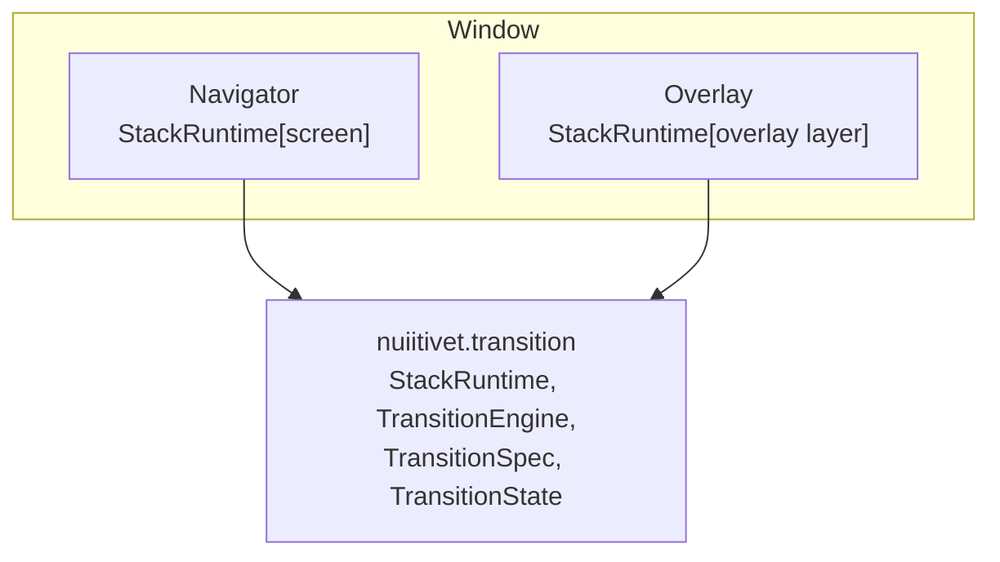

# Navigation System Design

`Navigator.push()` changes the screen. `Overlay.show()` puts a layer on top
of it. The window stacks the two side by side, overlay above, and neither
imports the other.

```mermaid
flowchart TB
    subgraph Window
        direction LR
        Navigator["Navigator<br/>StackRuntime[screen]"]
        Overlay["Overlay<br/>StackRuntime[overlay layer]"]
    end
    Kernel["nuiitivet.transition<br/>StackRuntime, TransitionEngine,<br/>TransitionSpec, TransitionState"]
    Navigator --> Kernel
    Overlay --> Kernel
```

Both stacks come from `nuiitivet.transition`. The kernel tracks when an
element enters, stays and exits, drives the progress and says how it moves;
it knows nothing of screens or layers, since the stack holds any element
with a `dispose()`. The two stacks differ in what the top means: a navigator
paints only its top screen, the screens beneath staying mounted and
unpainted, while an overlay paints every layer, newest on top.

A window scope owns one navigator and one overlay. A navigator also nests
inside the content, because it keeps a history; an overlay does not nest,
because modality has one scope, and a region that needs its own modality
would nest the scope itself. The window takes its navigator through
`content`, which may return a `Navigator`; a `navigator=` keyword was
rejected because a navigator is built with its first screen, so the keyword
would give the initial screen two routes into the window. Building the
overlay on a `Navigator` was rejected because overlay layers pile up instead
of replacing each other and must never enter the back stack.

## Resolving a Navigator

Every window provides a root navigator, since a full-screen transition is
the common case. `Navigator.of(context)` walks the ancestors for the nearest
`Navigator`, so a nested navigator keeps its own history, and with none it
falls back to the navigator owned by the context's window, found through the
window scope. There is no process-global root, so two windows, or two apps
in one process, never collide. `Navigator.of(context, root=True)` skips the
ancestors. Both follow the `.of()` timing rule: valid from `on_mount`, not
from `__init__`.

`NavigatorProtocol` (`navigation/protocols.py`) is what a ViewModel is
typed against: `push`, `pop` and `can_pop`, deliberately narrow, because a
wider protocol would re-couple the ViewModel to the widget. `MaterialNavigator`
adds no navigation API, so one protocol serves both layers.

## Intents

An intent declares a screen change as data, a plain dataclass with no base
class, and the navigator resolves it to a screen. `routes` maps an intent
type to a factory; the factory returns the screen, or a `(screen,
transition)` pair. An unregistered intent raises `RuntimeError`, so a
configuration error surfaces at the push, not later.

`Navigator.intents(initial=..., routes=...)` builds a navigator from an
intent, and passed as the window's `content` it becomes the root navigator,
so a ViewModel can push intents without knowing any widget. A plain widget
as `content` is wrapped in an implicit root navigator. `Navigator.routes([...])`
starts with a pre-populated stack, for deep linking or state restoration.

## Transitions

`push()` takes a widget or an intent, and a widget may bring its own
`transition=`. A transition belongs to the screen, not to the push: a spec
carries `enter`, `exit_`, `enter_back` and `exit_back`, and the layer
composer maps each screen through its own spec. A screen's `enter` runs when
it is pushed, its `exit_` when another screen covers it, its `exit_back`
when it pops and its `enter_back` when the screen above it pops, so the
transition given at push travels with the screen until it is disposed.
`pop(transition=...)` is not offered, because the motion of a pop is fixed
by the specs of the two screens involved.

A screen given no transition gets the navigator's default: none for the core
`Navigator`, `MaterialTransitions.page()` for `MaterialNavigator`. The
default is a subclass hook, not a constructor parameter; `Overlay` fixes its
defaults the same way, per presenter method.

`transition=` together with an intent raises `TypeError`. An intent is a
restorable description, and a hot reload replays its factory; a per-call
keyword would be lost on restore, so the factory gives the transition
instead. The screen and its transition travel as a plain pair rather than a
class of their own: naming the pair would pay off only with a declarative
back stack whose elements need an identity for diffing, and there is none.
Internally the navigator wraps the pair in a `Route`, its stack element,
which also unmounts the screen on disposal.

## Back

`Escape` and the platform back gesture are handled in one order: close the
topmost overlay entry; else `pop()` the navigator; else nothing, at the root
route. A back action never reaches past a blocking layer. An entry stays open
until its exit animation finalises, so a dialog that has been dismissed but
is still on screen has nothing left to close, and the event stops there
rather than popping the route the user can still see behind it; a
pass-through layer, a toast or a banner, blocks neither.

Rapid presses, key repeat or several OS events, are absorbed rather than
compounded. The window handles exactly one request per input, and
`Navigator.request_back()` is the user-input entry that absorbs re-entrancy
during a transition: a back during a pop animation queues the request
(`pending_pop_requests`) and completes the current pop at once, the queue is
then consumed with the intermediate pops unanimated and only the final one
animated; a back during a push completes the push and performs a single pop;
a cancelled `will_pop` discards the queue.

Confirmation before leaving a screen is the `will_pop` modifier, an async
callback returning whether to continue. The navigator checks the chain
immediately before popping, so a screen with unsaved changes can await a
dialog and cancel; the modifier's contract is in
[MODIFIER.md](MODIFIER.md).
