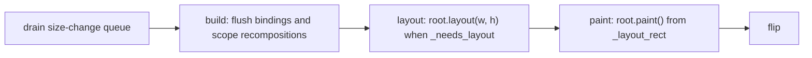

# Rendering Pipeline Architecture

A frame is three phases in a fixed order: **build**, **layout**, **paint**.
Layout runs to completion before any paint, so every geometric fact is final
before the first draw command. Frames are produced on demand: an idle window
draws nothing.

## Build

Build turns declarative widget definitions into the instance tree and applies
incremental updates when an `Observable` changes. Parent-child relations and
properties are decided here; sizes and positions are not.

A change recomposes only the scope it touches. Dynamic children sit in a
`render_scope`, so rebuilding a host does not regenerate the expensive widgets
around them; `ForEach` and `Card` carry a scope of their own for the same
reason. Scope metadata records each child's `_layout_dependencies` and
`_paint_dependencies`, which routes a binding invalidation to the right
consumer. Recomposition is idempotent: a scope is rebuilt when it is new,
unbuilt or explicitly invalidated (`_dirty_scopes`), never merely because the
host's `build()` ran again ([WIDGET_ARCHITECTURE.md](WIDGET_ARCHITECTURE.md)).
Binding and scope queues flush together; for an unmounted host there is no
frame to wait for, so invalidating a scope rebuilds it synchronously.

## Layout

Layout decides every widget's size and position and is guaranteed to finish
before paint.

### The Layout Protocol

`layout(width, height)` is called by the parent with the available size. The
widget decides its own size from `preferred_size` and its `Sizing`, lays out
its children, stores the result in `_layout_rect` and clears `_needs_layout`.

**Forbidden inside `layout()`:** a draw command, and any state change another
consumer can observe within the same pass. An `Observable` write is the
canonical violation: it propagates synchronously, so a sibling measured before
the write and painted after it sees two values inside one frame, a torn frame.
Whether tearing strikes depends on sibling order within the pass, which app
authors cannot reason about; the writer is the only party that knows it is
inside `layout()`, so the rule binds the writer.

**Permitted**, because nothing becomes observable mid-pass:

1. Storing layout results: `_layout_rect`, and plain synchronous fields that
   paint, hit testing and other post-layout consumers read, such as the
   recorded scroll metrics.
2. Requesting a frame: `invalidate()` / `mark_needs_layout()` alter no
   measurement, and work discovered during measurement has to be scheduled
   somewhere.
3. Queueing a deferred publish or callback (`widgeting.widget_size_change`).
   The app drains that queue between frames, at the start of the next frame
   before its build flush. This is the sanctioned way to make a measured
   result reactive: `Geometry`'s size and the scroll metrics publish to their
   `Observable`s through it. A reactive consumer therefore sees a measurement
   one frame after the layout that produced it, and never a torn mix of old
   and new.

`preferred_size()` reports the intrinsic size so the parent can allocate room.
It is free of side effects, the same constraint as `layout()`; in particular,
measuring a mounted composable never calls `build()` and never unmounts the
live subtree, which would discard focus, scroll position, animation state and
pointer capture and cancel a gesture in progress. Measurement reads the
existing subtree only.

Measurement is also **constraint-monotonic**: shrinking a max constraint down
to, but not below, the measured result does not change the result. Text
wrapping, min/max clamping and every other fit-then-report strategy satisfy
this naturally; what it rules out is a result computed as a function of the
constraint while staying strictly inside it, "half the available width". The
measure cache relies on it to reuse a measurement across a constraint
animation.

`mark_needs_layout()` is called when a layout-affecting property changes
(`width`, `padding`, a child added or removed). It sets `_needs_layout` on the
widget and every ancestor, so the next frame re-lays out only that path.

### Caches

- `parse_sizing()` is memoised, so repeated `width` / `height` literals cost no
  allocation.
- `LayoutEngine` caches preferred sizes, internal rects and child placement,
  keyed on padding, border width, the container's `_layout_cache_token` and
  the children's tokens. A widget that changes padding or border width bumps
  its token.
- `layout.measure.preferred_size()` memoises each widget's measurement in
  `_measure_cache`, keyed on the max constraints asked. `mark_needs_layout()`
  drops the widget's entry and, propagating upward, every ancestor's, so a
  change routed through normal invalidation re-measures exactly the dirtied
  path while untouched siblings stay O(1). Constraint monotonicity lets a
  cached result also answer a shrunk constraint it still fits, which keeps a
  width animation from re-measuring the static subtrees beside it.
- `Row` / `Column` skip a child's `layout()` entirely when the child is clean
  and its allocated size is unchanged; position is applied via
  `set_layout_rect` and is not an input to `layout()`. With the measure cache
  this makes a frame's layout cost proportional to what changed, not to the
  tree size.
- `enable_layout_cache_profiling()` exposes hit rates.

### Recording Is Not Publishing

The layout pass records sizes, positions and scroll metrics in `_layout_rect`
and plain fields, and paint and hit testing read those records. That is what
makes scrollbar visibility and hit testing accurate within the same frame. The
`Observable` publish of a recorded measurement rides the queue and lands at the
start of the next frame, so layout finalises the frame's geometry without
making any of it observable mid-pass.

## Paint

Paint draws from `_layout_rect` and issues Skia commands, including clip and
transform (`save`, `translate`, `restore`). It computes no size and moves
nothing: `paint()` is a pure consumer of layout results.

A multi-child container (`Column`, `Row`, `Flow`, `UniformFlow`, `Grid`) reads
the canvas clip once per paint and skips any child whose visual bounds, layout
rect plus `paint_outsets()`, end more than a small slack outside it. A scrolled
list pays paint cost for the rows in the viewport, not for the whole content. A
culled child still receives its `last_rect`; only its subtree's paint code is
not run. Without a readable clip (no canvas, or a stand-in) every child is
painted. What this asks of a widget that draws outside its rect is in
[BOX_MODEL.md](BOX_MODEL.md).

The Python walk of `paint()` is the frame's dominant cost. The caches that
skip parts of it, a widget's own visuals, the whole frame, a subtree, are in
[PAINT_CACHE.md](PAINT_CACHE.md).

## Frame Scheduling

The framework draws on demand. A frame is produced only when something has
invalidated the tree; an idle window, nothing animating and no interaction,
draws zero frames per second and costs no CPU or battery.

### Invalidation Drives Frames

Every visual state change routes to a redraw request:
`Widget.invalidate()` → `App.invalidate()` →
`ResponsiveEventLoop.request_draw()` sets `_draw_pending`. Most changes reach
`invalidate()` indirectly: `Observable` and `Animatable` notify subscribers,
and those subscriptions call `invalidate()`. That is why the interaction
modules (hover, press, focus, scrolling, slider drag, overlay transitions,
animations) contain few or no explicit `invalidate()` calls; the observable
graph carries the signal. Scroll offset, for example, is an `Observable`, and
the scrollable subscribes to it.

Animations tick on the UI clock (`runtime.clock`, installed as the event
loop's clock). Each tick updates an `Animatable`, the subscriber invalidates,
one frame is drawn. When the animation completes it unschedules itself, the
clock goes idle and the loop returns to zero frames.

### `draw_fps` Is an Upper Bound

`App.run(draw_fps=...)` and `set_draw_fps` configure a throttle, never a
mandate to draw. `None`, the default, draws as soon as a request arrives; `N`
still draws only when something invalidated, but coalesces requests to at most
`N` frames per second. `ResponsiveEventLoop._should_draw()` returns `False`
whenever `_draw_pending` is clear, whatever the cadence, and
`_compute_sleep_timeout()` refuses to wake the loop for a cadence deadline
when nothing is pending; otherwise an idle app would spin at `draw_fps` doing
nothing.

### The Flip Invariant

The GPU and raster backends both present through a double-buffered
`window.flip()`. After a swap the contents of the new back buffer are
undefined, so the loop holds one invariant:

> **Never flip without drawing.** A frame is a full repaint of the back buffer
> followed by a flip; the loop never presents a buffer it did not just draw.

On-demand drawing satisfies this trivially: with a clean tree the loop draws
nothing and flips nothing, and the front buffer keeps showing the last
complete frame. Redrawing every frame was never required, only not flipping a
stale buffer. Paths that can leave an undefined front buffer (window show,
activation, resize, DPI change) call `invalidate()` so the next frame repaints
from scratch. Such a redraw fills the buffer from the full-frame cache in
[PAINT_CACHE.md](PAINT_CACHE.md) instead of walking an unchanged tree.
