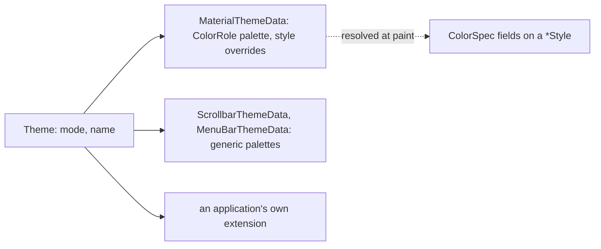

# Style and Theme

A widget's look is a **style**, one frozen dataclass per widget, and a
**theme** supplies the colours a style refers to and, where a design system
wants it, a different default style. How a widget reads the theme is in
[THEME_CONSUMPTION.md](THEME_CONSUMPTION.md).

## Styles

Every widget has its own style class (`ButtonStyle`, `CheckboxStyle`,
`IconStyle`), flat, with no inheritance between them. A style is a frozen
dataclass; a variation is `copy_with(...)`, never a mutation. Its colour
fields are `ColorSpec`: a design-system token such as a `ColorRole`, a
literal, or either paired with an alpha. A token is resolved at paint time
against the theme current then (`theme.resolver.resolve_color_to_rgba`), so
a widget switches between light and dark with no code of its own. A style's
shape and size fields (`container_height`, `content_insets`, a touch target)
are the MD3 component tokens; which dimensions are style fields rather than
constructor parameters is decided in [SIZE_POLICY.md](SIZE_POLICY.md).

An MD3 variant is a factory on the style class, `ButtonStyle.filled("s")`,
`ButtonStyle.outlined()`, `CardStyle.elevated()`, with the size variant as
its argument. The style in effect for a widget is the one the caller passed,
else the one a hosting widget derives for it (a toolbar pushes the style its
colour scheme prescribes onto each button it hosts), else the preset.

## Theme

`Theme` is design-agnostic: a `mode`, a `name` and a list of
`ThemeExtension`s, at most one per type, retrieved with
`theme.extension(T)`. Everything design-specific lives in an extension.
`MaterialThemeData` holds the `ColorRole` palette derived from a seed by
`MaterialThemeFactory`, and a nullable slot per widget variant through which
a theme overrides that variant's default style; a slot left empty falls
through to one shared frozen preset, because the fall-through runs on every
paint of every leaf and a frozen style can be handed out by every theme.
`PlainThemeData` serves the plain design system the same way.

A generic widget, one that is not Material, never reads a Material colour
role. The scrollbar and the menu bar each take their palette from a
`ThemeData` extension of their own, which every design system registers,
with the colours stored as `ColorSpec` tokens so they too resolve against
the current theme. That is the framework-wide split: the app-wide palette
lives in a `ThemeData`, a per-instance override in the nullable `ColorSpec`
fields of the widget's `Style`, and the shape in the `Style`.

The `ThemeManager` holds the current theme and a generation counter and
notifies one owner, the `AppScope`; it keeps no subscriber list, for the
reason THEME_CONSUMPTION.md gives.

## Against the Alternatives

Flutter's `ThemeData` with per-widget sub-themes is the closest shape; the
difference is that here the sub-theme is optional and the preset lives on
the style class, so `Theme` stays a container of tokens rather than a
catalogue of every widget's defaults. SwiftUI's environment values and
`.buttonStyle()` modifiers were not followed: a style is a plain parameter,
explicit at the call site. The style classes map directly onto MD3 component
tokens, so a spec value has one field to land in.
