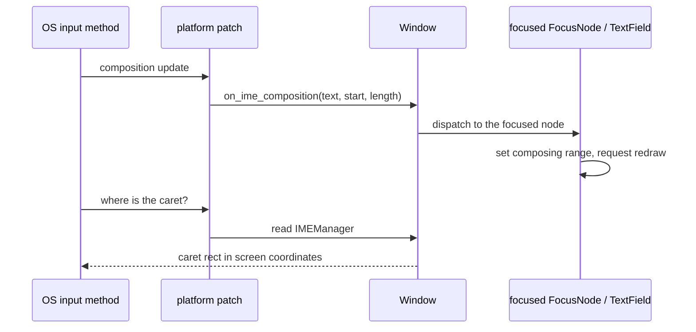

# Text Editing Architecture

Text editing synchronises three parties, the application, the OS text input
system (the IME) and the renderer. State flows one way, through an immutable
value, and the IME is reached by patching the platform window rather than
through the backend's own text input, which cannot compose inline.

## Data Model

`TextEditingValue` is an immutable snapshot of a field: `text`, `selection`
(a `TextRange`; `start == end` is the caret) and `composing`, the range the
IME is still converting. A composing range is part of `text` but subject to
change by the IME until it commits.

## The Value Mirror

`TextField` holds an internal `Observable[TextEditingValue]`. An observable
passed as `value` is the field's value cell in the sense of
[OBSERVABLE.md](OBSERVABLE.md): edits are written back to it, so the caller
keeps no second copy of the text to fall out of sync with.

It is nonetheless the framework's one **mirror** rather than a true storage
substitution, for a type mismatch. The internal cell holds text, selection and
composing range; the bound observable holds a `str`. A `str` cell cannot carry
the caret, so it cannot be adopted as the cell outright; the widget keeps its
own `TextEditingValue` and reconciles the text half with the observable in
both directions. Three rules make the mirror behave:

- **Write-back is suppressed while a composition is active.** The provisional
  text of a half-converted candidate is not a value the application should
  see, and anything it wrote in response would fight the IME. The composition
  commits through the normal text path, with the composing range cleared. The
  guard compares against the observable's own value rather than the previous
  text, so ending a composition reconciles even when that update left the
  text alone.
- **An incoming write keeps the caret, clamped into the new text.** Resetting
  it to the end would be right only for a field nobody is editing: an
  application that normalises on write-back (upper-casing, trimming,
  reformatting) changes the text under an actively edited field, and a caret
  jumping to the end on every keystroke makes such a field unusable.
- **The loop terminates on equality.** A write-back delivers back into the
  widget, which returns early once the text it is handed already matches.

A read-only observable (a computed or mapped value) has nowhere to write, so
it is displayed and not written to. Such a field is still editable, and the
edits go only to the internal cell; `disabled=True` makes that visible.

Accepting an `ObservableProtocol[TextEditingValue]` as `value`, a cell whose
type matches the internal one, would make the field a plain storage
substitution and leave the three rules nothing to reconcile. It is not
offered: the only thing it buys is letting the application own the caret,
and every caller who binds a `str` still needs the reconciliation. Reasons to
revisit, none present today: an application that has to restore a caret
position across navigation or a re-created field; a second widget editing the
same text alongside the field; a caller who needs to drive the selection
programmatically, which the widget's own `value` setter cannot express.

## Input Filters

An input filter is a rule applied to text between a keystroke and the value
cell. The placement is forced: correcting text requires knowing where the
caret was, what it was in and what it became, and the observable knows none
of these, so a rule enforced there would return through the mirror on every
keystroke and drag the caret with it. The widget is the only participant that
holds all three; the control-character strip it already applied is the hook
the filter generalises.

- **A filter defines what is typeable, not what is valid.** A decimal field
  must let `"1."` be typed, or `.` can never be entered. Whether a finished
  value is acceptable is `is_error` / `supporting_text`; reshaping a finished
  value is `on_submit`.
- **Filters run on insertion only**: typing, an IME commit, a paste. Running
  them over deletions would let a whole-string rule reject the backspace that
  breaks its pattern, leaving a field that cannot be erased.
- **Filters do not touch values the application assigns.** The initial
  `value` and a write to the bound observable pass through untouched; the
  field does not rewrite what its owner put there.
- **The internal contract carries the selection** (`apply(old, new)` on a
  `TextEditingValue`), so the built-in filters move the caret exactly. The
  public shorthand, a `Callable[[str], str]`, reports only the string and has
  its caret inferred from the length change; widening it to the
  selection-aware form later is additive.

Filters compose with `|`, the modifier vocabulary. Masking, displaying
`1,234,567` while storing `"1234567"`, is out of scope: it needs the
displayed and the stored text to differ, and whatever a filter returns is the
value.

## Commit

`on_submit` fires on every Enter, a repeat on an unchanged value included, and
never on focus loss: it reports the user asking for an action, not the value
settling. Firing on focus loss too was rejected because an `on_submit` that
runs a search or saves a record would fire every time the field is tabbed
through. A "changed since the last commit" guard would make that safe and was
rejected too: pressing Enter again on the same query means run it again, and
only the caller knows whether repeating its work is wasteful. Work that
belongs to leaving the field, finishing a half-typed `"1."` as `"1.0"`, goes
to `on_focus_change`.

Supplying `on_submit` is also what makes the field claim the Enter key
([KEYBOARD_SHORTCUTS.md](KEYBOARD_SHORTCUTS.md)): a field with an action for
Enter owns it, and one without lets it reach a shortcut. A field that only
reacts to being left takes `on_focus_change` and leaves Enter alone.

## Lines

A multi-line field is the same widget in a second mode, reached by a named
constructor, `TextField.multiline`. The mode changes what Enter does, how the
text is laid out and how the field grows, and a name at the call site says so.

Shift+Enter breaks the line. The break is inserted like typed text, so an
input filter sees it. It does not come from the text the backend delivers: on
macOS, Return arrives as `on_text('\r')` next to the key press whether Shift
is held or not, so a break taken from there would also land on every submit.
Enter means the same in both modes; a field claims it only when it has an
action for it. Making Enter the line break was rejected because a multi-line
field would then take Enter from the rest of the screen.

## IME

The backend's own text input leaves a floating candidate window and no inline
composition on some platforms, so nuiitivet patches each platform window at
runtime to intercept the IME before the OS handles it:

- **macOS**: hooks `PygletTextView` (an `NSTextView`) through `ctypes` and the
  Objective-C runtime, overriding `setMarkedText:selectedRange:replacementRange:`
  for composition updates and `firstRectForCharacterRange:actualRange:` to
  report the caret to the OS.
- **Windows**: subclasses the window procedure to intercept
  `WM_IME_COMPOSITION` and reads the composition and caret with
  `ImmGetCompositionString`.
- **Linux (X11)**: recreates the input context with `XIMPreeditCallbacks` and
  receives `PreeditStart` / `PreeditDraw` / `PreeditDone` directly from the
  input method.

The candidate window follows the caret through `IMEManager`, per-window state
(`Window.ime`, in [APP_WINDOW.md](APP_WINDOW.md)) holding that window's
geometry and the local caret rectangle. `TextField` updates it with the caret
during paint, the backend with the window position during the draw loop, and
the patch answers the OS's query from it. When a window loses OS focus, a
pending composition is committed on the focused field, its provisional text
stays, and the OS-side conversation is discarded, so another window's typing
starts clean.
