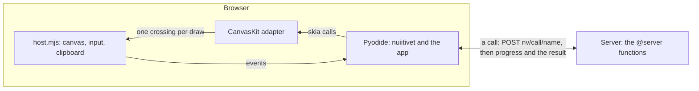
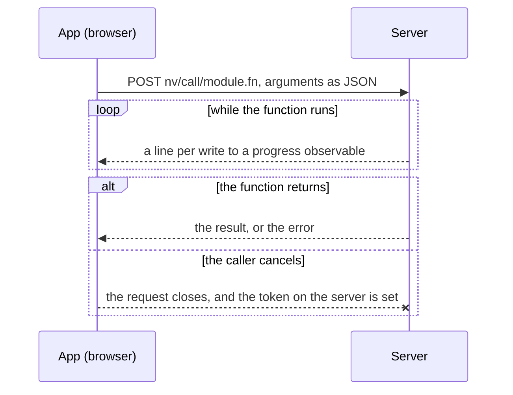

# Web Target

One app runs on the desktop and in a browser from the same source. The app
does not branch on the target: the widgets, the observables, the handlers
and the navigation are written once, and the web target is realised under
them. The one mark an app makes for the web, `@server`, runs on the desktop
too.

In the browser, Pyodide runs the app's Python unmodified, a CanvasKit adapter
with the shape of skia-python draws it onto one canvas, and the browser's
event loop replaces the pyglet one. The page is files that any file server
can serve. The functions an app marks with `@server` are the only code that
runs on a server; everything else ships to the browser.

## The Page

The page is five files beside the fonts: `index.html`, `boot.mjs`,
`host.mjs`, `config.json` and `bundle.zip`. The zip holds the framework under
`lib/` and the app's directory under `app/`, built from the sources at every
request, so a browser reload shows an edit. One zip is one fetch; the
framework alone is hundreds of modules, and the page would otherwise start
with hundreds of requests.

`config.json` says where Pyodide and CanvasKit are. A development page loads
them from a CDN; a built site carries them, with the licences of everything it
redistributes, so it needs no other server. Every URL is relative to the page,
so a built site works under any path.

`boot.mjs` loads CanvasKit, Pyodide, the zip and the fonts in parallel,
unpacks the zip to `/nuiitivet`, installs the host, and runs the entry script
as `__main__`. Before the entry runs it calls the backend's `prepare()`, which
installs the adapter as the `skia` module, registers the UI thread and
installs the browser clock. The clock goes in first because a widget mounted
while the App is constructed arms its timers at once, and the fallback clock
would start a thread for them.

`App.run()` in a browser hands the app to the backend and returns. The
browser's event loop drives the app from then on; the backend module keeps a
reference to the app, since the entry script has finished.

## Drawing

The adapter is installed under the name `skia`, so the rendering code is the
desktop code: paints, paths, text blobs, pictures and the paint cache run
unchanged. The adapter covers the calls that code makes; a skia-python call
nothing in the framework uses is not mirrored.

The canvas matrix lives in Python. CanvasKit has no `setMatrix`; a matrix
pushed to it could only be replaced by multiplying with an inverse, and at a
device pixel ratio such as 1.5 that leaves a matrix that is almost the
identity. The adapter's matrix reaches CanvasKit once per run of draws, inside
a save level the host pops before every save, restore and clip, and clips are
applied in device coordinates. Geometry and paint state cross to JS as plain
numbers, once per draw, so no array is built on the Python side.

Every font family name resolves to the text typefaces the page loaded, and a
font file loads as its own typeface. The browser has no system font list to
match against.

A frame runs only when one was asked for: by an invalidation, by a resize, or
by the clock for a callback that is due. The request is a
`requestAnimationFrame`, so frames pace to the display and `draw_fps` has no
effect. The WebGL surface is made again when the canvas or the device pixel
ratio changes, and that frame repaints everything.

The main window fills the canvas and follows its size. A browser shows one
window, so a second window stays unrealized and a warning says so once.

## The Clock

The browser clock keeps its own list of deadlines. A deadline within a frame's
time waits for the next frame, so an animation ticks in step with the
display; a later one is a `setTimeout`. Every frame ticks the clock before it
draws, so a callback due at that frame runs before the paint it invalidates.

## Input

The host forwards pointer, wheel, key, text, composition and paste events to
the same dispatch methods of `Window` that the pyglet backend calls. Key names
are translated once, at the host boundary; from there the key handling is the
desktop's, including a held key repeating only as a text motion.

An input element the user never sees sits at the caret. It is what the
browser composes IME text into and what a phone shows its keyboard for;
without a focused text field it asks for no keyboard. The browser does not
report a selection inside the composition, so the caret sits at its end.

The clipboard crosses in one direction at a time. A copy writes through
`navigator.clipboard`. A paste arrives only as a paste event, because the
browser gives a page the clipboard on that gesture alone; the backend stores
the text and dispatches Ctrl+V, so a text field pastes as on the desktop.

Escape is back navigation, on the release. The press reports whether the app
can handle it, so the browser acts on the key itself only when the app would
not.

## One Thread

Pyodide runs on the browser's main thread and cannot start another. The UI
thread is the only thread, and a `threading.Thread` is refused. This is the
one place where the desktop and the browser differ in what an app may do,
and the one place where the framework offers an API of its own instead of
the standard library's: `@server`. A thread shares memory with the UI; a
server cannot, so the standard API could not be made to mean the same thing
on both targets. `switch_map` accepts a coroutine function and runs it as a
task, so an async transform needs no thread on either target.

## Server Functions

`@server` marks a module-level function, and the app calls it the same way
on both targets. What differs is underneath.

On the desktop the call runs on a thread the runtime owns, in the same
process. The arguments, the result and every progress write still pass
through the codec, so the function shares no object with its caller;
cancelling the awaiting task sets the function's token; and an exception
that is not builtin arrives as `ServerError`. The desktop follows the
browser's rules so that an app which works on the desktop works in the
browser, instead of failing there on an object it passed by reference.

In the browser the same call becomes one HTTP request to the server that
holds the function. The server keeps no session state, so any instance can
answer any call.

The function lives in a server-only module: one whose top level calls
`server_only()`, or that sits under a package whose `__init__.py` does. A
server-only module never reaches the browser. The build leaves its files out
of the zip and writes a stub in their place, with the same signatures, whose
functions send their call to the server. The stubs come from the source text,
so the build imports nothing of the server side; a DB password in a
server-only module stays on the server without the author doing more than
marking the module.

The caller writes `await fn(...)`. The function itself is a plain `def`, so
it is unit-tested as any function.

Arguments and the result cross as JSON, and the codec comes from the type
annotations, never from the data: a float annotated `float` arrives as a
float even when it was sent as `2`, a dataclass arrives as that dataclass,
and a value of another type is refused with the field named. A type the
codec has no rule for is refused when the function is defined, not at the
first call. A dataclass must come from a module the page gets, since the
stub's signature names it.

Progress flows through a `WriteOnlyObservable` parameter. The caller passes an
observable, the server side writes it, and each write streams back as a line
of the response. The caller's observable takes the latest value per clock
tick, so a tight loop on the server does not flood the page.

Cancellation is the request closing. The caller cancels its task, the browser
aborts the request, and the handler, which watches the connection while the
function runs, sets the function's `CancelToken`. The token is a parameter
with a default, so the function runs unchanged when nobody cancels.

A builtin exception raised on the server is raised again in the caller by
type. Any other exception arrives as `ServerError`, carrying the type's name
and the message: the browser has no class to rebuild it from.

## Build and Serve

The development server serves the page from the source tree and answers the
server functions from the same process. The build writes two directories: the
site, which any static host serves, and the server, which is the app's
sources. An app without server functions deploys the site alone; one with
them deploys both, and the server is the only part that needs Python.
