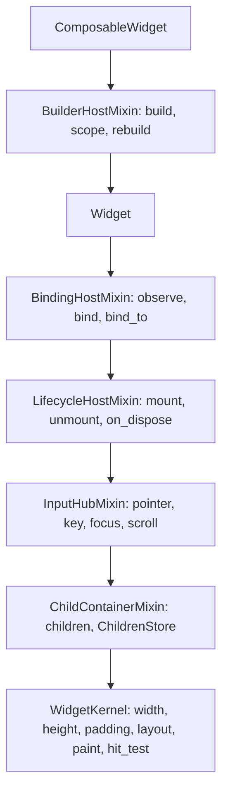

# Widget Architecture

`Widget` is composed from mixins by cooperative multiple inheritance, one
mixin per responsibility. `Widget` is the leaf-friendly base: it lays out,
paints and hit-tests its `children` and never assumes a `build()`.
`ComposableWidget` adds `BuilderHostMixin` for a widget that assembles a
subtree in `build()` and recomposes it in scopes.

Method calls chain down the MRO in that order. `BuilderHostMixin` overrides
`layout`, `paint` and `hit_test` to delegate to the built subtree (`_built`)
when it exists, then falls through to `super()`; `WidgetKernel` knows only
`children` and its own rectangle. An application widget is a
`ComposableWidget`; a `Widget` is for a leaf that draws or lays out and
returns no subtree from `build()`.

## Lifecycle Chain Checks

An `on_mount` or `on_unmount` override that forgets `super()` fails silently:
the body completes, nothing raises, and the widget never builds or never
releases its bindings. The base implementations end both chains, so each sets
a flag that `mount` / `unmount` read back, raising a `RuntimeError` naming the
widget, the hook and what was lost.

| Hook | Checked on | What is lost |
| --- | --- | --- |
| `on_mount` | Build hosts only (`_requires_on_mount_chain`) | `build()` never runs |
| `on_unmount` | Every widget | Bindings are never disposed |

The scopes differ because the damage does: `LifecycleHostMixin.on_mount` is a
no-op, so a plain `Widget` skipping it loses nothing, while binding disposal
is universal. `super().on_mount()` may sit anywhere in the body, last when
`build()` reads what the override computes.

Two limits are part of the contract. The check runs under `if __debug__`
only, like `assert_ui_thread` beside it, so `python -O` never reports. And it
stays silent when the override itself raised: `_call_contained` has already
reported that failure, and a missing-`super()` message on top would point at
the wrong line. Nested in the tree, the raise is contained by the parent's
`_safe_call` and forwarded to `report_contained`: visible in `runtime_log`,
fatal to a test, not to the frame. Only a root widget stops the app.
`find_missing_super_on_mount` in `skills/nuiitivet-app/scripts/check_idioms.py`
catches the same mistake statically.

## Binding Ownership

`BindingHostMixin` owns `Disposable`s for the widget's mounted life and
disposes them all in `on_unmount`. Three methods register one:

| Method | Subscribes | Applies current value first |
| --- | --- | --- |
| `observe(observable, callback)` | Yes | Yes |
| `bind(disposable)` | No, the caller already did | n/a |
| `bind_to(observable, setter, *, dependency, scope_id)` | Yes | Yes |

All three are widget-implementation APIs: they exist so a widget can accept an
`Observable` constructor argument and apply it to its own state. `observe`
carries the bulk of that work in-tree (`gap`, `padding`, sizing, transform
properties, external value sync). Application code passes observables into
widgets, derives with `map` / `combine`, and uses `on_size_changed` for
size-driven state. A source with no `.value`, a subscribe-only emitter, is
subscribed without a seed rather than rejected.

`bind_to` does one thing `observe` does not: on every change it calls
`_invalidate_binding_dependency(dependency, scope_id)` after the setter. The
`dependency` is a label naming what the new value invalidates;
`Widget._handle_dependency_invalidation` matches it against the class-level
`_layout_dependencies` / `_paint_dependencies` and drops only the affected
cache, `None` drops both. The initial seed skips this: it runs before the
widget has laid out or painted, so there is no cache to drop. Invalidations
are queued per widget and flushed at the frame boundary
(`flush_binding_invalidations`), so several observables firing together
coalesce into one re-render; a widget with no `_app`, unmounted or standalone
in a test, flushes immediately. A widget with no such caches gains nothing
from `bind_to` and uses `observe`.

An `on_unmount` override that skips `super()` skips `_dispose_bindings()`,
and because remounting (navigation, hot reload) re-runs `on_mount`,
subscriptions accumulate: one source event then invokes N callbacks against N
detached widgets. That is the case the chain check above exists for.
`Observable` itself is [OBSERVABLE.md](OBSERVABLE.md).

## Recompose Scopes

A `RecomposeScope` wraps a subtree in a named scope, and its `ScopeHandle`
(`invalidate()`, `invalidate_scope_id()`) rebuilds that scope alone. A binding
invalidation is routed to its scopes through
`_lookup_scope_ids_for_dependency()`.

Recomposition is idempotent. A scope's subtree is rebuilt only when it is
new, unbuilt or explicitly invalidated; `_dirty_scopes` tracks that and
`_schedule_scope_recomposition()` is the one funnel that marks a scope dirty.
Re-running the host's `build()` does not rebuild a scope that was not
invalidated, because `build()` is re-entered on every measure, and tearing
down a live subtree there would discard focus, scroll, animation and pointer
state. The caller that changes a `render_scope` factory's inputs therefore
invalidates the scope itself, as `ForEach` does for an item whose value
changed; a host rebuild will not refresh it.

The layout and paint caches are in
[RENDERING_PIPELINE.md](RENDERING_PIPELINE.md).

## Internal State Ownership

An underscore field belongs to the mixin that owns it and is read or written
only inside that module. Across a module boundary a widget goes through the
public accessor, so that a field is updated in one place and no mixin reaches
into another's internals:

| Field | Owner | Accessor |
| --- | --- | --- |
| `_built` | `BuilderHostMixin` | `built_child` |
| `_layout_rect` | `WidgetKernel` | `layout_rect`, `set_layout_rect()` |
| `_last_rect` | `WidgetKernel` | `last_rect`, `set_last_rect()` |
| `_needs_layout` | `WidgetKernel` / `Widget` | `needs_layout`, `mark_needs_layout()`, `clear_needs_layout()` |
| `_layout_cache_token` | `Widget` | `layout_cache_token` (`None` on `WidgetKernel`, an `int` on `Widget`) |

Input bounds and overlay anchors come from `global_visual_rect`: the global
layout rect plus each ancestor's `visual_offset()`. They are never derived
from paint state (`last_rect`), and never from `global_layout_rect`, which
inside a scrolled region is content space, off by the scroll offset. A
container that paints its children away from their layout position, a scroll
viewport, exposes `visual_offset()`, or `global_visual_rect` is wrong beneath
it.
