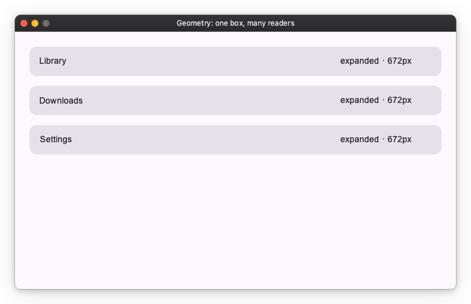

# Geometry: scoped measured size

Most adaptive layout is a widget reacting to its own box, which
[`on_size_changed`](../layout/adaptive.md) handles with one modifier. Reach for
`Geometry` for the other shape of the problem: **one measured box, many readers**
— widgets nested at arbitrary depth that must react to an ancestor's size,
without every widget in between having to pass it through.

`Geometry` wraps a single child and is transparent to layout: the child receives
the same size `Geometry` receives. After each layout pass it publishes its own
resolved size as an `Observable[Size]`, which descendants read with
`Geometry.of(self).size`.

Two rules come with it, and they are the reason this is the advanced tool:

- **Bind the Observable; never read `.value` at build time.** `.value` is a
  one-time snapshot that never updates. Map it into a value widget, or drive a
  `Deck` index for a structural switch.
- **Resolve it in `on_mount`, not `__init__`.** `Geometry.of` walks the ancestor
  chain, and a widget has no ancestors until it is mounted. `build()` then just
  references what `on_mount` derived. Get this wrong and the error says so — a
  premature `of()` reports that the widget was not mounted yet, rather than
  blaming a missing `Geometry` provider.

## One box, many readers

```python
import nuiitivet.material as nv

_WIDE = 600


class SizeClassBadge(nv.ComposableWidget):
    """A leaf, nested arbitrarily deep, that reads the pane it lives in."""

    def on_mount(self) -> None:
        size = nv.Geometry.of(self).size
        self._label = size.map(lambda s: f"{'expanded' if s.width >= _WIDE else 'compact'} · {s.width}px")
        super().on_mount()

    def build(self) -> nv.Widget:
        return nv.Text(self._label, width=150)


class _Section(nv.ComposableWidget):
    """An intermediate widget: it holds a badge but knows nothing about size."""

    def __init__(self, title: str) -> None:
        super().__init__(width="wt")
        self._title = title

    def build(self) -> nv.Widget:
        return nv.Card(
            nv.Row([nv.Text(self._title), nv.Spacer(width="wt"), SizeClassBadge()],
                   gap=12, padding=16, width="wt", cross_alignment="center"),
            width="wt",
        )


# One filling Geometry defines the scope for every badge below it.
nv.Geometry(
    nv.Column([_Section("Library"), _Section("Downloads"), _Section("Settings")],
              gap=16, width="wt", height="wt"),
    width="wt",
    height="wt",
)
```



`_Section` passes nothing down — it does not know that a badge somewhere inside
it cares about the pane's width. Move the badge elsewhere and it reads whatever
pane it lands in.

## Two kinds of binding

- **Read-only** (a label, a `Deck` index): map straight from `size` — e.g.
  `Text(size.map(...))`, `Deck(index=size.map(...))`. `Deck` accepts a derived
  `.map(...)` index and shows one mounted child by it.
- **Two-way** widget state (a `NavigationRail`'s `expanded`, which its own menu
  button can also toggle): a read-only `.map` cannot be written back, so mirror
  the size-derived value into a plain `Observable` and keep it in sync — and at
  that point `on_size_changed` is usually the simpler tool.

## Notes

- **Nearest provider wins.** `Geometry.of(self)` resolves to the nearest ancestor
  `Geometry`, so a nested one overrides the window for its subtree. The app
  installs a root `Geometry` provider at the window, so with no nearer provider a
  read falls back to it and tracks the window size.
- **A filling `Geometry` measures available space.** `width="wt"` makes it fill
  what the parent offers, so it measures the space *available* to a pane rather
  than the child's intrinsic size.
- **Rebuilds land on the next frame.** The size is measured during layout, so a
  consumer that has to rebuild — a `Deck` switching arrangements, say — does so
  on the following frame. Imperceptible, and it keeps the layout pass free of
  subtree rebuilds.
- **Stable sizes don't re-fire.** An unchanged size is de-duped, so a `Geometry`
  whose size is imposed by its parent cannot drive a feedback loop.
- **`Size`** is a `(width, height)` pair: `size.width`, `size.height`, or unpack
  it with `w, h = size`.

## Choosing between the two

| | Use for |
| --- | --- |
| [`on_size_changed`](../layout/adaptive.md) | **Push, to itself.** This component reacts to its own box. No lifecycle override, no subscription, no scope. |
| `Geometry` | **Pull, from a scope.** Many widgets, at any depth, read one ancestor's box. |
