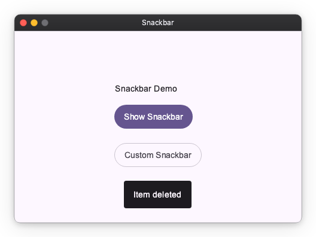
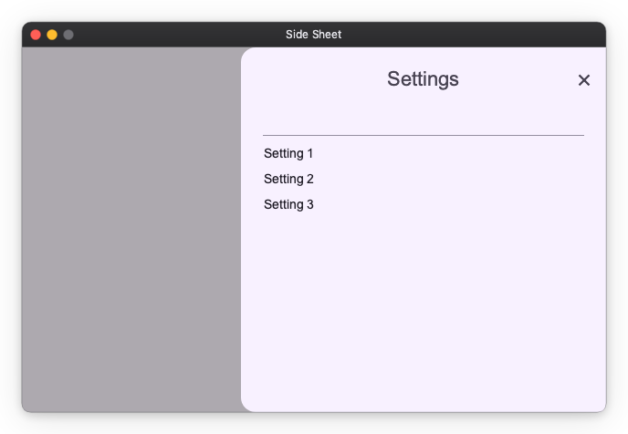
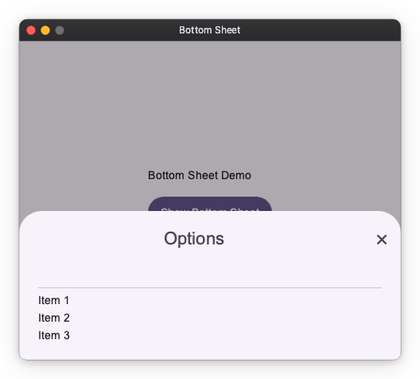
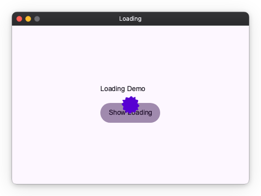

# Material Overlay

`MaterialOverlay` is a Material Design 3-flavored subclass of `Overlay` — the framework's system for displaying content above the main widget tree. It is automatically configured by `App`.

!!! note "Import convention"
    Import `App` and `Overlay` from `nuiitivet.material`.

    ```python
    from nuiitivet.material import App
    from nuiitivet.material import Overlay
    ```

    The rest of this guide follows this convention.

The base `Overlay` exposes three primitives: `show_modal`, `show_modeless`, and `show_light_dismiss` — see [Primitives](../overlay/primitives.md) for details. `MaterialOverlay` wraps these with two additions:

1. **Shortcut methods** — `dialog()`, `snackbar()`, `bottom_sheet()`, `side_sheet()`, `loading()` — each pre-configured with the correct MD3 position and transition.
2. **Intent resolution** — shortcuts accept plain data objects (intents) in addition to widgets, decoupling business logic from the widget layer.

## Accessing Overlay

`App` registers an `Overlay` instance as the root overlay. In most cases, use `Overlay.root()` to retrieve it directly.

```python
from nuiitivet.material import Overlay

overlay = Overlay.root()
```

`Overlay.of(self)` walks up the widget tree and returns the nearest ancestor `Overlay`. Use this only when you have intentionally nested an `Overlay` inside the widget tree and need to reach that inner instance rather than the root.

```python
# Only needed when an Overlay is nested in the widget tree
overlay = Overlay.of(self)
```

## Shortcuts at a Glance

| Shortcut | Base primitive | Scrim |
| -------- | -------------- | ----- |
| `dialog()` | `show_modal` | Fade |
| `snackbar()` | `show_modeless` | None |
| `side_sheet()` | `show_modal` | Fade |
| `bottom_sheet()` | `show_modal` | Fade |
| `loading()` | `show_modeless` | None |

Every shortcut returns an `OverlayHandle`. You can await it to receive the result after the overlay closes:

```python
handle = overlay.dialog(...)
result = await handle   # OverlayResult[T]
if result.value is True:
    ...
```

For a full treatment of the handle/await pattern and MVVM architecture, see [Dialogs](../overlay/dialogs.md).

## Dialog

Displays a modal dialog with a scrim. This is the most common use case; refer to [Dialogs](../overlay/dialogs.md) for the complete guide including custom dialogs, `OverlayAware`, and MVVM patterns.

```python
from nuiitivet.material import BasicDialog, Button, ButtonStyle, Overlay

overlay.dialog(
    BasicDialog(
        title="Delete item?",
        message="This action cannot be undone.",
        actions=[
            Button("Cancel", on_click=lambda: Overlay.root().close(None), style=ButtonStyle.text()),
            Button("Delete", on_click=lambda: Overlay.root().close(True), style=ButtonStyle.text()),
        ],
    )
)
```

| Parameter | Type | Default | Description |
| --------- | ---- | ------- | ----------- |
| `dialog` | `Widget \| Any` | required | Dialog widget, or an intent resolved by the overlay |
| `dismiss_on_outside_tap` | `bool` | `True` | Dismiss when tapping the scrim |

For a fully custom `Route` (non-standard transition or barrier), call `show_modal()` directly. Dialogs do not auto-dismiss, so there is no `timeout` parameter.

## Snackbar

Displays a brief, non-blocking message at the bottom of the screen. Background interaction remains active. Automatically dismisses after `duration` seconds.

```python
overlay.snackbar("Item deleted")
```

Pass a `Snackbar` widget for more control over appearance:

```python
from nuiitivet.material.snackbar import Snackbar

overlay.snackbar(Snackbar("Upload complete"))
```

| Parameter | Type | Default | Description |
| --------- | ---- | ------- | ----------- |
| `message` | `str \| Snackbar` | required | Message text or a `Snackbar` widget |
| `duration` | `float` | `3.0` | Display duration in seconds |



## Side Sheet

Displays a modal sheet that slides in from a side edge. The slide-in edge is a placement concern owned by `side_sheet()`: the `side` argument drives three things at once — the slide direction of the transition, the screen-edge alignment, and which (inner, away-from-edge) corners are rounded. The corner rounding is applied by `side_sheet()` via the `corner_radius` modifier, so the `SideSheet` widget itself renders a square container and no longer takes a `side` parameter.

```python
from nuiitivet.material import SideSheet, Text

overlay.side_sheet(
    SideSheet(
        headline="Settings",
        content=Text("Sheet content here"),
    ),
    side="right",
)
```

| Parameter | Type | Default | Description |
| --------- | ---- | ------- | ----------- |
| `sheet` | `SideSheet` | required | Side sheet widget |
| `side` | `"right" \| "left"` | `"right"` | Edge the sheet slides in from |
| `dismiss_on_outside_tap` | `bool` | `True` | Dismiss when tapping the scrim |



## Bottom Sheet

Displays a modal sheet that slides up from the bottom edge. The same principle as `side_sheet()` applies: the transition direction (slide from bottom), screen-edge position (bottom-center), and corner radii (top two corners rounded, bottom edge flush) must all stay consistent. Because all three are determined solely by the fact that it is a bottom sheet, `bottom_sheet()` accepts only a `BottomSheet` widget rather than an arbitrary `OverlayRoute`.

```python
from nuiitivet.material import BottomSheet, Text

overlay.bottom_sheet(
    BottomSheet(
        headline="Options",
        content=Text("Sheet content here"),
    )
)
```

| Parameter | Type | Default | Description |
| --------- | ---- | ------- | ----------- |
| `sheet` | `BottomSheet` | required | Bottom sheet widget |
| `dismiss_on_outside_tap` | `bool` | `True` | Dismiss when tapping the scrim |



## Loading Indicator

Displays a centered loading indicator. The overlay is modeless — background content remains visible but there is no dismiss gesture. Use `handle.close(None)` or `while_loading()` to dismiss it.

### Manual Control

```python
handle = overlay.loading()
perform_long_task()
handle.close(None)
```

### Context Manager

`while_loading()` shows the indicator and guarantees it is dismissed when the block exits, even on exceptions:

```python
async with Overlay.of(self).while_loading():
    await fetch_data()
```

### Custom Indicator

```python
async with Overlay.of(self).while_loading(my_custom_widget):
    await fetch_data()
```



## Material Design 3 Transitions

Each shortcut applies a pre-configured MD3 transition automatically. All transitions use Material Expressive spring-based easing (`EXPRESSIVE_DEFAULT_EFFECTS`).

| Shortcut | Enter | Exit | Scrim |
| -------- | ----- | ---- | ----- |
| `dialog` | Fade in + scale up from 92% | Fade out + scale down to 96% | Fades with content |
| `snackbar` | Fade in + slide up 20 px | Fade out | None |
| `bottom_sheet` | Slide in from bottom edge | Slide out to bottom edge | Fades with content |
| `side_sheet` | Slide in from side edge | Slide out to side edge | Fades with content |
| `loading` | Instant | Instant | None |

These shortcuts accept only their typed arguments — a `Widget` (or intent) for `dialog()`/`loading()`, `str`/`Snackbar` for `snackbar()`, and the corresponding sheet widget for `bottom_sheet()`/`side_sheet()`. They do not accept a free-form `Route`/`OverlayRoute`, because each shortcut owns the MD3 transition, screen-edge position, and (for sheets) corner radii, and accepting an arbitrary route would break that consistency. `bottom_sheet()` derives everything from the fact that it is a bottom sheet; `side_sheet()` derives it from its `side` argument.

To display fully custom overlay content with a non-standard transition or barrier, call `show_modal()` / `show_modeless()` directly.

## Intent System

Intents let view models request overlays without importing widget classes. Pass a plain data object to a shortcut; `Overlay` resolves it to the correct widget via the registered `overlay_routes`.

### Built-in Intents

| Intent | Resolves to | Shortcut |
| ------ | ----------- | -------- |
| `BasicDialogIntent` | `BasicDialog` with an OK button | `dialog()` |
| `LoadingIntent` | Built-in `LoadingIndicator` | `loading()` |

```python
from nuiitivet.material.intents import BasicDialogIntent

overlay.dialog(BasicDialogIntent(title="Error", message="Something went wrong."))
```

### Custom Intents

Register a mapping from intent type to widget factory in `App`:

```python
from dataclasses import dataclass
from nuiitivet.material import App, BasicDialog, Button, ButtonStyle, Overlay


@dataclass(frozen=True)
class ConfirmIntent:
    message: str


App(
    HomeScreen(),
    overlay_routes={
        ConfirmIntent: lambda intent: BasicDialog(
            title="Confirm",
            message=intent.message,
            actions=[
                Button("Cancel", on_click=lambda: Overlay.root().close(False), style=ButtonStyle.text()),
                Button("OK", on_click=lambda: Overlay.root().close(True), style=ButtonStyle.text()),
            ],
        ),
    },
).run()
```

Dispatch from anywhere in the widget tree:

```python
async def on_submit(self) -> None:
    handle = Overlay.of(self).dialog(ConfirmIntent(message="Submit form?"))
    result = await handle
    if result.value is True:
        self.submit()
```

For more on intents in the context of MVVM architecture, see [Dialogs — Architecting Dialogs in MVVM](../overlay/dialogs.md#architecting-dialogs-in-mvvm).

---

[API Reference](../../api/material.md#nuiitivet.material.MaterialOverlay)
