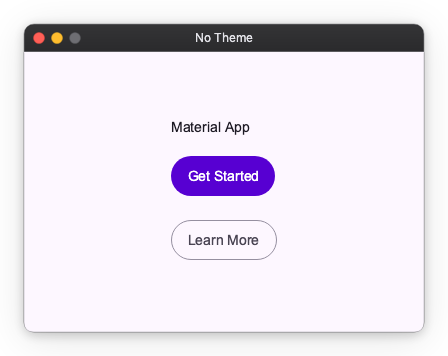
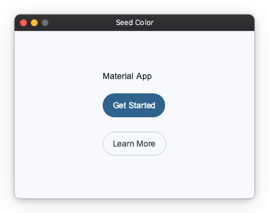
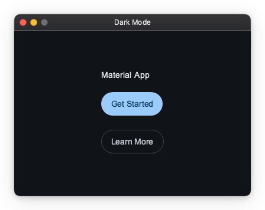

# Material Theme

`MaterialThemeFactory` is a factory that creates `Theme` objects pre-configured with Material Design 3 color roles derived from a seed color.

!!! note "Import convention"
    `App` and `ThemeFactory` are the public names exported from `nuiitivet.material` for these classes.
    Import and use them by these names throughout your code.

    ```python
    import nuiitivet.material as nv
    ```

    The rest of this guide follows this convention.

## Setting the Theme

Pass a `Theme` to `App` via the `theme` parameter to apply it to the entire application.

### No theme

When `theme` is omitted, `App` applies the default M3 light theme (`#6750A4`).

```python
import nuiitivet.material as nv

nv.App(HomeScreen()).run()
```



### Seed color

Pass a different seed color to generate a distinct M3 palette:

```python
import nuiitivet.material as nv

nv.App(HomeScreen(), theme=nv.ThemeFactory.light("#00639B")).run()
```



### Dark mode

```python
nv.App(HomeScreen(), theme=nv.ThemeFactory.dark("#00639B")).run()
```



---

## Tuning the Palette

A seed color does not fully determine the palette. Two further inputs shape how roles are derived from it, and both default to the Material 3 defaults.

### Scheme variant

`variant` selects the algorithm that derives the tonal palettes from the seed. It defaults to `SchemeVariant.TONAL_SPOT`, the M3 default, which keeps colors close to the seed's hue at a moderate chroma.

```python
import nuiitivet.material as nv

nv.App(HomeScreen(), theme=nv.ThemeFactory.light("#6750A4", variant=nv.SchemeVariant.VIBRANT)).run()
```

| Variant | Character |
| --- | --- |
| `TONAL_SPOT` | M3 default; moderate chroma near the seed hue |
| `NEUTRAL` | Near-grayscale, seed hue barely present |
| `MONOCHROME` | Pure grayscale |
| `VIBRANT` | Maximum chroma; strongly saturated |
| `EXPRESSIVE` | Shifts hue away from the seed for contrast |
| `FIDELITY` / `CONTENT` | Stays as close to the literal seed color as possible |
| `RAINBOW` / `FRUIT_SALAD` | Playful multi-hue schemes |

### Contrast level

`contrast_level` accepts a value in `[-1.0, 1.0]` and defaults to `0.0`. Higher values push foreground roles further from their backgrounds, which helps meet accessibility requirements.

```python
nv.App(HomeScreen(), theme=nv.ThemeFactory.light("#6750A4", contrast_level=0.5)).run()
```

Both options are accepted by `ThemeFactory.light`, `dark`, `from_seed`, and `from_seed_pair`.

---

## Switching Themes at Runtime

To switch the active theme, dispatch an intent via `App.of(self).dispatch(intent)`.

### Light / Dark Toggle

`from_seed_pair` generates both a light and a dark `Theme` from a single seed color. Use an `Observable[str]` for the button label so it updates reactively without a full rebuild:

```python
import nuiitivet.material as nv

light, dark = nv.ThemeFactory.from_seed_pair("#6750A4")

class HomeScreen(nv.ComposableWidget):
    _is_dark = False

    def on_toggle() -> None:
        next_theme = light if self._is_dark else dark
        nv.App.of(self).dispatch(nv.ThemeModeIntent(theme=next_theme))

nv.App(HomeScreen(), theme=light).run()
```

See the full runnable demo: `samples/design-system/material_theme/light_dark_toggle.py`

### Multiple Themes

When themes are too many to hold in local scope everywhere, register them by name with `ThemeRegistryIntent` and switch by string key:

```python
import nuiitivet.material as nv

ocean_light, ocean_dark   = nv.ThemeFactory.from_seed_pair("#00639B")
forest_light, forest_dark = nv.ThemeFactory.from_seed_pair("#386A20")

app = nv.App(HomeScreen(), theme=ocean_light)

# Register before run() — app.dispatch() is safe before the event loop starts
app.dispatch(nv.ThemeRegistryIntent(themes={
    "ocean-light":  ocean_light,
    "ocean-dark":   ocean_dark,
    "forest-light": forest_light,
    "forest-dark":  forest_dark,
}))

app.run()


# Switch from anywhere in the widget tree
nv.App.of(self).dispatch(nv.ThemeModeIntent(theme="forest-dark"))
```

See the full runnable demo: `samples/design-system/material_theme/multiple_themes.py`

!!! note "Registry keys and `from_seed_pair` names"
    `from_seed_pair` accepts an optional `name` argument, but it assigns the **same** label to both the light and dark `Theme` — no `-light` / `-dark` suffix is appended automatically. The dictionary keys in `ThemeRegistryIntent` are the actual lookup keys; choose them freely.

    ```python
    light, dark = nv.ThemeFactory.from_seed_pair("#6750A4", name="brand")
    light.name  # "brand"
    dark.name   # "brand"  ← same, not "brand-dark"
    ```

!!! note "`\"light\"` and `\"dark\"` as built-in fallbacks"
    `ThemeModeIntent(theme="light")` and `ThemeModeIntent(theme="dark")` are reserved shortcuts. When no theme with that exact name is registered, they fall back to a plain (non-Material) default theme.

    These strings happen to equal the values of `Theme.mode`, but they are separate concepts — one is a registry lookup key, the other is a property of the `Theme` object itself.

---

## Advanced: Color Roles in Custom Widgets

!!! note "Target audience"
    This section is for authors building **custom widgets**. Built-in Material widgets apply color roles automatically; if you are only composing them, you do not need this.

### Reading the current theme

Inside any mounted widget, `Theme.of(self)` returns the active `Theme`:

```python
import nuiitivet.material as nv

theme = nv.Theme.of(self)
is_dark = theme.mode == "dark"
```

### Applying a color role

Call `theme.extension(MaterialThemeData)` to retrieve M3-specific data, then look up a `ColorRole`:

```python
import nuiitivet.material as nv
from nuiitivet.material.theme.theme_data import MaterialThemeData

mat = nv.Theme.of(self).extension(MaterialThemeData)
if mat is not None:
    surface_color = mat.roles.get(nv.ColorRole.SURFACE_CONTAINER)
```

`ColorRole` also provides a `resolve` shorthand that combines both steps:

```python
color = nv.ColorRole.SURFACE_CONTAINER.resolve(nv.Theme.of(self))  # str | None
```

Both `extension()` and `resolve()` return `None` outside an initialized widget tree (e.g. during construction), so always guard against `None`.

### Example: theme-aware custom widget

```python
import nuiitivet.material as nv


class ThemedCard(nv.ComposableWidget):
    def __init__(self, child: nv.Widget) -> None:
        super().__init__()
        self.child = child

    def build(self) -> nv.Widget:
        bg = nv.ColorRole.SURFACE_CONTAINER.resolve(nv.Theme.of(self)) or "#FFFFFF"
        return nv.Container(color=bg, padding=16, child=self.child)
```

### Available Color Roles

| Group | Roles |
| ----- | ----- |
| Primary | `PRIMARY`, `ON_PRIMARY`, `PRIMARY_CONTAINER`, `ON_PRIMARY_CONTAINER`, `INVERSE_PRIMARY` |
| Secondary | `SECONDARY`, `ON_SECONDARY`, `SECONDARY_CONTAINER`, `ON_SECONDARY_CONTAINER` |
| Tertiary | `TERTIARY`, `ON_TERTIARY`, `TERTIARY_CONTAINER`, `ON_TERTIARY_CONTAINER` |
| Background | `BACKGROUND`, `ON_BACKGROUND` |
| Surface | `SURFACE`, `ON_SURFACE`, `INVERSE_SURFACE`, `INVERSE_ON_SURFACE`, `SURFACE_VARIANT`, `ON_SURFACE_VARIANT` |
| Surface containers | `SURFACE_CONTAINER_LOWEST`, `SURFACE_CONTAINER_LOW`, `SURFACE_CONTAINER`, `SURFACE_CONTAINER_HIGH`, `SURFACE_CONTAINER_HIGHEST` |
| Outline | `OUTLINE`, `OUTLINE_VARIANT` |
| Utility | `SHADOW`, `SCRIM` |
| Error | `ERROR`, `ON_ERROR`, `ERROR_CONTAINER`, `ON_ERROR_CONTAINER` |

---

[API Reference](../../api/material.md#nuiitivet.material.MaterialThemeFactory)
