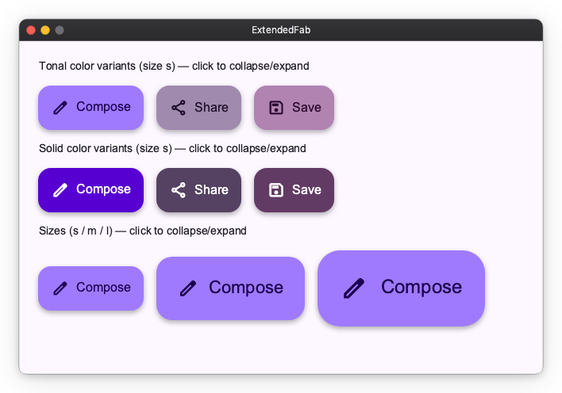
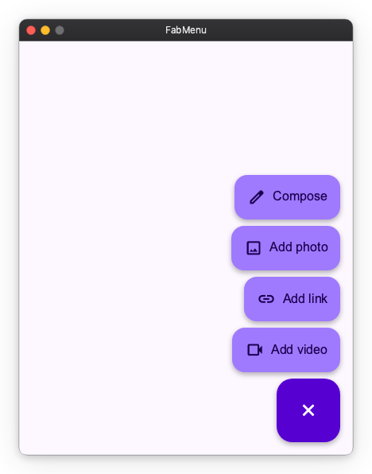
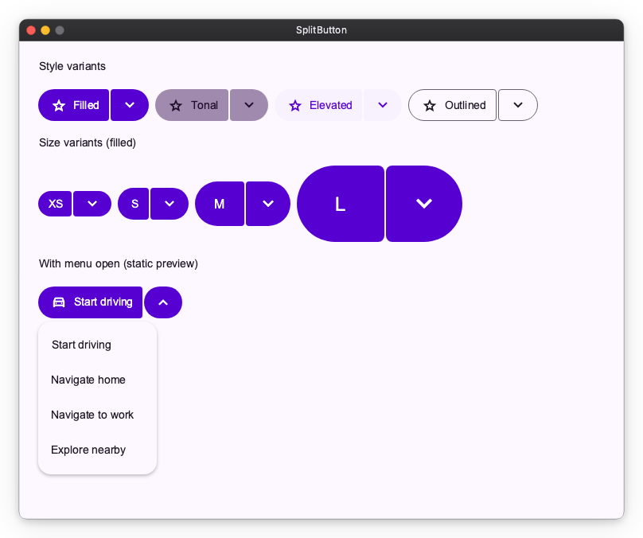
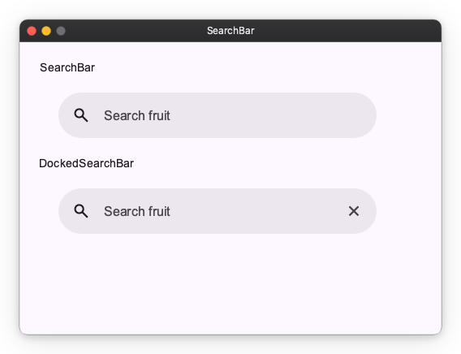
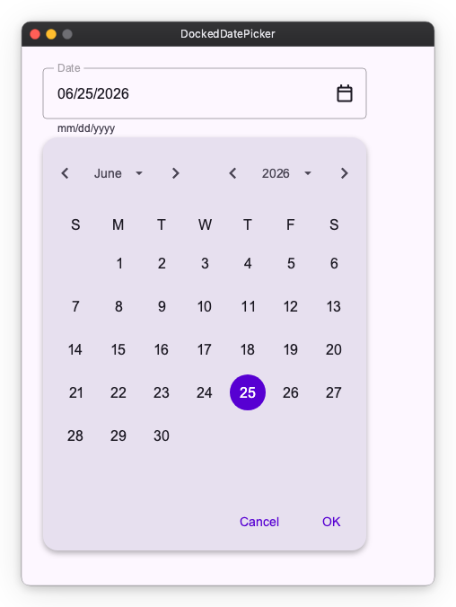

# Material Widgets

`nuiitivet.material` implements Material Design 3 widgets, with more on the way. This page showcases the available widgets — each with a screenshot and a link to the API reference. Overlay-based widgets (Dialog, BottomSheet, SideSheet, Loading) are covered in [Material Overlay](material_overlay.md).

!!! note "Import convention"
    All widgets shown below are exported from `nuiitivet.material`:

    ```python
    import nuiitivet.material as nv
    ```

---

## Text

Typography component for rendering text with theme-aware styles.


[API Reference](../../api/material.md#nuiitivet.material.Text)

---

## Icon

Material Symbols icon component. Specify a symbol name and an optional size.


[API Reference](../../api/material.md#nuiitivet.material.Icon)

---

## Button

Five M3 button styles — Filled, Tonal, Elevated, Outlined, and Text — plus icon support and disabled state.


[API Reference](../../api/material.md#nuiitivet.material.Button)

---

## ToggleButton

Two-state button with selected / unselected appearance. Available in Filled and Outlined styles.


[API Reference](../../api/material.md#nuiitivet.material.ToggleButton)

---

## IconButton

Compact icon-only buttons in the standard M3 styles, plus a toggle variant.


[API Reference](../../api/material.md#nuiitivet.material.IconButton)

---

## Fab (Floating Action Button)

Prominent action button. Multiple color variants and three sizes (small / medium / large).


[API Reference](../../api/material.md#nuiitivet.material.Fab)

---

## ExtendedFab

FAB with a label beside the icon. Toggle its `expanded` observable to morph between the extended pill and a circular FAB. Available in tonal and solid color variants across all three sizes.



[API Reference](../../api/material.md#nuiitivet.material.ExtendedFab)

---

## FabMenu

M3 Expressive FAB menu. A single `is_open` observable morphs the FAB between its `add` and `close` icons and reveals a stack of labelled `FabMenuItem` actions, dismissed by tapping outside or selecting an action.



API References: [FabMenu](../../api/material.md#nuiitivet.material.FabMenu) ・ [FabMenuItem](../../api/material.md#nuiitivet.material.FabMenuItem)

---

## SplitButton

M3 Expressive split button — a leading action button joined to a trailing button that opens a menu. Available in Filled, Tonal, Elevated, and Outlined styles across sizes XS–L.



[API Reference](../../api/material.md#nuiitivet.material.SplitButton)

---

## ButtonGroup

Group related actions. `StandardButtonGroup` keeps spacing between buttons; `ConnectedButtonGroup` connects them as a single segmented control.


[API Reference](../../api/material.md#nuiitivet.material.StandardButtonGroup)

---

## Selection Controls

`Checkbox`, `RadioButton` (typically grouped via `RadioGroup`), and `Switch` for boolean / single-select input.


API References: [Checkbox](../../api/material.md#nuiitivet.material.Checkbox) ・ [RadioButton](../../api/material.md#nuiitivet.material.RadioButton) ・ [Switch](../../api/material.md#nuiitivet.material.Switch)

---

## Slider

Numeric input, split by axis. `HorizontalSlider` / `VerticalSlider` select a value in a range, the `*CenteredSlider` variants are anchored at zero, and the `*RangeSlider` variants select a min/max pair. Horizontal variants are sized with `width`; vertical variants with `height`.


API References: [HorizontalSlider](../../api/material.md#nuiitivet.material.HorizontalSlider) ・ [VerticalSlider](../../api/material.md#nuiitivet.material.VerticalSlider) ・ [HorizontalCenteredSlider](../../api/material.md#nuiitivet.material.HorizontalCenteredSlider) ・ [VerticalCenteredSlider](../../api/material.md#nuiitivet.material.VerticalCenteredSlider) ・ [HorizontalRangeSlider](../../api/material.md#nuiitivet.material.HorizontalRangeSlider) ・ [VerticalRangeSlider](../../api/material.md#nuiitivet.material.VerticalRangeSlider)

---

## TextField

Text input, with leading icons, supporting text and error states. The filled and outlined variants come from `style`; `TextField.multiline` is the text area.


An `Observable` passed as `value` is the field's value — it is displayed, and what the user types is written into it. A read-only source (`.map(...)`, a computed value) has nowhere to write, so it only displays; pair it with `disabled=True`.

```python
nv.TextField(value=self.query, label="Search")
nv.TextField(value=self.pin, input_filter=nv.digits_only() | nv.max_length(4))
nv.TextField.multiline(value=self.notes, label="Notes", max_lines=4)
```

Derive what the text means from the observable; `on_change` is for a side effect only. `on_submit` fires on every `Enter` and never on focus loss, and setting it takes `Enter` from the screen's shortcuts ([Interaction modifiers](../modifiers/interaction.md)); work for when the user leaves the field goes in `on_focus_change`. In a multi-line field `Shift+Enter` breaks the line and `Enter` still submits. Restricting what can be typed, and finishing a half-typed value on the way out, are recipes in [Typed Values from Text Input](../state-management/patterns_and_recipes.md#typed-values-from-text-input).

[API Reference](../../api/material.md#nuiitivet.material.TextField)

---

## SearchBar

A search input. `DockedSearchBar` is the same bar with a panel anchored below it.



`value` binds exactly as `TextField`'s does — pass an `Observable` and what the user types is written into it.

```python
nv.SearchBar(self.query, placeholder="Search fruit", width=440)
```

**`DockedSearchBar`** puts one widget in that panel, as `content`. It holds whatever the query currently calls for — recent searches, suggestions, results, a spinner, "no matches" — and you swap what is inside it from your own observables:

```python
nv.DockedSearchBar(
    self.query,
    placeholder="Search fruit",
    content=nv.Column(
        children=[nv.ForEach(self.matches, lambda item, index: nv.Text(item))],
    ),
    on_submit=self.search,
    width=440,
)
```

`content` stays live while the panel is closed, so whatever drives it keeps running. Gate that with your own observable if it is expensive.

### Opening and closing the panel

The widget drives one observable from these triggers:

| Trigger | Effect |
| --- | --- |
| The bar takes focus | Open — including on an empty query, where MD3 shows recent searches |
| A tap on the bar | Open — so a click brings a closed panel back even while the bar keeps focus |
| The user edits the text | Open, even if it was just closed |
| `Enter` | Close, unless you pass `close_on_enter=False` |
| `Escape` | Close, leaving the bar focused — typing reopens it. With the panel closed, `Escape` is left for an enclosing handler |
| Focus leaves, or a tap outside | Close. The bar itself is not outside: clicking into the text moves the caret and the panel stays up |

That default gives you the usual desktop loop for free: `Enter` puts the panel away, `on_submit` renders results on the page, and typing again brings the panel back. The close runs *before* `on_submit`, so a search that wants the panel to stay up can reopen it from inside its own callback. To keep the results *in* the panel instead, pass `close_on_enter=False` and swap `content` when the search returns.

Only *user* edits reopen it. Assigning to the bound observable does not, so filling the bar in after the user picks something leaves the panel closed:

```python
def pick(self, item: str) -> None:
    self.query.value = item      # the panel stays closed
    self.search(item)
```

Pass `is_open=self.panel_open` to drive the panel from your own `Observable[bool]`, or to react to it opening and closing. Writing to it opens and closes the panel directly; omit it and the widget keeps its own, readable as `bar.is_open`.

In a window too short for the panel, it keeps its minimum height and extends past the bottom edge rather than covering the bar.

**There is no full-screen search widget.** Lay the screen out yourself and put a `SearchBar` in it; the bar keeps its focus animation there.

**Not supported:** an avatar slot, multiple trailing actions, and a disabled state. `trailing_icon` is a single generic slot — clearing the query is one thing you can wire it to, not built-in behaviour.

[API Reference](../../api/material.md#nuiitivet.material.SearchBar)

---

## Card

Container for grouped content. Three variants — Filled, Outlined, Elevated.


[API Reference](../../api/material.md#nuiitivet.material.Card)

---

## Chip

Compact actions and choices: `AssistChip`, `FilterChip`, `InputChip`, `SuggestionChip`.


API References: [AssistChip](../../api/material.md#nuiitivet.material.AssistChip) ・ [FilterChip](../../api/material.md#nuiitivet.material.FilterChip) ・ [InputChip](../../api/material.md#nuiitivet.material.InputChip) ・ [SuggestionChip](../../api/material.md#nuiitivet.material.SuggestionChip)

---

## Badge

Small status indicator that decorates other widgets via a modifier. `SmallBadge` is a dot; `LargeBadge` shows a count.


API References: [SmallBadge](../../api/material.md#nuiitivet.material.SmallBadge) ・ [LargeBadge](../../api/material.md#nuiitivet.material.LargeBadge)

---

## Divider

Separator line, split by axis. `HorizontalDivider` draws a full-width line (sized with `width`); `VerticalDivider` draws a full-height line (sized with `height`). The cross-axis thickness comes from the style.


API References: [HorizontalDivider](../../api/material.md#nuiitivet.material.HorizontalDivider) ・ [VerticalDivider](../../api/material.md#nuiitivet.material.VerticalDivider)

---

## Progress Indicators

Linear and circular progress, in determinate and indeterminate variants. `LoadingIndicator` is the M3 Expressive shape-morphing indicator.


API References: [LinearProgressIndicator](../../api/material.md#nuiitivet.material.LinearProgressIndicator) ・ [CircularProgressIndicator](../../api/material.md#nuiitivet.material.CircularProgressIndicator) ・ [LoadingIndicator](../../api/material.md#nuiitivet.material.LoadingIndicator)

---

## NavigationRail

Vertical navigation bar with collapsed / expanded states, badges, and an optional menu button. Pairs with [Material Navigator](material_navigator.md) for routing.


[API Reference](../../api/material.md#nuiitivet.material.NavigationRail)

---

## Toolbar

Action bar of icon buttons. `DockedToolbar` stretches to its container; `HorizontalFloatingToolbar` / `VerticalFloatingToolbar` are pill-shaped overlays laid out along their respective axis. `Button` / `IconButton` children are recommended per MD3; other widgets (including tooltip-wrapped buttons) are laid out as-is.


API References: [DockedToolbar](../../api/material.md#nuiitivet.material.DockedToolbar) ・ [HorizontalFloatingToolbar](../../api/material.md#nuiitivet.material.HorizontalFloatingToolbar) ・ [VerticalFloatingToolbar](../../api/material.md#nuiitivet.material.VerticalFloatingToolbar)

---

## Menu

Vertical list of `MenuItem`s. Supports leading icons, trailing shortcut/affordance text, dividers, and disabled items.


[API Reference](../../api/material.md#nuiitivet.material.Menu)

---

## Tooltip

Contextual hint shown next to a target. `Tooltip` is a plain text label; `RichTooltip` supports a title, body, and action buttons.


API References: [Tooltip](../../api/material.md#nuiitivet.material.Tooltip) ・ [RichTooltip](../../api/material.md#nuiitivet.material.RichTooltip)

---

## StandardSideSheet

Docked side panel that sits beside the main content area. Unlike the modal `SideSheet`, it is a permanent part of the layout. Pass a writable `Observable[bool]` as `opened` and the sheet animates its own width open and closed, staying mounted throughout.

```python
opened: nv.Observable[bool] = nv.Observable(True)

nv.Row([
    main_content,
    nv.StandardSideSheet(panel_content, headline="Filters", opened=opened),
])
```

The close icon button writes `opened.value = False` by default. Pass `on_close_click` to intercept the press instead — the callback **replaces** the default, so updating `opened` becomes your responsibility:

```python
def confirm_close() -> None:
    if vm.has_unsaved_changes:
        vm.show_confirm_dialog()
    else:
        opened.value = False

nv.StandardSideSheet(panel_content, opened=opened, on_close_click=confirm_close)
```

With a literal `opened=True` and no `on_close_click`, no close button is rendered: a press would have nothing to act on.


[API Reference](../../api/material.md#nuiitivet.material.StandardSideSheet)

---

## DockedDatePicker

A text field with a trailing calendar icon button. Tapping the icon opens a calendar in a dropdown anchored below the field; the date can also be typed directly.

`value` is the field's **text**, not a date. The date is derived from it, and so is anything the application wants to say about it — the widget flags nothing on its own, so `is_error` and `supporting_text` are derived from the same text and passed in.

```python
self.arrival_text = nv.Observable("")
self.arrival = self.arrival_text.map(nv.parse_date)      # date | None

nv.DockedDatePicker(value=self.arrival_text, label="Arrival")
```

See [Typed Values from Text Input](../state-management/patterns_and_recipes.md#typed-values-from-text-input) for the recipe, and `nv.DateFormat` for a pattern other than `mm/dd/yyyy`.

The calendar renders English month names and weekday initials in a Sunday-first grid on every platform — it never reads the process locale. To localize it, pass `nv.CalendarLabels`:

```python
import calendar

nv.DockedDatePicker(
    value=self.arrival_text,
    label="Anreise",
    date_format=nv.DateFormat("dd.mm.yyyy"),
    labels=nv.CalendarLabels(
        month_names=("Januar", "Februar", "März", "April", "Mai", "Juni", "Juli",
                     "August", "September", "Oktober", "November", "Dezember"),
        weekday_labels=("Mo", "Di", "Mi", "Do", "Fr", "Sa", "So"),  # Monday first
        first_day_of_week=calendar.MONDAY,
    ),
)
```

`weekday_labels` is always given Monday-first (indexed like `date.weekday()`), whatever `first_day_of_week` says; the default first day is Sunday, per MD3. The header always shows the month before the year, even for languages that write the year first. `DatePicker`, the inline calendar, takes the same `labels`.



[API Reference](../../api/material.md#nuiitivet.material.DockedDatePicker)

---

## Image

`Image` is a primitive widget that is not part of Material Design. Displays a raster image from in-memory bytes. Supports `contain`, `cover`, `fill`, and `none` fit modes.


[API Reference](../../api/widgets.md#nuiitivet.widgets.image.Image)
