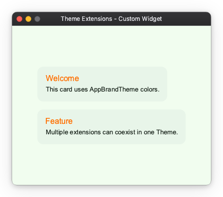
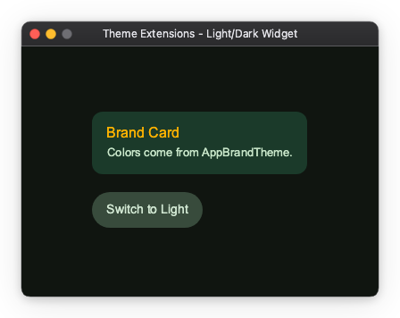

# Theme Extensions

`Theme` itself is design-agnostic — it is simply a container for a list of
`ThemeExtension` objects. Built-in widgets such as `Button` and `Checkbox`
depend on `MaterialThemeData` being registered in that list. You can attach
your own extensions to the same list to inject additional design-system data
without interfering with Material.

!!! note "Import convention"
    `ThemeExtension` is available from the aggregate `nuiitivet.material` namespace:

    ```python
    import nuiitivet.material as nv
    ```

---

## Why `extensions`?

| Concern | Mechanism |
|---------|-----------|
| Keep `Theme` design-agnostic | `Theme` holds no built-in color roles. All data lives in extensions. |
| Support multiple independent concerns | Each extension has a distinct type; `theme.extension(T)` retrieves exactly one. |
| Enforce uniqueness | Registering two extensions of the same type raises `ValueError`. |

### Retrieving an extension

```python
import nuiitivet.material as nv

mat = nv.Theme.of(self).extension(MaterialThemeData)  # returns MaterialThemeData | None
```

Always guard the result against `None` — `extension()` returns `None` when
the extension is not present or when the widget is not yet mounted.

---

## Use case 1 — Custom widget backed by a ThemeExtension

This pattern is for authors building **custom widgets** that need app-specific
colors or sizes that do not belong to Material.

### Step 1: Define the extension

```python
from dataclasses import dataclass, replace

@dataclass(frozen=True)
class AppBrandTheme:
    brand_primary: str = "#1A6B3C"
    brand_on_primary: str = "#FFFFFF"
    brand_surface: str = "#E8F5E9"
    brand_accent: str = "#FF6F00"

    def copy_with(self, **kwargs) -> "AppBrandTheme":
        return replace(self, **kwargs)
```

`@dataclass(frozen=True)` satisfies the `ThemeExtension` protocol automatically —
all that is required is a `copy_with` method.

### Step 2: Build a theme that includes both extensions

```python
import nuiitivet.material as nv

def make_theme() -> nv.Theme:
    base = nv.ThemeFactory.light("#1A6B3C")
    return nv.Theme(
        mode=base.mode,
        extensions=[*base.extensions, AppBrandTheme()],
        name="app-brand-light",
    )
```

`MaterialThemeData` (from `ThemeFactory`) and `AppBrandTheme` coexist in the
same `extensions` list. Each has a unique type, so there is no conflict.

### Step 3: Read the extension inside a widget

```python
import nuiitivet.material as nv

class BrandCard(nv.ComposableWidget):
    def __init__(self, heading: str, content: str) -> None:
        super().__init__()
        self.heading = heading
        self.content = content

    def build(self) -> nv.Widget:
        brand = nv.Theme.of(self).extension(AppBrandTheme)
        bg     = brand.brand_surface if brand else "#E8F5E9"
        accent = brand.brand_accent  if brand else "#FF6F00"
        ...
```

### Full sample

See the complete runnable example: `samples/design-system/theme_extensions/custom_widget.py`



---

## Use case 2 — Light / Dark support

This use case extends `BrandCard` from Use case 1 to support runtime
light / dark switching. Two `AppBrandTheme` variants — one for each mode —
are swapped in by a toggle button.

### Step 1: Add required fields (no defaults)

Remove the default values so each theme factory is forced to supply explicit
colors for its mode:

```python
import nuiitivet.material as nv

@dataclass(frozen=True)
class AppBrandTheme:
    brand_surface: str     # no default — must be set per mode
    brand_on_surface: str  # text color on brand_surface
    brand_accent: str

    def copy_with(self, **kwargs) -> nv.ThemeExtension:
        return replace(self, **kwargs)
```

### Step 2: Create separate light and dark factories

```python
import nuiitivet.material as nv

def make_light_theme() -> nv.Theme:
    base = nv.ThemeFactory.light("#1A6B3C")
    return nv.Theme(
        mode=base.mode,
        extensions=[*base.extensions, AppBrandTheme(
            brand_surface="#E8F5E9",
            brand_on_surface="#1B2A1F",
            brand_accent="#FF6F00",
        )],
        name="app-brand-light",
    )

def make_dark_theme() -> nv.Theme:
    base = nv.ThemeFactory.dark("#1A6B3C")
    return nv.Theme(
        mode=base.mode,
        extensions=[*base.extensions, AppBrandTheme(
            brand_surface="#1B3A2A",
            brand_on_surface="#C8E6C9",
            brand_accent="#FFB300",
        )],
        name="app-brand-dark",
    )
```

### Step 3: Subscribe to theme changes and rebuild

`BrandCard` must call `rebuild()` when the theme changes so that `build()`
is re-run with the new extension values. The subscription follows the same
pattern used by built-in Material widgets:

```python
from typing import Optional
import nuiitivet.material as nv

class BrandCard(nv.ComposableWidget):
    def __init__(self, heading: str, content: str) -> None:
        super().__init__()
        self.heading = heading
        self.content = content
        self._theme_manager: Optional[nv.ThemeManager] = None

    def on_mount(self) -> None:
        super().on_mount()
        scope = self.find_ancestor(nv.AppScope)
        if scope is not None:
            self._theme_manager = scope.theme_manager
            self._theme_manager.subscribe(self._on_theme_change)

    def on_unmount(self) -> None:
        if self._theme_manager is not None:
            self._theme_manager.unsubscribe(self._on_theme_change)
            self._theme_manager = None
        super().on_unmount()

    def _on_theme_change(self, _theme: nv.Theme) -> None:
        self.rebuild()

    def build(self) -> nv.Widget:
        brand  = nv.Theme.of(self).extension(AppBrandTheme)
        bg     = brand.brand_surface     if brand else "#1B3A2A"
        fg     = brand.brand_on_surface  if brand else "#C8E6C9"
        accent = brand.brand_accent      if brand else "#FFB300"
        ...
```

`Theme.of(self)` is called inside `build()`, which runs every time
`rebuild()` is called.  The widget itself stays unaware of *which* theme
variant is active — it simply reads whatever `AppBrandTheme` is registered.

### Full sample

See the complete runnable example: `samples/design-system/theme_extensions/custom_color_token.py`



---

## Coexisting extensions

Multiple extensions of different types can live in the same `Theme`.
The only constraint is that each type appears **at most once**:

```python
import nuiitivet.material as nv

base = nv.ThemeFactory.light("#6750A4")

theme = nv.Theme(
    mode=base.mode,
    extensions=[
        *base.extensions,   # includes MaterialThemeData
        AppBrandTheme(brand_surface="#E8F5E9", brand_on_surface="#1B2A1F", brand_accent="#FF6F00"),
    ],
    name="full-light",
)
```

Each widget retrieves exactly the extension it needs via `theme.extension(T)`,
and is unaware of the others.

---

## Summary

| Scenario | Pattern |
|----------|----------|
| Custom widget needs brand colors | Define a `ThemeExtension`, read via `theme.extension(T)` in `build()` |
| Custom widget needs light/dark adaptive colors | Define separate `ThemeExtension` values per mode; widget code is unchanged |
| Multiple independent design concerns | Register each as a separate extension type in the same `Theme` |
