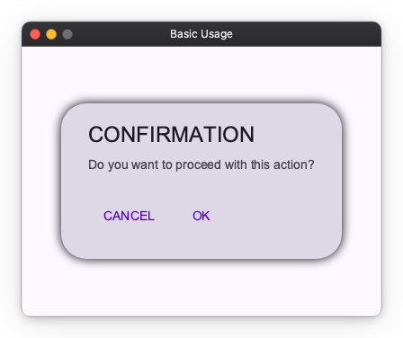
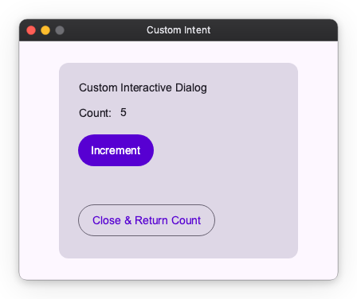

## Introduction

nuiitivet offers a robust dialog system built on top of the Overlay architecture. While `AlertDialog` is the most common use case, the system is flexible enough to display any widget as a modal dialog and supports advanced architectural patterns like MVVM.


## Basic Usage

The most straightforward way to show a dialog is to create an `AlertDialog` widget and pass it to `MaterialOverlay.root().dialog()`.

The `dialog()` method is **awaitable**, meaning you can wait for the user to close the dialog and receive a result.

```python
# src/samples/dialogs/basic_usage.py (Excerpt)

class BasicDialogDemo(ComposableWidget):
    result_text: Observable[str] = Observable("Ready")

    async def _show_dialog(self):
        # MaterialOverlay.root() finds the globally unique Overlay
        overlay = MaterialOverlay.root()

        # Create the dialog widget
        dialog = AlertDialog(
            title="CONFIRMATION",
            message="Do you want to proceed with this action?",
            actions=[
                TextButton(
                    "CANCEL",
                    on_click=lambda: overlay.close("Canceled"),
                ),
                TextButton(
                    "OK",
                    on_click=lambda: overlay.close("Confirmed"),
                ),
            ],
        )

        # Show the dialog and await the result
        # The result is an OverlayResult[T] object
        result = await overlay.dialog(dialog)
        
        if result.value:
            self.result_text.value = f"Last Action: {result.value}"

    def build(self) -> Widget:
        # User Interface building code...
        return Container(
            alignment="center",
            child=Column(
                gap=20,
                children=[
                    Text(self.result_text),
                    FilledButton(
                        "Show Alert Dialog",
                        on_click=self._show_dialog,
                    ),
                ],
            )
        )
```



### Key Points

- `MaterialOverlay.root()`: Retrieves the root overlay instance.
- `overlay.dialog(widget)`: Displays the widget as a modal dialog with a scrim.
- `overlay.close(value, target)`: Closes the dialog associated with `target`. The `value` is wrapped in an `OverlayResult` and returned to the caller of `await overlay.dialog()`.

## Custom Dialogs

You are not limited to `AlertDialog`. Any Widget can be shown in the overlay. This is useful for custom forms, interactive tools, or specialized prompts.

```python
# src/samples/dialogs/custom_dialog.py (Excerpt)

class CustomDialogContent(ComposableWidget):
    """A completely custom widget to be used as a dialog."""
    
    def __init__(self, overlay: MaterialOverlay):
        super().__init__()
        self.overlay = overlay
        self.counter = Observable(0)

    def _increment(self):
        self.counter.value += 1

    def build(self) -> Widget:
        return Card(
            child=Container(
                padding=24,
                child=Column(
                    gap=16,
                    children=[
                        Text("Custom Interactive Dialog"),
                        Row(
                            gap=10,
                            children=[Text("Count:"), Text(self.counter.map(str))],
                        ),
                        FilledButton("Increment", on_click=self._increment),
                        OutlinedButton(
                            "Close & Return Count", 
                            on_click=lambda: self.overlay.close(self.counter.value)
                        ),
                    ],
                ),
            ),
            width=300,
        )

# Usage in parent widget:
# await overlay.dialog(CustomDialogContent(overlay))
```


## Architecting Dialogs in MVVM

When building larger applications with patterns like MVVM (Model-View-ViewModel), handling dialogs requires care regarding boundaries and testing. To illustrate the differences, we will use the same "Operation Complete" dialog in both coupled and decoupled patterns.

### Coupled ViewModels

One approach is to have the ViewModel create Widgets directly. While simple to implement, this couples your business logic to the UI framework.

**Direct Widget Creation Example:**

```python
# src/samples/dialogs/view_model_direct.py (Excerpt)

class CoupledViewModel:
    """
    This ViewModel knows about types like AlertDialog.
    It imports widgets which ties it to the UI layer.
    """
    
    def __init__(self):
        self.status = Observable("Ready")

    async def process_action(self, overlay: MaterialOverlay):
        self.status.value = "Processing..."
        
        # Logic creates UI components directly
        dialog = AlertDialog(
            title="Operation Complete",
            message="Process finished successfully.",
            icon="check_circle",
            actions=[TextButton("OK", on_click=lambda: overlay.close(True))]
        )
        
        await overlay.dialog(dialog)
        self.status.value = "Finished"

class DirectViewModelDemo(ComposableWidget):
    async def _on_run_click(self):
        overlay = MaterialOverlay.root()
        await self.vm.process_action(overlay)
```


### Decoupling with Intents

For those who prefer a stricter separation of concerns, nuiitivet supports **Intents**. An Intent is a plain data class that describes *what* needs to happen, not *how* it looks. The ViewModel emits an Intent, and the View (or Overlay system) decides how to render it.

By using `AlertDialogIntent`, the ViewModel remains pure logic.

```python
# src/samples/dialogs/view_model_intent.py (Excerpt)

from nuiitivet.material.intents import AlertDialogIntent

class DecoupledViewModel:
    """
    Pure logic. No Widget imports.
    Easier to test: we just assert that proper Intent was emitted.
    """
    
    def __init__(self):
        self.status = Observable("Ready")

    async def process_action(self, overlay: MaterialOverlay):
        self.status.value = "Processing..."
        
        # We just create a data description of what we want
        intent = AlertDialogIntent(
            title="Operation Complete",
            message="Process finished successfully.",
            icon="check_circle"
        )
        
        # Dispatch the intent. The system handles the UI.
        await overlay.dialog(intent)
        self.status.value = "Finished"
```


## Custom Intents

The same principle applies to custom UI. You can define your own Intent classes and register them to render specific Widgets, keeping your ViewModels free of UI dependencies.

Below, we show how to implement the same "Counter Card" logic using Intents.

1. **Define the Intent**: A simple data class.

   ```python
   # src/samples/dialogs/custom_intent.py (Excerpt)

   @dataclass(frozen=True)
   class CounterIntent:
       initial_value: int = 0
   ```

2. **Map Intent to Dialog**: Register the connection between the Intent data and its Widget in `MaterialApp`.

   ```python
   def create_counter_dialog(intent: CounterIntent) -> Widget:
       # This function knows about Widgets, but ViewModel doesn't
       return CustomDialogContent(
           MaterialOverlay.root(),
           initial=intent.initial_value
       )

   class IntentDemoApp(ComposableWidget):
       def build(self) -> Widget:
           return MaterialApp(
               content=HomeView(),
               overlay_routes={
                   CounterIntent: create_counter_dialog
               }
           )
   ```

3. **Use in ViewModel**:

   ```python
   class MyViewModel:
       async def open_counter(self, overlay: MaterialOverlay):
           # Pure logic, using our custom intent
           result = await overlay.dialog(CounterIntent(initial_value=5))
           
           if result.value is not None:
              self.message.value = f"Final Count: {result.value}"
   ```


