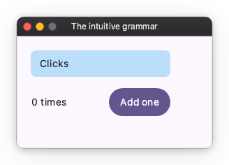

# The intuitive grammar

Nuiitivet keeps the parts of other frameworks that were already intuitive, so
most of it reads like something you know. This page builds one small card, a
few lines at a time.



## Lay out with a widget tree and parameters

```python
import nuiitivet.material as nv

nv.Column(
    [
        nv.Text("Clicks"),
        nv.Button("Add one"),
    ],
    gap=12,
    padding=20,
)
```

A screen is a tree of widgets, as in Flutter. Spacing and sizes are
parameters: `padding`, `gap`, `size`(`width`, `height`). Those parameters
are all that decides the layout.

In Flutter, a padding and a width are widgets wrapped around the text, so the
nesting grows with every decoration:

```dart
// Flutter — not Nuiitivet
Padding(
  padding: EdgeInsets.all(12),
  child: SizedBox(
    width: 200,
    child: Text("Clicks"),
  ),
)
```

Here they are parameters of the widget itself:

```python
nv.Text("Clicks", padding=12, width=200)
```

A size is a number, `"auto"` (fit the content), or `"wt"` — a share of the
space that is left, what WPF writes as `*`. The count below takes the leftover
and pushes the button to the right edge:

```python
nv.Row(
    [
        nv.Text("0 times", width="wt"),
        nv.Button("Add one"),
    ],
    gap=12,
    width=200,
    cross_alignment="center",
)
```

There is no `margin`. Spacing is `padding` and `gap` only — the habit CSS
authors settle into, made the rule. And every pair is horizontal first, then
vertical: `padding=(16, 8)` is 16 left and right, as `alignment` and
`translate` are x before y.

[Layout](layout/index.md) has the rest, including `Grid`: tracks sized as in
WPF, cells placed by area name as in CSS.

## Add everything else with modifiers

What is not layout — a background, rounded corners, a tooltip, a click — is
attached as a **modifier**. Modifiers chain with `|`, the way they chain in
SwiftUI and Compose:

```python
nv.Text("Clicks", padding=12, width=200).modifier(
    nv.background("#BBDEFB") | nv.corner_radius(8)
)
```

So the code itself tells the two apart: the parameters are the layout, the
modifier chain is everything else. [Modifiers](modifiers/index.md) lists them.

## Show state by binding it

```python
count = nv.Observable(0)

nv.Text(count.map(lambda n: f"{n} times"))  # follows count on its own
```

`Observable` is modelled on ReactiveProperty, from WPF's MVVM. Hand the
`Observable` to the widget and the widget follows it; there is no `setState`
and nothing to refresh by hand. [Observable](state-management/index.md) covers
deriving values and the Rx-style operators.

## Handle events with ordinary code

```python
def handle_add(self) -> None:
    self.count.value += 1
    if self.count.value % 10 == 0:
        print("Milestone reached!")
```

```python
nv.Button("Add one", on_click=self.handle_add)
```

What the screen shows is declared: the tree, and the values bound into it.
What happens on a click is a different kind of thing — read a value, change
it, branch on the result. That is a procedure. Forced into a declarative shape
it only gets harder to follow, so a handler is an ordinary method, written top
to bottom, the way you would say it aloud.

## The whole card

```python
import nuiitivet.material as nv


class CounterCard(nv.ComposableWidget):
    def __init__(self) -> None:
        super().__init__()
        self.count = nv.Observable(0)

    def handle_add(self) -> None:
        self.count.value += 1
        if self.count.value % 10 == 0:
            print("Milestone reached!")

    def build(self) -> nv.Widget:
        return nv.Column(
            [
                nv.Text("Clicks", padding=12, width=200).modifier(nv.background("#BBDEFB") | nv.corner_radius(8)),
                nv.Row(
                    [
                        nv.Text(self.count.map(lambda n: f"{n} times"), width="wt"),
                        nv.Button("Add one", on_click=self.handle_add),
                    ],
                    gap=12,
                    width=200,
                    cross_alignment="center",
                ),
            ],
            gap=12,
            padding=20,
        )


def build_root() -> nv.Widget:
    return CounterCard()


nv.App(nv.Window(content=build_root)).run()
```

## Next Steps

- [Layout](layout/index.md) — rows, columns, spacing, sizing and alignment.
- [Guides](index.md) — the overview.
