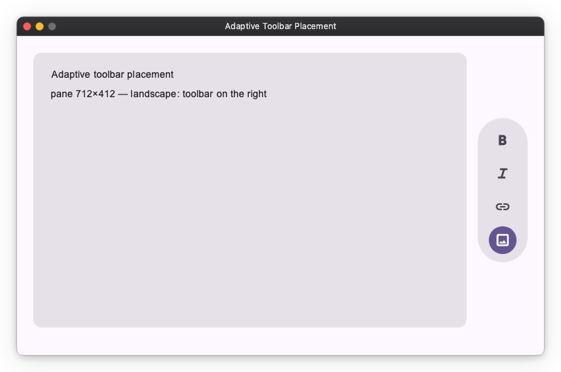

# Adaptive Layout

## `on_size_changed` Modifier

Some layouts need to change shape based on **how much space they have** — a
toolbar that moves depending on a pane's orientation, a panel that switches
arrangement once it gets narrow.

A widget cannot read its own size in `build()` — the parent decides that size
afterwards. So the size comes to you instead: attach `on_size_changed` to the
widget whose size you want to know, and the callback is called with that widget's
`(width, height)` whenever it changes.

```python
Column([...], width="wt").modifier(
    on_size_changed(lambda size: print(size.width))
)
```

Assign the size to an `Observable` in the callback and the widgets bound to it
update as usual. Those `Observable`s live in a plain `__init__` — nothing about
this needs a lifecycle hook.

> **Mind the initial value.** The callback also runs once when the widget is
> first shown, not only when the size later changes — so whatever `Observable`
> you assign in it is overwritten right at startup. Give that `Observable` the
> value the starting size will produce. If the two differ, the UI shows the
> initial value for one frame and then switches.

### Example: Adaptive toolbar placement

A content pane places its toolbar by its own shape: a `VerticalFloatingToolbar`
on the right when the pane is landscape, a `HorizontalFloatingToolbar` on the
bottom when it is portrait.

A `Grid` holds all three widgets at once — card, right toolbar, bottom toolbar —
and each toolbar sits in a `Collapsible` that folds it away along its own axis.
The toolbar tracks are `"auto"`, so a collapsed toolbar takes its track with it
and the card reclaims the space. The callback only has to flip one flag.

```python
import nuiitivet.material as nv


class AdaptiveToolbarPanel(nv.ComposableWidget):
    def __init__(self) -> None:
        super().__init__(width="wt", height="wt")
        self._landscape = nv.Observable(True)      # this app's initial shape
        self._portrait = self._landscape.map(lambda landscape: not landscape)

    def _on_size(self, size: nv.Size) -> None:
        self._landscape.value = size.width >= size.height

    def build(self) -> nv.Widget:
        card = nv.Card(..., width="wt", height="wt")
        right_toolbar = nv.Collapsible(
            nv.VerticalFloatingToolbar(_actions(), style=nv.ToolbarStyle.standard()),
            opened=self._landscape, axis="horizontal",
        )
        bottom_toolbar = nv.Collapsible(
            nv.HorizontalFloatingToolbar(_actions(), style=nv.ToolbarStyle.standard()),
            opened=self._portrait, axis="vertical",
        )
        return nv.Grid(
            children=[
                nv.GridItem(card, row=0, column=0),
                nv.GridItem(right_toolbar, row=0, column=1, alignment="center"),
                nv.GridItem(bottom_toolbar, row=1, column=0, alignment="center"),
            ],
            rows=["wt", "auto"], columns=["wt", "auto"],
            row_gap=16, column_gap=16,
            width="wt", height="wt",
        ).modifier(nv.on_size_changed(self._on_size))
```

Keeping every widget in place, rather than swapping between two prebuilt
arrangements, means there is only ever **one** card: reflowing reshapes it
instead of replacing it, so a scroll position or a half-typed field inside it
survives. The toolbars animate in and out as a bonus.



> **Do not change the widget's own size from its callback** — assigning its
> `width`, for example. The new size calls the callback again, which changes the
> size again, and so on.

## When a subtree needs the size instead

`on_size_changed` tells a widget about its *own* size. Sometimes the widget that
needs the size is a different one — a control nested several levels down that has
to react to the size of a pane above it. Threading the value through every widget
in between is not practical, so `Geometry` publishes it to the whole subtree
instead.

| | Use it when |
| --- | --- |
| `on_size_changed` | A widget reacts to its own size. |
| [`Geometry`](../advanced/geometry.md) | Widgets nested anywhere below need one ancestor's size. |

See [Geometry: scoped measured size](../advanced/geometry.md).
