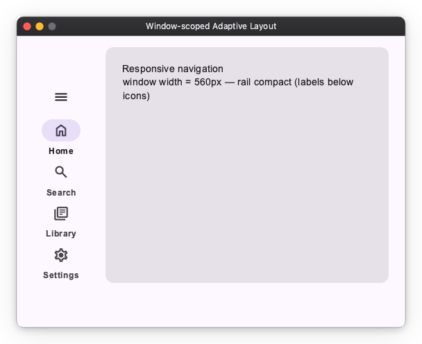
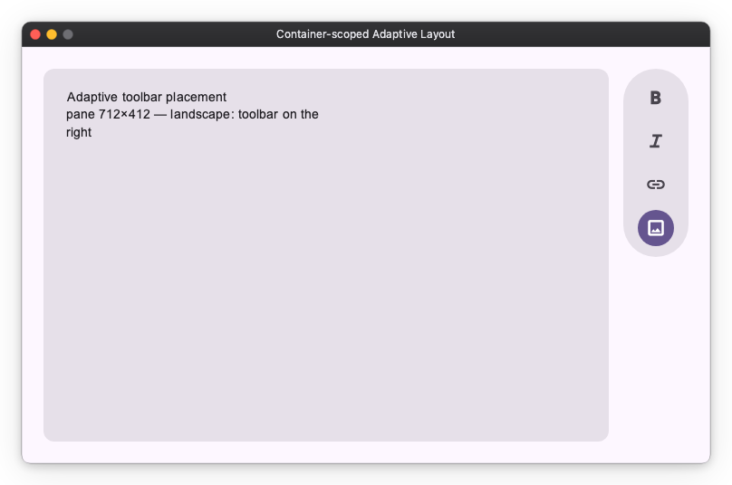

# Adaptive Layout with `Geometry`

Some layouts need to change shape based on **how much space they have** — a
navigation rail that expands when there is room, a toolbar that moves depending
on a pane's orientation. Crucially this often depends on the size of a **specific
container**, not the whole window.

`Geometry` measures its own box and publishes that size to its subtree as an
`Observable[Size]`. Consumers read it with `Geometry.of(self).size` and **bind**
it — the same reactivity rule as any other `Observable`: pass the Observable
(mapped) into a widget; do **not** read `.value` at build time (that is a
one-time snapshot that never updates).

Because `Geometry.of` needs an ancestor chain, derive the bound values in
`on_mount` (not `__init__`, where the widget has no ancestors yet); `build()`
then just references them.

Two kinds of binding show up:

- **Read-only** (a label, a `Deck` index): map straight from `size` — e.g.
  `Text(size.map(...))`, `Deck(index=size.map(...))`. `Deck` accepts a derived
  `.map(...)` index and shows one mounted child by it.
- **Two-way** widget state (a `NavigationRail`'s `expanded`, which its own menu
  button can also toggle): a read-only `.map` can't be written back, so mirror
  the size-derived value into a plain `Observable` and keep it in sync.

## Window-scoped: responsive navigation rail

The app installs a root `Geometry` provider at the window, so a top-level panel
reflows on the *window* width with no explicit wrapper. Here a `NavigationRail`
stays compact (labels below icons) on a narrow window and expands (labels beside
icons) when wide.

```python
import nuiitivet.material as nv

_EXPAND_THRESHOLD = 700


class ResponsiveScaffold(nv.ComposableWidget):
    def on_mount(self) -> None:
        size = nv.Geometry.of(self).size
        # NavigationRail.expanded is two-way (its menu button can toggle it), so
        # it needs a *mutable* Observable — a read-only .map won't do. Mirror the
        # size-derived flag into a plain Observable and keep it synced.
        self._expanded = nv.Observable(size.value.width >= _EXPAND_THRESHOLD)
        self._expanded_sub = size.subscribe(
            lambda s: setattr(self._expanded, "value", s.width >= _EXPAND_THRESHOLD)
        )
        super().on_mount()

    def on_unmount(self) -> None:
        self._expanded_sub.dispose()
        super().on_unmount()

    def build(self) -> nv.Widget:
        rail = nv.NavigationRail(
            children=[
                nv.RailItem(icon="home", label="Home"),
                nv.RailItem(icon="search", label="Search"),
                nv.RailItem(icon="library_books", label="Library"),
                nv.RailItem(icon="settings", label="Settings"),
            ],
            index=nv.Observable(0),
            expanded=self._expanded,      # mutable: driven by window width AND the menu button
            width=220,
        )
        card = nv.Card(nv.Text("Responsive navigation"), width=nv.Sizing.flex(1), height=nv.Sizing.flex(1))
        return nv.Row([rail, card], gap=16, width=nv.Sizing.flex(1), height=nv.Sizing.flex(1))
```



## Container-scoped: adaptive toolbar placement

Wrapping a region in a **filling** `Geometry` (`width="100%"`) makes its
descendants react to *that region*'s size. Here a content pane reads its own
shape and places its toolbar accordingly — a `VerticalFloatingToolbar` on the
right when the pane is landscape, a `HorizontalFloatingToolbar` on the bottom
when it is portrait — via a `Deck` keyed on the pane's aspect ratio.

```python
class AdaptiveToolbarPanel(nv.ComposableWidget):
    def on_mount(self) -> None:
        size = nv.Geometry.of(self).size
        self._index = size.map(lambda s: 1 if s.width >= s.height else 0)
        super().on_mount()

    def build(self) -> nv.Widget:
        portrait = nv.Column(
            [self._card(), nv.HorizontalFloatingToolbar(_actions(), style=nv.ToolbarStyle.standard())],
            gap=16, width=nv.Sizing.flex(1), height=nv.Sizing.flex(1),
        )
        landscape = nv.Row(
            [self._card(), nv.VerticalFloatingToolbar(_actions(), style=nv.ToolbarStyle.standard())],
            gap=16, width=nv.Sizing.flex(1), height=nv.Sizing.flex(1),
        )
        return nv.Deck(children=[portrait, landscape], index=self._index,
                       width=nv.Sizing.flex(1), height=nv.Sizing.flex(1))


# Wrap it in a filling Geometry so it reflows on its own box, not the window:
#   nv.Geometry(AdaptiveToolbarPanel(), width="100%", height="100%")
```



Drop the same panel into any container and it reflows on *that* container's
shape, because it reads its own nearest `Geometry` — not the window.

## Notes

- **Nearest provider wins.** `Geometry.of(self)` resolves to the nearest ancestor
  `Geometry`, so a nested one overrides the window for its subtree. With no
  nested provider, a read falls back to the window-level root provider.
- **A filling `Geometry` measures available space.** `width="100%"` /
  `Sizing.flex(...)` makes it fill what the parent offers, so it measures the
  space *available* to a pane rather than the child's intrinsic size.
- **One-frame latency.** The size is measured during layout and published on the
  next frame — imperceptible, and it keeps the update safe (bound widgets never
  re-bind mid-layout).
- **Stable sizes don't re-fire.** An unchanged size is de-duped, so a `Geometry`
  whose size is imposed by its parent cannot drive a feedback loop.
- **`Size`** is a `(width, height)` pair: `size.width`, `size.height`, or unpack
  it with `w, h = size`.
