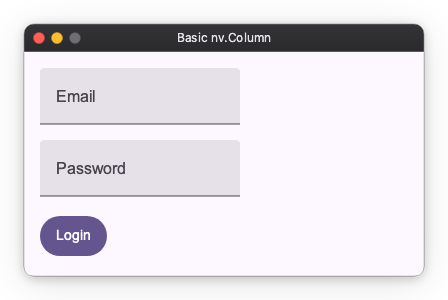
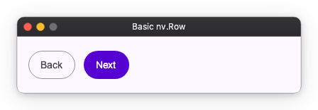
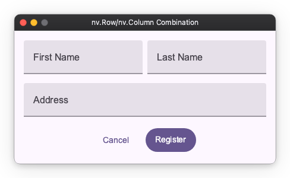

# Layout Basics

The basics of screen layout are combinations of "vertical arrangement" and "horizontal arrangement".
This page explains how to use `Column` and `Row`, which are the most fundamental and powerful tools.
Before learning complex mechanisms, let's confirm that most screens can be created with just these two.

## Column

Forms, lists, settings screens, etc., are centered around Column.

```python
import nuiitivet.material as nv

content = nv.Column(
    children=[
        nv.TextField(label="Email"),
        nv.TextField(label="Password"),
        nv.Button("Login", style=nv.ButtonStyle.filled()),
    ],
    gap=16,
    padding=16,
)
```

- `gap`: Space between child elements
- `padding`: Padding inside the column



## Row

Toolbars, button rows, left-right splits, etc. often use Row.

```python
import nuiitivet.material as nv

actions = nv.Row(
    children=[
        nv.Button("Back", style=nv.ButtonStyle.outlined()),
        nv.Button("Next", style=nv.ButtonStyle.filled()),
    ],
    gap=12,
    padding=16,
)
```



## Combining Row and Column

You can express complex layouts by combining Row and Column.
For example, a "Registration Form" layout can be created as follows:

```python
import nuiitivet.material as nv

# User Registration Form
form = nv.Column(
    children=[
        # Row 1: Name (Horizontal)
        nv.Row(
            children=[
                nv.TextField(label="First Name"),
                nv.TextField(label="Last Name"),
            ],
            gap=8,
        ),

        # Row 2: Address
        nv.TextField(label="Address", width="wt"),

        # Row 3: Buttons (Horizontal)
        nv.Row(
            children=[
                nv.Button("Cancel", style=nv.ButtonStyle.text()),
                nv.Button("Register", style=nv.ButtonStyle.filled()),
            ],
            gap=12,
        ),
    ],
    gap=16,
    padding=16,
    cross_alignment="center",
)
```



In this way, you construct screens by putting Column inside Row or Row inside Column.

## Next Steps

- [Layout Spacing](spacing.md)
- [Layout Overview](index.md)
