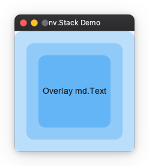
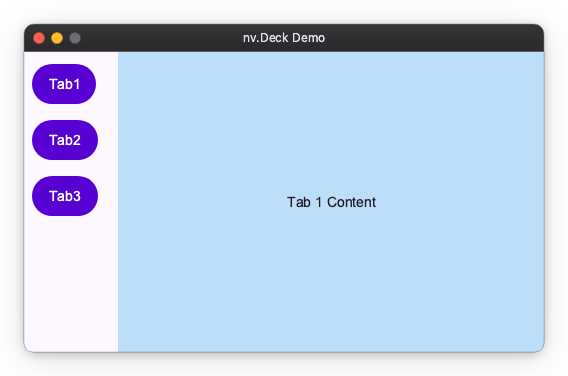
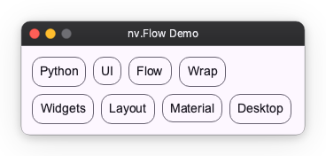
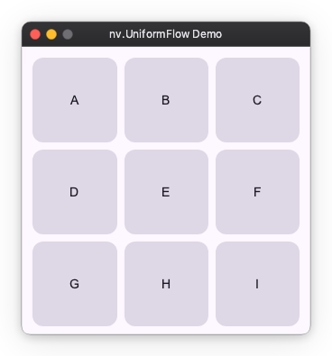
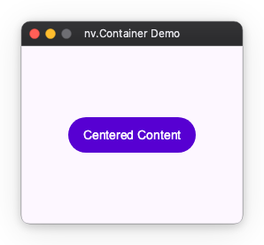
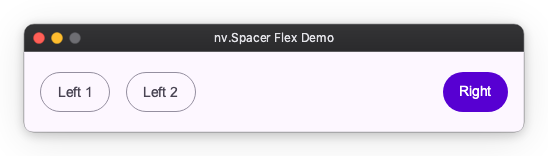
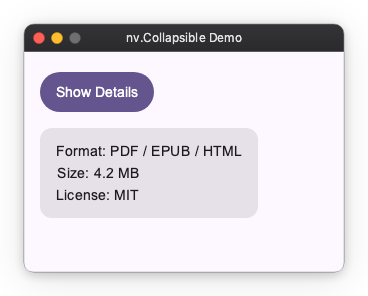

# Layout Extras

This section introduces components for special arrangements that cannot be expressed by basic layouts like Column or Row.

## Stack

Arranges elements in stacking order (Z-order).
Use this when you want to place text over a background image or display a notification badge over an icon.

- The first written element goes to the back (bottom).
- The last written element goes to the front (top).

```python
import nuiitivet.material as nv

nv.Stack(
    width=240,
    height=200,
    alignment="center",  # Default alignment position
    children=[
        nv.Card(
            nv.Text(""),
            width="wt",
            height="wt",
        ).modifier(nv.background("#BBDEFB")),
        nv.Card(
            nv.Text(""),
            width="wt",
            height="wt",
        ).modifier(nv.background("#90CAF9")),
        nv.Card(
            nv.Text("Overlay Text"),
            width="wt",
            height="wt",
            alignment="center",
        ).modifier(nv.background("#64B5F6")),
    ],
)
```



## Deck (Conditional Display)

A component that displays **only one** child at a time from multiple children.
Used for tab switching or content switching in side menus.

The index is an `Observable[int]`, and the buttons write it. A lambda cannot
assign, so the write uses [`set()`](../state-management/basic_api.md#writing-from-a-lambda):

```python
import nuiitivet.material as nv

current_index = nv.Observable(0)

menu = nv.Column(
    padding=8,
    gap=8,
    children=[
        nv.Button("Tab 1", on_click=lambda: current_index.set(0), style=nv.ButtonStyle.filled()),
        nv.Button("Tab 2", on_click=lambda: current_index.set(1), style=nv.ButtonStyle.filled()),
        nv.Button("Tab 3", on_click=lambda: current_index.set(2), style=nv.ButtonStyle.filled()),
    ],
)

body = nv.Deck(
    index=current_index,
    width="wt",
    height="wt",
    children=[
        nv.Container(
            alignment="center",
            width="wt",
            height="wt",
            child=nv.Text("Tab 1 Content"),
        ).modifier(nv.background("#BBDEFB")),
        nv.Container(
            alignment="center",
            width="wt",
            height="wt",
            child=nv.Text("Tab 2 Content"),
        ).modifier(nv.background("#C8E6C9")),
        nv.Container(
            alignment="center",
            width="wt",
            height="wt",
            child=nv.Text("Tab 3 Content"),
        ).modifier(nv.background("#FFE0B2")),
    ],
)

contents = nv.Row(
    gap=12,
    width="wt",
    children=[menu, body],
)
```



## Flow (Wrap Layout)

Arranges elements from left to right and automatically wraps to the next line when exceeding the parent width.
Suitable for tag lists or card lists.

```python
import nuiitivet.material as nv

tags = ["Python", "UI", "Framework", "Layout", "Grid", "Flex"]

nv.Flow(
    main_gap=8,
    cross_gap=8,
    padding=8,
    children=[
        nv.Card(nv.Text(tag), style=nv.CardStyle.outlined()) for tag in tags
    ],
)
```



> To generate the children from a data collection (including reactive updates), see [layout_dynamic.md](dynamic.md).

## UniformFlow (Uniform Grid)

Arranges elements into a grid with **uniform column widths**.
Use this for tile layouts where each cell should align and size consistently.

```python
import nuiitivet.material as nv

tiles = ["A", "B", "C", "D", "E", "F", "G", "H", "I"]

nv.UniformFlow(
    columns=3,
    main_gap=8,
    cross_gap=8,
    padding=8,
    aspect_ratio=1.0,
    children=[
        nv.Card(nv.Text(t), alignment="center", padding=12)
        for t in tiles
    ],
)
```



### Flow vs UniformFlow

- Use **Flow** for wrapping rows with variable-width items (tags, chips, variable text).
- Use **UniformFlow** for grid-like layouts with uniform columns (tiles, cards, image grids).

> To generate the children from a data collection (including reactive updates), see [layout_dynamic.md](dynamic.md).

## Container (Decoration/Size Control)

A wrapper with a single child element.
Used to add padding to child elements, fix sizes, or specify alignment.
(Similar to `div` in HTML)

```python
import nuiitivet.material as nv

nv.Container(
    nv.Button("Centered Content", style=nv.ButtonStyle.filled()),
    width=250,
    height=200,
    alignment="center",
    padding=16,
)
```



## Spacer (Space Adjustment)

An invisible widget useful when you want to create flexible spacing.
Useful for pushing elements to both ends within `Row` or `Column`.

```python
import nuiitivet.material as nv

nv.Row(
    padding=16,
    gap=16,
    width=500,
    children=[
        nv.Button("Left 1", style=nv.ButtonStyle.outlined()),
        nv.Button("Left 2", style=nv.ButtonStyle.outlined()),
        nv.Spacer(width="wt"),
        nv.Button("Right", style=nv.ButtonStyle.filled()),
    ],
)
```



## Collapsible (Animated Expand/Collapse)

Smoothly expands or collapses a child widget, shifting the surrounding layout as it animates.
Use this for expandable panels, side sheets, and accordion-style sections.

- When `opened` is `False`, the child shrinks to zero size along the animated axis.
- When `opened` is `True`, it expands back to the child's natural size.

```python
import nuiitivet.material as nv

nv.Collapsible(
    nv.Card(
        nv.Column(
            padding=16,
            gap=8,
            children=[
                nv.Text("Format: PDF / EPUB / HTML"),
                nv.Text("Size: 4.2 MB"),
                nv.Text("License: MIT"),
            ],
        ),
    ),
    opened=self.opened,
)
```



### visible() vs Collapsible

| | `visible()` modifier | `Collapsible` |
|---|---|---|
| Layout space | Always occupied | Shrinks to zero when closed |
| Animation | Opacity / scale fade | Smooth expand/collapse with layout reflow |
| Use case | Fade in/out without shifting siblings | Accordion panels, side sheets |
