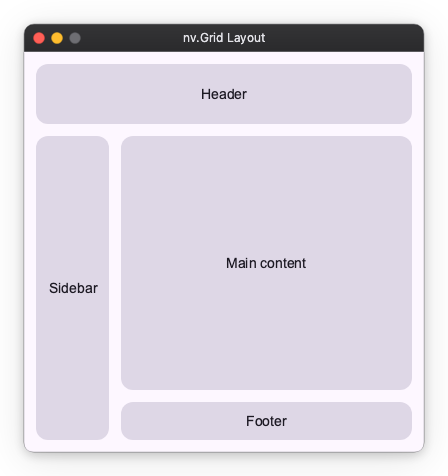
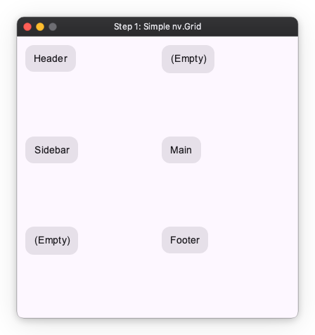
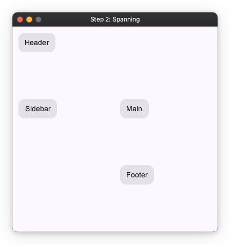
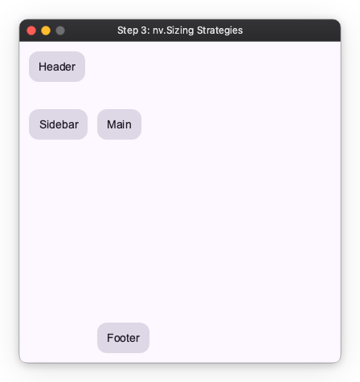

# Layout Grid

Use `Grid` for layouts where vertical and horizontal relationships are intricate, such as complex dashboards or application screens with headers and sidebars.
Arrangements that are difficult to express with just nested Columns and Rows can be described cleanly with Grid.

## Finished Image

In this guide, we will learn how to use Grid by building a common application layout step-by-step.



## Step 1: Simple Placement (3 Rows x 2 Columns)

First, create a grid that will be the skeleton of the layout. Here we define a 3-row x 2-column grid and place content in each cell.
By giving every row and every column the same weight (`"wt"`), the space is divided equally.

```python
# Define a 3-row x 2-column grid
import nuiitivet.material as nv

nv.Grid(
    rows=["wt", "wt", "wt"],
    columns=["wt", "wt"],
    children=[
        # [0, 0] Planned for Header
        nv.GridItem(_card("Header"), row=0, column=0),

        # [0, 1] Right Top (Will be expanded by Header later)
        nv.GridItem(_card("(Empty)"), row=0, column=1),
        
        # [1, 0] Planned for Sidebar
        nv.GridItem(_card("Sidebar"), row=1, column=0),

        # [1, 1] Main content
        nv.GridItem(_card("Main"), row=1, column=1),
        
        # [2, 0] Left Bottom (Will be expanded by Sidebar later)
        nv.GridItem(_card("(Empty)"), row=2, column=0),

        # [2, 1] Planned for Footer
        nv.GridItem(_card("Footer"), row=2, column=1),
    ],
    padding=12,
    row_gap=12, 
    column_gap=12,
)

# Helper for creating cards
def _card(label: str, width="wt", height="wt") -> nv.Card:
    return nv.Card(
        nv.Text(label),
        padding=12,
        alignment="center",
        width=width,
        height=height,
    )
```



Cells marked (Empty) are places planned to be merged later. We will remove them shortly.

## Step 2: Merging Cells

Next, merge cells to expand the header horizontally and the sidebar vertically.

By passing a list or tuple like `(start, end)` to `column` or `row` arguments, you can span placement across multiple cells.

```python
nv.Grid(
    rows=["wt", "wt", "wt"],
    columns=["wt", "wt"],

    children=[
        # Header: Span columns 0 to 1 horizontally
        nv.GridItem(_card("Header"), row=0, column=(0, 1)),
        
        # Sidebar: Span rows 1 to 2 vertically
        nv.GridItem(_card("Sidebar"), row=(1, 2), column=0),
        
        # Main:
        nv.GridItem(_card("Main"), row=1, column=1),
        
        # Footer:
        nv.GridItem(_card("Footer"), row=2, column=1),
    ],

    padding=12,
    row_gap=12, 
    column_gap=12,
)
```



Although not visible, the (Empty) places have been absorbed by the header and sidebar respectively.

## Step 3: Adjusting Row and Column Sizes

Decide the sizes of rows and columns. Sizes can be specified in the following three ways as explained in [Layout Sizing](sizing.md).

1. **Fixed**: Specify by number (e.g., `60`).
2. **Auto**: `"auto"`. Fit to content size.
3. **Weight**: `"wt"`, or `"wt<n>"` for an uneven share. Distributes the remaining space by the weight ratio.

Here, we define each component as follows:

- **Header**: Height 60px
- **Sidebar**: Auto width (`"auto"`)
- **Footer**: Auto height (`"auto"`)
- **Main**: Use all remaining space (`"wt"`)

```python
nv.Grid(
    # Rows: [Header fixed 60px, Main rest, Footer auto]
    rows=[60, "wt", "auto"],
    
    # Columns: [Sidebar auto, Main rest]
    columns=["auto", "wt"],
    
    children=[
        # Header: Span columns 0 to 1 horizontally
        nv.GridItem(_card("Header"), row=0, column=(0, 1)),
        
        # Sidebar: Span rows 1 to 2 vertically
        nv.GridItem(_card("Sidebar"), row=(1, 2), column=0),
        
        # Main:
        nv.GridItem(_card("Main"), row=1, column=1),
        
        # Footer:
        nv.GridItem(_card("Footer"), row=2, column=1),
    ],

    padding=12,
    row_gap=12, 
    column_gap=12,
)
```



The appearance is still broken because we haven't adjusted the content size inside the cells. We will fix this in the next step.

## Step 4: Content Size in Cells

Decide the size of the content placed inside the cells.

Here we set it as follows:

- **Header**:
  - width: `"wt"`
  - height: `"wt"`
- **Sidebar**:
  - width: `None` (Auto)
  - height: `"wt"`
- **Footer**:
  - width: `"wt"`
  - height: `None` (Auto)
- **Main**:
  - width: `"wt"`
  - height: `"wt"`

```python
import nuiitivet.material as nv

nv.Grid(
    # Rows: [Header fixed 60px, Main rest, Footer auto]
    rows=[60, "wt", "auto"],
    
    # Columns: [Sidebar auto, Main rest]
    columns=["auto", "wt"],

    children=[
        # Header:
        #   Span columns 0 to 1 horizontally
        #   Specify width/height as "wt"
        nv.GridItem(_card("Header"), row=0, column=[0, 1]), 

        # Sidebar:
        #   Span rows 1 to 2 vertically
        #   Specify width as None (Auto), height as "wt"
        nv.GridItem(_card("Sidebar", width=None), row=[1, 2], column=0),

        # Main:
        #   Specify width/height as "wt"
        nv.GridItem(_card("Main content"), row=1, column=1), 

        # Footer:
        #   Specify width as "wt", height as None (Auto)
        nv.GridItem(_card("Footer", height=None), row=2, column=1)
    ],

    row_gap=12,
    column_gap=12,
    padding=12,    
)
```


## Placement by Named Areas (Named Areas)

In addition to index numbers, you can also use area names to specify placement.
This is convenient when you want to visually define complex layouts.

By using `Grid.named_areas()` and `GridItem.named_area()`, you can clarify your intent.

```python
nv.Grid.named_areas(
    rows=[60, "wt", "auto"],
    columns=["auto", "wt"],
    # Layout map definition
    areas=[
        ["header",  "header"],
        ["sidebar", "content"],
        ["sidebar", "footer"],
    ],
    children=[
        nv.GridItem.named_area(_card("Header"), "header"),
        nv.GridItem.named_area(_card("Sidebar", width=None), "sidebar"),
        nv.GridItem.named_area(_card("Main content"), "content"),
        nv.GridItem.named_area(_card("Footer", height=None), "footer"),
    ],
    row_gap=12,
    column_gap=12,
    padding=12,
)
```


