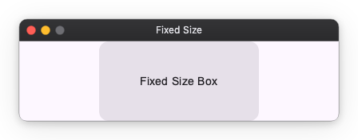
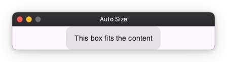
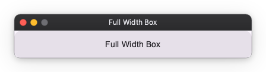

# Layout Sizing

Element sizes are specified using `width` and `height` properties.
A size is one of three things: a "fixed size", an "auto size" that follows the
content, or a "weight" that claims a share of whatever space is left over.

## Basic Size Specification

There are largely three patterns for size specification.

### 1. Fixed Size

The size is determined by the specified pixel value.
Specify a number like `100`.

```python
import nuiitivet.material as nv

nv.Card(
    width=200,   # Fix width to 200px
    height=100,  # Fix height to 100px
    child=nv.Text("Fixed Size Box"),
    padding=16,
    alignment="center",
)
```



### 2. Auto Size

The size is determined according to the content.
Specify `"auto"`.

```python
# The box grows to fit the text size inside
nv.Card(
    width="auto",
    height="auto",
    child=nv.Text("This box fits the content"),
    padding=16,
    alignment="center",
)
```



### 3. Weight

Claims a share of the space left over once the `fixed` and `auto` siblings have
taken theirs. Specify `"wt"` for a weight of 1, or `"wt<n>"` for anything else.

```python
# Takes the whole remainder — there is no sibling to share it with
nv.Card(
    width="wt",
    child=nv.Text("Full Width Box"),
    padding=16,
    alignment="center",
)
```



When several children carry a weight, the remainder is split between them in
proportion to their weights:

```python
# The row's width, minus the 120px sidebar, is split 1 : 3
nv.Row([
    nv.Card(width=120, child=nv.Text("Sidebar")),
    nv.Card(width="wt", child=nv.Text("Narrow")),
    nv.Card(width="wt3", child=nv.Text("Wide")),
])
```

## Next Steps

- [Layout Alignment](alignment.md)
- [Layout Overview](index.md)
