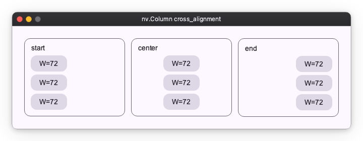

# Layout Alignment

Alignment determines "where to place" content in the remaining space.
Sizing (stretching/shrinking) is the role of `Sizing`, while `Alignment` is responsible purely for "positioning".

## Basic Positioning Rules

- The content's own size is determined by `width` / `height`.
- Where to place it within the parent is determined by `alignment`.

## Positioning a Single Element (Container)

When there is only one child element inside a parent, you can specify 9 positions using the `alignment` property.

```python
import nuiitivet as nv
import nuiitivet.material as md

alignments = [
    "top-left",
    "top-center",
    "top-right",
    "center-left",
    "center",
    "center-right",
    "bottom-left",
    "bottom-center",
    "bottom-right",
]


def _tile(alignment: str) -> md.FilledCard:
    return md.FilledCard(
        md.Text(alignment, padding=8),
        width=160,
        height=96,
        alignment=alignment,
    )

nv.UniformFlow(
    columns=3,
    main_gap=8,
    cross_gap=8,
    padding=8,
    # Render all variants so differences are easy to compare.
    children=[_tile(a) for a in alignments],
)
```


| Property | Meaning | Available Values |
| --- | --- | --- |
| `alignment` | Placement position of the child element | `top-left`, `top-center`, `top-right`, `center-left`, `center`, `center-right`, `bottom-left`, `bottom-center`, `bottom-right` |

> **Note**: "Expanding to full width" is not the job of alignment.
> In that case, specify `"100%"` or `Sizing.flex(...)` in the child's `width`.

## Arranging Multiple Elements (Row / Column)

When arranging multiple elements, different properties are used for the "arranging direction (Main axis)" and "other direction (Cross axis)".

### Horizontal Arrangement (Row)

`Row` uses different values for the arranging direction (Horizontal=Main) and the crossing direction (Vertical=Cross).

#### Examples of `main_alignment` (6 patterns)

```python
import nuiitivet as nv
import nuiitivet.material as md

main_alignments = [
    "start",
    "center",
    "end",
    "space-between",
    "space-around",
    "space-evenly",
]


def _demo_row(alignment: str) -> nv.Row:
    # The row stretches to full width, so main-axis alignment is visible.
    return nv.Row(
        width="100%",
        gap=8,
        main_alignment=alignment,
        cross_alignment="center",
        children=[_tile("A"), _tile("B"), _tile("C")],
    )


def _tile(label: str) -> md.FilledCard:
    return md.FilledCard(
        md.Text(label),
        width=56,
        height=40,
        alignment="center",
    )


nv.Column(
    gap=12,
    cross_alignment="start",
    children=[
        md.OutlinedCard(
            nv.Column(
                children=[
                    md.Text(a),
                    _demo_row(a),
                ],
                gap=8,
                cross_alignment="start",
                width="100%",
            ),
            padding=12,
        )
        for a in main_alignments
    ],
)
```


#### Examples of `cross_alignment` (3 patterns)

```python
import nuiitivet as nv
import nuiitivet.material as md

cross_alignments = [
    "start",
    "center",
    "end",
]


def _demo_row(alignment: str) -> nv.Row:
    # The row has a fixed height, so cross-axis alignment is visible.
    return nv.Row(
        width="100%",
        height=120,
        gap=8,
        main_alignment="start",
        cross_alignment=alignment,
        children=[_bar("H=32", 32), _bar("H=64", 64), _bar("H=96", 96)],
    )


def _bar(label: str, h: int) -> md.FilledCard:
    return md.FilledCard(
        md.Text(label),
        width=72,
        height=h,
        alignment="center",
    )


def _panel(alignment: str) -> md.OutlinedCard:
    return md.OutlinedCard(
        nv.Column(
            children=[md.Text(alignment), _demo_row(alignment)],
            gap=8,
            cross_alignment="start",
            width="100%",
        ),
        padding=12,
    )


nv.Column(
    gap=12,
    cross_alignment="start",
    # Render all variants so differences are easy to compare.
    children=[
        _panel(a)
        for a in cross_alignments
    ],
)
```


| Property | Meaning | Available Values |
| --- | --- | --- |
| `main_alignment` | Horizontal placement | `start` (Left), `center`, `end` (Right), `space-between` (Both ends), `space-around`, `space-evenly` |
| `cross_alignment` | Vertical alignment | `start` (Top), `center`, `end` (Bottom) |

### Vertical Arrangement (Column)

`Column` uses different values for the arranging direction (Vertical=Main) and the crossing direction (Horizontal=Cross).

#### Column `main_alignment` Examples (4 patterns)

```python
import nuiitivet as nv
import nuiitivet.material as md

main_alignments = [
    "start",
    "center",
    "end",
    "space-between",
]


def _demo_column(alignment: str) -> nv.Column:
    # The column has a fixed height, so main-axis alignment is visible.
    return nv.Column(
        width="100%",
        height=250,
        gap=6,
        main_alignment=alignment,
        cross_alignment="center",
        children=[_tile("A"), _tile("B"), _tile("C")],
    )


def _tile(label: str, *, width: int = 72, height: int = 32) -> md.FilledCard:
    return md.FilledCard(
        md.Text(label),
        width=width,
        height=height,
        alignment="center",
    )


def _panel(alignment: str) -> md.OutlinedCard:
    return md.OutlinedCard(
        nv.Column(
            children=[md.Text(alignment), _demo_column(alignment)],
            gap=8,
            cross_alignment="start",
            width="100%",
        ),
        width=150,
        padding=12,
    )


nv.Column(
    gap=12,
    cross_alignment="start",
    children=[
        nv.Row(
            gap=12,
            main_alignment="start",
            cross_alignment="start",
            # Render all variants side-by-side for easy comparison.
            children=[_panel(a) for a in main_alignments],
        ),
    ],
)
```


#### Column `cross_alignment` Examples (3 patterns)

```python
import nuiitivet as nv
import nuiitivet.material as md

cross_alignments = [
    "start",
    "center",
    "end",
]


def _demo_column(alignment: str) -> nv.Column:
    # The tiles are full-width, so cross-axis alignment is visible.
    return nv.Column(
        width="100%",
        gap=6,
        main_alignment="start",
        cross_alignment=alignment,
        children=[_tile("W=72"), _tile("W=72"), _tile("W=72")],
    )


def _tile(label: str, *, width: int = 72, height: int = 32) -> md.FilledCard:
    return md.FilledCard(
        md.Text(label),
        width=width,
        height=height,
        alignment="center",
    )


def _panel(alignment: str) -> md.OutlinedCard:
    return md.OutlinedCard(
        nv.Column(
            children=[md.Text(alignment), _demo_column(alignment)],
            gap=8,
            cross_alignment="start",
            width="100%",
        ),
        width=200,
        padding=12,
    )


nv.Column(
    gap=12,
    cross_alignment="start",
    children=[
        nv.Row(
            gap=12,
            main_alignment="start",
            cross_alignment="start",
            # Render all variants side-by-side for easy comparison.
            children=[_panel(a) for a in cross_alignments],
        ),
    ],
)
```



| Property | Meaning | Available Values |
| --- | --- | --- |
| `main_alignment` | Vertical placement | `start` (Top), `center`, `end` (Bottom), `space-between` (Both ends) |
| `cross_alignment` | Horizontal alignment | `start` (Left), `center`, `end` (Right) |

## Next Steps

- Designing Sizes: [layout_sizing.md](layout_sizing.md)
- Separation of Duties in Grid: [layout_grid.md](layout_grid.md)
