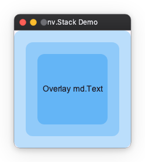
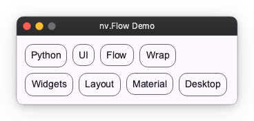

# Layout Extras

This section introduces components for special arrangements that cannot be expressed by basic layouts like Column or Row.

## Stack

Arranges elements in stacking order (Z-order).
Use this when you want to place text over a background image or display a notification badge over an icon.

- The first written element goes to the back (bottom).
- The last written element goes to the front (top).

```python
import nuiitivet as nv
import nuiitivet.material as md
import nuiitivet.modifiers as mod

nv.Stack(
    width=240,
    height=200,
    alignment="center",  # Default alignment position
    children=[
        md.FilledCard(
            md.Text(""),
            width="100%",
            height="100%",
        ).modifier(mod.background("#BBDEFB")),
        md.FilledCard(
            md.Text(""),
            width="80%",
            height="80%",
        ).modifier(mod.background("#90CAF9")),
        md.FilledCard(
            md.Text("Overlay Text"),
            width="60%",
            height="60%",
            alignment="center",
        ).modifier(mod.background("#64B5F6")),
    ],
)
```



## Deck (Conditional Display)

A component that displays **only one** child at a time from multiple children.
Used for tab switching or content switching in side menus.

```python
import nuiitivet as nv
import nuiitivet.material as md
import nuiitivet.modifiers as mod


def set_index(i: int) -> None:
    # state is assumed to be defined elsewhere or part of a class
    state.current_index.value = i


menu = nv.Column(
    padding=8,
    gap=8,
    children=[
        md.FilledButton("Tab 1", on_click=lambda: set_index(0)),
        md.FilledButton("Tab 2", on_click=lambda: set_index(1)),
        md.FilledButton("Tab 3", on_click=lambda: set_index(2)),
    ],
)

body = nv.Deck(
    index=state.current_index,
    width="100%",
    height="100%",
    children=[
        nv.Container(
            alignment="center",
            width="100%",
            height="100%",
            child=md.Text("Tab 1 Content"),
        ).modifier(mod.background("#BBDEFB")),
        nv.Container(
            alignment="center",
            width="100%",
            height="100%",
            child=md.Text("Tab 2 Content"),
        ).modifier(mod.background("#C8E6C9")),
        nv.Container(
            alignment="center",
            width="100%",
            height="100%",
            child=md.Text("Tab 3 Content"),
        ).modifier(mod.background("#FFE0B2")),
    ],
)

contents = nv.Row(
    gap=12,
    width="100%",
    children=[menu, body],
)
```


## Flow (Wrap Layout)

Arranges elements from left to right and automatically wraps to the next line when exceeding the parent width.
Suitable for tag lists or card lists.

```python
import nuiitivet as nv
import nuiitivet.material as md

tags = ["Python", "UI", "Framework", "Layout", "Grid", "Flex"]

nv.Flow(
    main_gap=8,
    cross_gap=8,
    padding=8,
    children=[
        md.OutlinedCard(md.Text(tag)) for tag in tags
    ],
)
```



## Container (Decoration/Size Control)

A wrapper with a single child element.
Used to add padding to child elements, fix sizes, or specify alignment.
(Similar to `div` in HTML)

```python
import nuiitivet as nv
import nuiitivet.material as md

nv.Container(
    md.FilledButton("Centered Content"),
    width=250,
    height=200,
    alignment="center",
    padding=16,
)
```


## Spacer (Space Adjustment)

An invisible widget useful when you want to create flexible spacing.
Useful for pushing elements to both ends within `Row` or `Column`.

```python
import nuiitivet as nv
import nuiitivet.material as md

nv.Row(
    padding=16,
    gap=16,
    width=500,
    children=[
        md.OutlinedButton("Left 1"),
        md.OutlinedButton("Left 2"),
        nv.Spacer(width="100%"),
        md.FilledButton("Right"),
    ],
)
```


