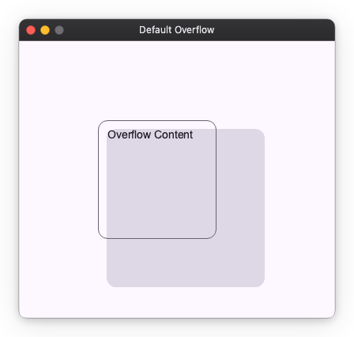
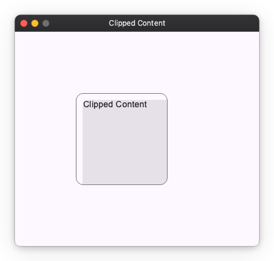
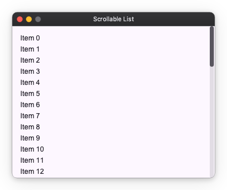

# Layout Overflow

If the content is larger than the parent component's size, it is **drawn overflowing the frame** by default.
This page explains the default behavior and how to "hide" or "make scrollable" as needed.

## Default Behavior (Overflow)

If the child (200x200) is larger than the parent size (150x150), it is drawn beyond the parent's frame by default.

```python
import nuiitivet as nv
import nuiitivet.material as md

# Parent frame (150x150)
md.Card(
    width=150,
    height=150,
    padding=10,
    # Child is larger (200x200) -> Displayed as overflowing
    child=md.Card(
        width=200,
        height=200,
        child=md.Text("Overflow Content"),
    ),,
    style=md.CardStyle.outlined(),
)
```



This "do not cut automatically" behavior allows decorations like shadows and badges to be displayed naturally.

## Hiding Overflow (Clip)

If you want to cut off (hide) the part sticking out of the frame, apply `.modifier(clip())` to the parent.

```python
import nuiitivet as nv
import nuiitivet.material as md
import nuiitivet.modifiers as mod

md.Card(
    width=150,
    height=150,
    padding=10,
    child=md.Card(
        width=200,
        height=200,
        child=md.Text("Clipped Content"),
    ),,
    style=md.CardStyle.outlined(),
).modifier(mod.clip())  # Parts sticking out of the frame are not drawn
```



## Making Scrollable (Scroller)

To view the overflowing part by scrolling, use the `Scroller` widget.
Wrap `Column` or `Row` with `Scroller` to create a scrollable area.

```python
import nuiitivet as nv
import nuiitivet.material as md
from nuiitivet.layout.scroller import Scroller

# Even with many items, you can scroll within the specified height (300px)
nv.Container(
    height=300,
    child=Scroller(
        child=nv.Column(
            children=[md.Text(f"Item {i}") for i in range(50)],
            gap=8,
            padding=16,
        ),
        direction="vertical",
        scrollbar_enabled=True,
    ),
)
```



| Argument | Description |
| --- | --- |
| `direction` | Scroll direction (`"vertical"` or `"horizontal"`) |
| `scrollbar_enabled` | Whether to display scrollbar (`True`/`False`) |

## Next Steps

- Basic Spacing: [layout_spacing.md](layout_spacing.md)
- Other Components: [layout_extras.md](layout_extras.md)
