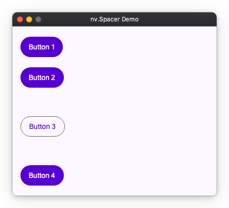
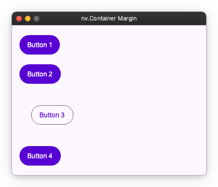

# Layout Spacing

Layout spacing is expressed only by "spacing inwards" and "spacing between elements".
This page explains how to use `padding` and `gap`, which are simple and highly reusable ways to add spacing.
There is no `margin`. First, verify that all spacing can be expressed with just these two.

## padding (Inner Spacing)

Creates spacing between itself and its child elements (inside).
In components with background colors or borders, this becomes the distance to the content.

```python
import nuiitivet as nv
import nuiitivet.material as md

# Creates 16px spacing inside the container (spacing between buttons is zero)
content = nv.Column(
    children=[
        md.FilledButton("Button 1"),
        md.FilledButton("Button 2"),
        md.OutlinedButton("Button 3"),  # Only this one has different style
        md.FilledButton("Button 4"),
    ],
    padding=16,
)
```


## gap (Spacing Between Elements)

Creates uniform space between child elements.
There is no need to set spacing for each child element, and you can adjust the overall spacing in one place.

```python
import nuiitivet as nv
import nuiitivet.material as md

# Creates a 12px gap between buttons
content = nv.Column(
    children=[
        md.FilledButton("Button 1"),
        md.FilledButton("Button 2"),
        md.OutlinedButton("Button 3"),
        md.FilledButton("Button 4"),
    ],
    gap=12,
    padding=16,
)
```


## When you want to change spacing "only here"

`padding` and `gap` are convenient for setting settings collectively, but if you want to "separate only here" or "give spacing only to specific elements", use the following two methods.

### 1. Insert Spacer (Separate Elements)

Place a `Spacer` if you want to widen the interval between adjacent elements only at a specific location.

```python
import nuiitivet as nv
import nuiitivet.material as md

# Widen interval only before and after Button 3
content = nv.Column(
    children=[
        md.FilledButton("Button 1"),
        md.FilledButton("Button 2"),
        nv.Spacer(height=24),  # Widen only here
        md.OutlinedButton("Button 3"),
        nv.Spacer(height=24),  # Widen only here
        md.FilledButton("Button 4"),
    ],
    gap=12,  # Basic interval
    padding=16,
)
```



### 2. Wrap with Container (Open Space Around)

If you want spacing only around a specific element (so-called margin-like usage), wrap that element in a `Container` and set `padding` on the `Container`.

```python
import nuiitivet as nv
import nuiitivet.material as md

# Create spacing only around Button 3 (top, bottom, left, right)
content = nv.Column(
    children=[
        md.FilledButton("Button 1"),
        md.FilledButton("Button 2"),
        nv.Container(
            child=md.OutlinedButton("Button 3"),
            padding=24,  # Secure 24px around this element only
        ),
        md.FilledButton("Button 4"),
    ],
    gap=12,
    padding=16,
)
```



## Gap Property per Component

Depending on the component, the method of setting spacing differs slightly.

| Component | gap property | Description |
| --- | --- | --- |
| Row / Column | `gap` | Interval between child elements |
| Flow | `main_gap` | Interval within row (same direction) |
| | `cross_gap` | Interval between rows (wrapping direction) |
| Grid | `column_gap` | Interval between columns (horizontal) |
| | `row_gap` | Interval between rows (vertical) |

## Next Steps

- Determining Size: [layout_sizing.md](layout_sizing.md)
- Determining Alignment: [layout_alignment.md](layout_alignment.md)
