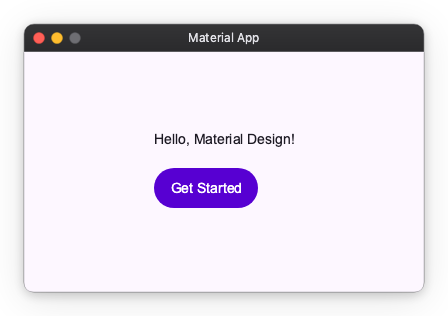

# Material App

`Material App` is the entry point for a Material Design application. It sets up Material Theme, Overlay, and Navigator with sensible defaults so you can focus on building your UI.

## Basic Usage

```python
import nuiitivet as nv
from nuiitivet.material import App, Button, Text
from nuiitivet.material.styles.button_style import ButtonStyle
from nuiitivet.layout.column import Column
from nuiitivet.layout.container import Container
from nuiitivet.widgeting.widget import ComposableWidget, Widget


class HomeScreen(ComposableWidget):
    def build(self) -> Widget:
        return Container(
            alignment="center",
            width="100%",
            height="100%",
            child=Column(
                gap=16,
                children=[
                    Text("Hello, Material Design!"),
                    Button("Get Started", style=ButtonStyle.filled()),
                ],
            ),
        )


App(HomeScreen(), title_bar=nv.DefaultTitleBar(title="Material App")).run()
```



## Window

Control the window size, position, and resize behavior:

```python
from nuiitivet.runtime.window import WindowPosition

App(
    HomeScreen(),
    width=1280,
    height=800,
    window_position=WindowPosition("center"),
    resizable=False,
).run()
```

See [Window](window.md) for detailed usage.

## Title Bar

### Default Title Bar

```python
import nuiitivet as nv

App(HomeScreen(), title_bar=nv.DefaultTitleBar(title="My App")).run()
```

### Custom Title Bar

Replace the OS title bar with any widget:

```python
import nuiitivet as nv
from nuiitivet.material import Text

App(
    HomeScreen(),
    title_bar=nv.CustomTitleBar(
        content=Text("My App"),
        title="My App",
    ),
).run()
```

See [Window Chrome](window_chrome.md) for detailed usage.

## Theme

Pass a `ThemeFactory` to change the seed color or switch to dark mode:

```python
from nuiitivet.material import App, ThemeFactory

App(HomeScreen(), theme=ThemeFactory.dark("#00639B")).run()
```

See [Material Theme](material_theme.md) for detailed usage.

## Overlay Routes

Register custom overlay intents that can be dispatched from anywhere in the widget tree:

```python
from nuiitivet.material import App
from nuiitivet.material.dialogs import BasicDialog

App(
    HomeScreen(),
    overlay_routes={
        MyIntent: lambda intent: BasicDialog(title=intent.title, message=intent.message),
    },
).run()
```

See [Material Overlay](material_overlay.md) for detailed usage.

---

[API Reference](../api/material.md#nuiitivet.material.App)
