# Material Widgets

`nuiitivet.material` implements Material Design 3 widgets, with more on the way. This page showcases the available widgets — each with a screenshot and a link to the API reference. Overlay-based widgets (Dialog, BottomSheet, SideSheet, Loading) are covered in [Material Overlay](material_overlay.md).

!!! note "Import convention"
    All widgets shown below are exported from `nuiitivet.material`:

    ```python
    from nuiitivet.material import Button, Card, TextField  # etc.
    ```

---

## Text

Typography component for rendering text with theme-aware styles.

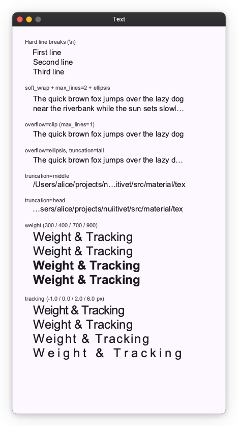

[API Reference](../api/material.md#nuiitivet.material.Text)

---

## Icon

Material Symbols icon component. Specify a symbol name and an optional size.

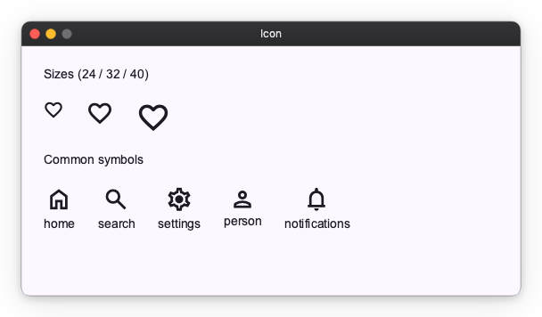

[API Reference](../api/material.md#nuiitivet.material.Icon)

---

## Button

Five M3 button styles — Filled, Tonal, Elevated, Outlined, and Text — plus icon support and disabled state.

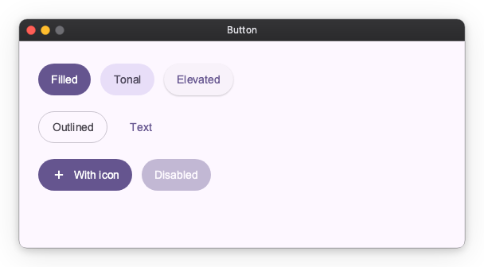

[API Reference](../api/material.md#nuiitivet.material.Button)

---

## ToggleButton

Two-state button with selected / unselected appearance. Available in Filled and Outlined styles.

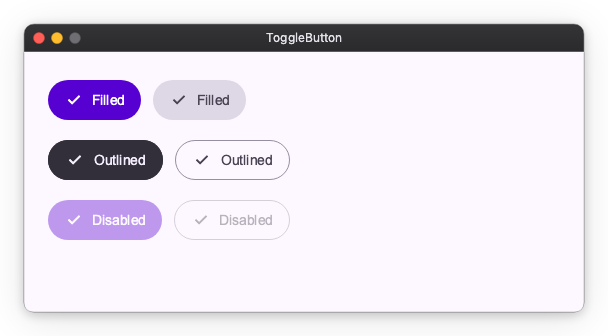

[API Reference](../api/material.md#nuiitivet.material.ToggleButton)

---

## IconButton

Compact icon-only buttons in the standard M3 styles, plus a toggle variant.

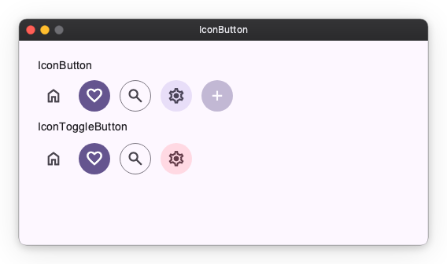

[API Reference](../api/material.md#nuiitivet.material.IconButton)

---

## Fab (Floating Action Button)

Prominent action button. Multiple color variants and three sizes (small / medium / large).

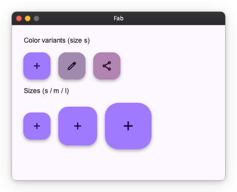

[API Reference](../api/material.md#nuiitivet.material.Fab)

---

## ButtonGroup

Group related actions. `StandardButtonGroup` keeps spacing between buttons; `ConnectedButtonGroup` connects them as a single segmented control.

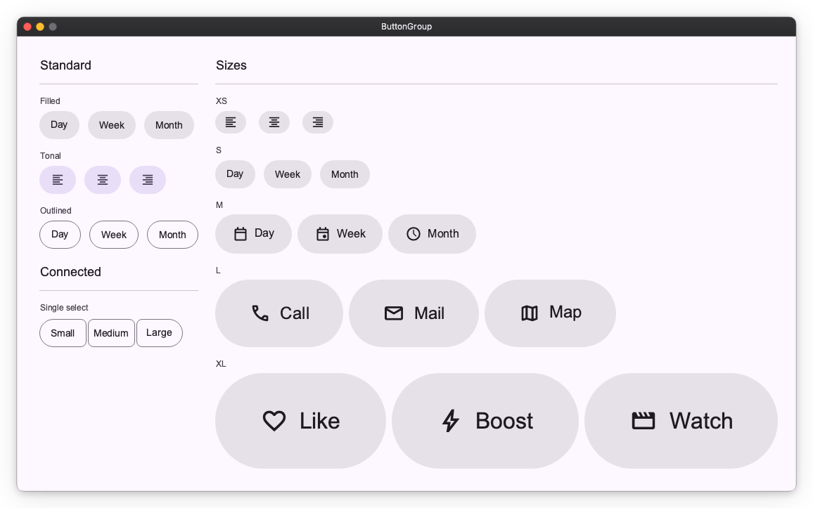

[API Reference](../api/material.md#nuiitivet.material.StandardButtonGroup)

---

## Selection Controls

`Checkbox`, `RadioButton` (typically grouped via `RadioGroup`), and `Switch` for boolean / single-select input.

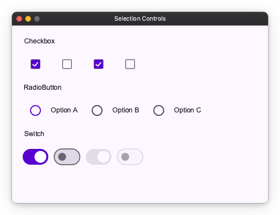

API References: [Checkbox](../api/material.md#nuiitivet.material.Checkbox) ・ [RadioButton](../api/material.md#nuiitivet.material.RadioButton) ・ [Switch](../api/material.md#nuiitivet.material.Switch)

---

## Slider

Numeric input. `Slider` selects a value in a range, `CenteredSlider` is anchored at zero, `RangeSlider` selects a min/max pair.

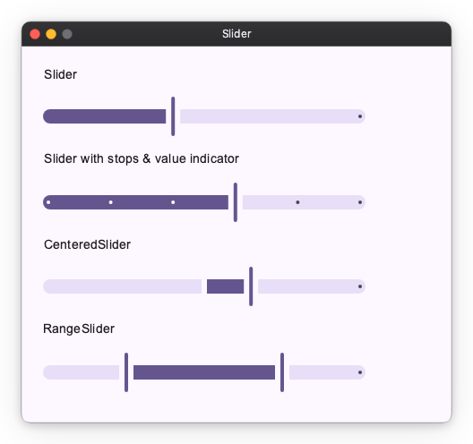

API References: [Slider](../api/material.md#nuiitivet.material.Slider) ・ [CenteredSlider](../api/material.md#nuiitivet.material.CenteredSlider) ・ [RangeSlider](../api/material.md#nuiitivet.material.RangeSlider)

---

## TextField

Text input. Available as `FilledTextField` and `OutlinedTextField`, with leading icons, supporting text, and error states.

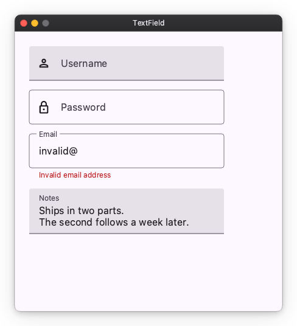

[API Reference](../api/material.md#nuiitivet.material.TextField)

---

## Card

Container for grouped content. Three variants — Filled, Outlined, Elevated.

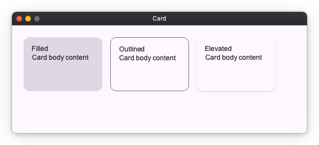

[API Reference](../api/material.md#nuiitivet.material.Card)

---

## Chip

Compact actions and choices: `AssistChip`, `FilterChip`, `InputChip`, `SuggestionChip`.

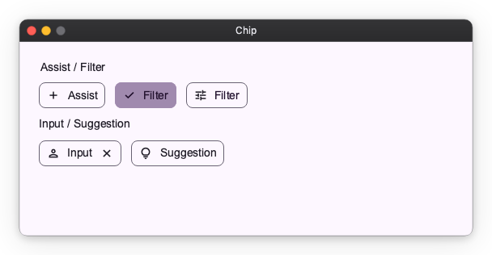

API References: [AssistChip](../api/material.md#nuiitivet.material.AssistChip) ・ [FilterChip](../api/material.md#nuiitivet.material.FilterChip) ・ [InputChip](../api/material.md#nuiitivet.material.InputChip) ・ [SuggestionChip](../api/material.md#nuiitivet.material.SuggestionChip)

---

## Badge

Small status indicator that decorates other widgets via a modifier. `SmallBadge` is a dot; `LargeBadge` shows a count.

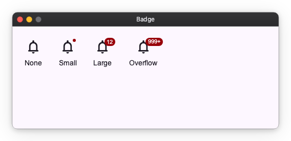

API References: [SmallBadge](../api/material.md#nuiitivet.material.SmallBadge) ・ [LargeBadge](../api/material.md#nuiitivet.material.LargeBadge)

---

## Divider

Horizontal or vertical separator line.

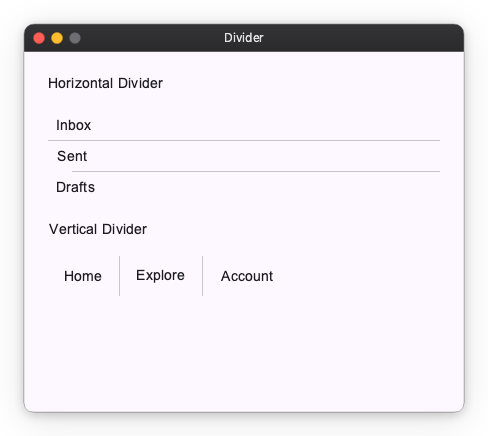

[API Reference](../api/material.md#nuiitivet.material.Divider)

---

## Progress Indicators

Linear and circular progress, in determinate and indeterminate variants. `LoadingIndicator` is the M3 Expressive shape-morphing indicator.

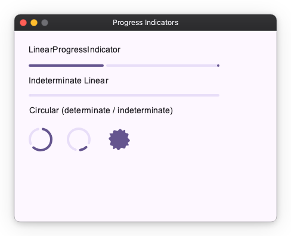

API References: [LinearProgressIndicator](../api/material.md#nuiitivet.material.LinearProgressIndicator) ・ [CircularProgressIndicator](../api/material.md#nuiitivet.material.CircularProgressIndicator) ・ [LoadingIndicator](../api/material.md#nuiitivet.material.LoadingIndicator)

---

## NavigationRail

Vertical navigation bar with collapsed / expanded states, badges, and an optional menu button. Pairs with [Material Navigator](material_navigator.md) for routing.

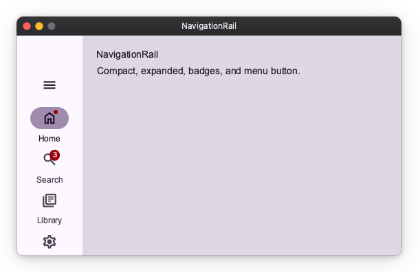

[API Reference](../api/material.md#nuiitivet.material.NavigationRail)

---

## Toolbar

Action bar of icon buttons. `DockedToolbar` stretches to its container; `FloatingToolbar` is a pill-shaped overlay.

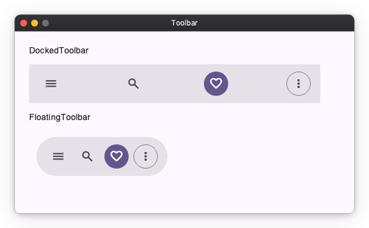

API References: [DockedToolbar](../api/material.md#nuiitivet.material.DockedToolbar) ・ [FloatingToolbar](../api/material.md#nuiitivet.material.FloatingToolbar)

---

## Menu

Vertical list of `MenuItem`s. Supports leading icons, trailing shortcut/affordance text, dividers, and disabled items.

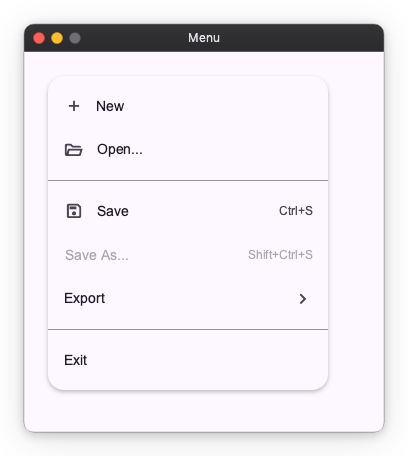

[API Reference](../api/material.md#nuiitivet.material.Menu)

---

## Tooltip

Contextual hint shown next to a target. `Tooltip` is a plain text label; `RichTooltip` supports a title, body, and action buttons.

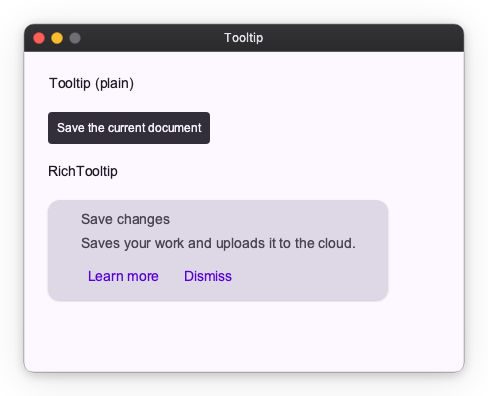

API References: [Tooltip](../api/material.md#nuiitivet.material.Tooltip) ・ [RichTooltip](../api/material.md#nuiitivet.material.RichTooltip)

---

## StandardSideSheet

Docked side panel that sits beside the main content area. Unlike the modal `SideSheet`, it is a permanent part of the layout. Wrap it in `Collapsible` (with `axis="horizontal"`) to animate it open and closed without any additional API on the sheet itself.

```python
Collapsible(
    StandardSideSheet(
        panel_content,
        headline="Filters",
        on_close=vm.close_panel,
    ),
    opened=vm.panel_open,
    axis="horizontal",
    alignment="top_right",
)
```

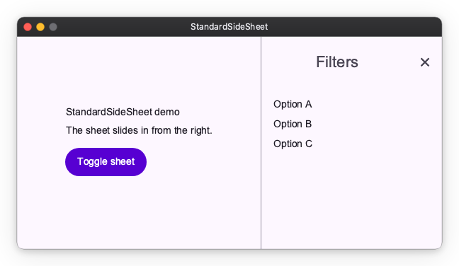

[API Reference](../api/material.md#nuiitivet.material.StandardSideSheet)

---

## Image

`Image` is a primitive widget that is not part of Material Design. Displays a raster image from in-memory bytes. Supports `contain`, `cover`, `fill`, and `none` fit modes.

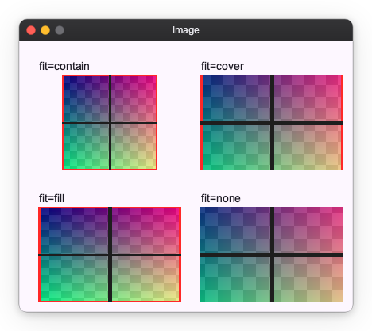

[API Reference](../api/widgets.md#nuiitivet.widgets.image.Image)
