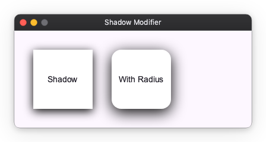

# Decoration Modifiers

Decoration modifiers are used to add visual styling to Widgets, such as background colors, borders, corner radii, clipping, and shadows.

## Background and Border

You can add a background color using the `background` modifier and a border using the `border` modifier.

```python
from nuiitivet.modifiers import background, border

# Background only
box1 = Container(child=Text("Background")).modifier(background("#E0E0E0"))

# Border only
box2 = Container(child=Text("Border")).modifier(border(color="#F44336", width=4))

# Both background and border
box3 = Container(child=Text("Both")).modifier(
    background("#E0E0E0") | border(color="#4CAF50", width=2)
)
```


## Corner Radius and Clip

You can round the corners of a Widget using the `corner_radius` modifier. If you want to clip the content of the Widget to its bounds, use the `clip` modifier.

```python
from nuiitivet.modifiers import background, corner_radius, clip

# Corner radius
box1 = Container(child=Text("Radius")).modifier(
    background("#2196F3") | corner_radius(16)
)

# Clip content
box2 = Container(child=Text("Clip")).modifier(
    background("#FF9800") | clip()
)
```


## Shadow

You can add a drop shadow to a Widget using the `shadow` modifier. It takes parameters like `color`, `blur`, and `offset`.

```python
from nuiitivet.modifiers import background, shadow, corner_radius

# Simple shadow
box1 = Container(child=Text("Shadow")).modifier(
    background("#FFFFFF") | shadow(color="#000000", blur=8, offset=(0, 4))
)

# Shadow with corner radius
box2 = Container(child=Text("With Radius")).modifier(
    background("#FFFFFF") | corner_radius(16) | shadow(color="#000000", blur=12, offset=(0, 6))
)
```


