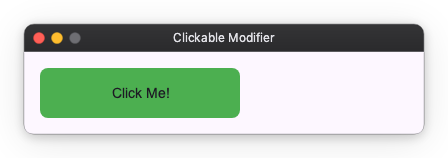

# Interaction Modifiers

Interaction modifiers are used to add interactivity to Widgets, such as clickability, hoverability, and focusability.

## Clickable

You can make a Widget clickable using the `clickable` modifier. It takes an `on_click` callback that is invoked when the Widget is clicked.

```python
from nuiitivet.modifiers import background, clickable, corner_radius

# Clickable box
box = Container(child=Text("Click Me!")).modifier(
    background("#4CAF50")
    | corner_radius(8)
    | clickable(on_click=lambda: print("Clicked!"))
)
```



## Hoverable

You can make a Widget hoverable using the `hoverable` modifier. It takes an `on_hover_change` callback that is invoked when the mouse pointer enters or leaves the Widget.

```python
import nuiitivet as nv
import nuiitivet.material as md
from nuiitivet.modifiers import background, hoverable, corner_radius
from nuiitivet.observable import Observable

class HoverDemo(nv.ComposableWidget):
    def __init__(self):
        super().__init__()
        self.is_hovered = Observable(False)

    def _set_hovered(self, hovered: bool) -> None:
        self.is_hovered.value = hovered

    def build(self):
        bg_color = self.is_hovered.map(lambda h: "#2196F3" if h else "#E0E0E0")

        return nv.Container(
            width=200,
            height=50,
            child=md.Text("Hover Me!"),
            alignment="center",
        ).modifier(
            background(bg_color)
            | corner_radius(8)
            | hoverable(on_hover_change=self._set_hovered)
        )
```


## Focusable

You can make a Widget focusable using the `focusable` modifier. It takes an `on_focus_change` callback that is invoked when the Widget gains or loses focus.

```python
import nuiitivet as nv
import nuiitivet.material as md
from nuiitivet.modifiers import background, focusable, border, corner_radius
from nuiitivet.observable import Observable

class FocusDemo(nv.ComposableWidget):
    def __init__(self):
        super().__init__()
        self.is_focused = Observable(False)

    def _set_focused(self, focused: bool) -> None:
        self.is_focused.value = focused

    def build(self):
        border_color = self.is_focused.map(lambda f: "#2196F3" if f else "#00000000")
        
        return nv.Container(
            width=200,
            height=50,
            child=md.Text("Focus with Tab"),
            alignment="center",
        ).modifier(
            background("#E0E0E0")
            | corner_radius(8)
            | border(color=border_color, width=2)
            | focusable(on_focus_change=self._set_focused)
        )
```


