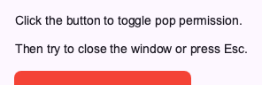

# Other Modifiers

Other modifiers provide additional functionalities to Widgets, such as scrollability and handling back navigation.

## Scrollable

You can make a Widget scrollable using the `scrollable` modifier. It takes an `axis` parameter that specifies the scroll direction (`"x"`, `"y"`, or `"both"`).

```python
from nuiitivet.modifiers import background, scrollable

items = [
    Container(child=Text(f"Item {i}")).modifier(background("#E0E0E0"))
    for i in range(10)
]

# Scrollable list
content = Container(
    width=250,
    height=200,
    child=Column(children=items, gap=8),
).modifier(scrollable(axis="y"))
```


## Will Pop

You can handle back navigation (e.g., pressing the Esc key or closing the window) using the `will_pop` modifier. It takes an `on_will_pop` callback that returns a boolean indicating whether the pop action should be allowed.

```python
import nuiitivet as nv
import nuiitivet.material as md
from nuiitivet.modifiers import background, will_pop, clickable, corner_radius
from nuiitivet.observable import Observable

class WillPopDemo(nv.ComposableWidget):
    def __init__(self):
        super().__init__()
        self.can_pop = Observable(False)

    def _toggle_can_pop(self) -> None:
        self.can_pop.value = not self.can_pop.value

    def build(self):
        bg_color = self.can_pop.map(lambda c: "#4CAF50" if c else "#F44336")
        text = self.can_pop.map(lambda c: "Can Pop: True" if c else "Can Pop: False")

        return nv.Container(
            width=200,
            height=50,
            child=md.Text(text),
            alignment="center",
        ).modifier(
            background(bg_color)
            | corner_radius(8)
            | clickable(on_click=self._toggle_can_pop)
            | will_pop(on_will_pop=lambda: self.can_pop.value)
        )
```


