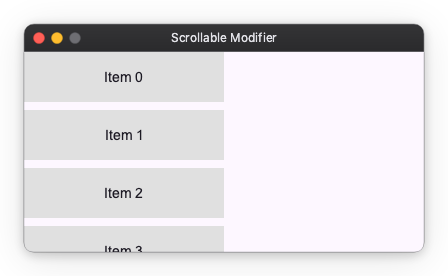

# Other Modifiers

Other modifiers provide additional functionalities to Widgets, such as scrollability and handling back navigation.

## Scrollable

You can make a Widget scrollable using the `scrollable` modifier. It takes an `axis` parameter that specifies the scroll direction (`"x"`, `"y"`, or `"both"`).

```python
from nuiitivet.modifiers import background, scrollable

items = [
    Container(child=Text(f"Item {i}")).modifier(background("#E0E0E0"))
    for i in range(10)
]

# Scrollable list
content = Container(
    width=250,
    height=200,
    child=Column(children=items, gap=8),
).modifier(scrollable(axis="y"))
```



## Will Pop

You can handle back navigation (e.g., pressing the Esc key) using the `will_pop` modifier. It takes an `on_will_pop` callback that returns a boolean indicating whether pop should be allowed.
In this example, an editor screen is pushed on a `Navigator`. Pop is blocked while there are unsaved changes, and allowed after Save or Discard.

```python
import nuiitivet as nv
import nuiitivet.material as md
from dataclasses import dataclass
from nuiitivet.material.buttons import Button
from nuiitivet.material.dialogs import BasicDialog
from nuiitivet.material import Overlay
from nuiitivet.material.text_fields import TextField
from nuiitivet.modifiers import will_pop
from nuiitivet.navigation import Navigator, Route
from nuiitivet.observable import Observable
from nuiitivet.material import ButtonStyle

@dataclass(frozen=True, slots=True)
class HomeIntent:
    pass

class HomeScreen(nv.ComposableWidget):
    def build(self):
        def _open_editor() -> None:
            Navigator.root().push(Route(builder=lambda: EditScreen()))

        return nv.Container(
            padding=24,
            child=nv.Column(
                children=[
                    md.Text("Will Pop Modifier"),
                    md.Text("Open editor, edit text, then try Esc or Back."),
                    Button("Open editor", on_click=_open_editor, style=ButtonStyle.filled()),
                ],
                gap=14,
                cross_alignment="start",
            ),
        )

class EditScreen(nv.ComposableWidget):
    def __init__(self) -> None:
        super().__init__()
        self.text = Observable("Hello")
        self._initial_text = str(self.text.value)

    def _is_dirty(self) -> bool:
        return str(self.text.value) != self._initial_text

    def _save(self) -> None:
        self._initial_text = str(self.text.value)

    def _try_pop(self) -> None:
        Navigator.root().pop()

    def _on_will_pop(self) -> bool:
        if not self._is_dirty():
            return True

        def _cancel() -> None:
            Overlay.root().close(None)

        def _discard() -> None:
            self._initial_text = str(self.text.value)
            Overlay.root().close(None)
            Navigator.root().pop()

        Overlay.root().dialog(
            BasicDialog(
                title="Discard changes?",
                message="You have unsaved changes.",
                actions=[
                    Button("Cancel", on_click=_cancel, style=ButtonStyle.text()),
                    Button("Discard", on_click=_discard, style=ButtonStyle.filled()),
                ],
            ),
            dismiss_on_outside_tap=False,
        )
        return False

    def build(self):
        return nv.Container(
            padding=24,
            child=nv.Column(
                children=[
                    md.Text("Edit text. Back/Esc asks confirmation when unsaved."),
                    TextField.two_way(
                        self.text,
                        width=420,
                        height=52,
                        padding=10,
                    ),
                    nv.Row(
                        children=[
                            Button("Back", on_click=self._try_pop, style=ButtonStyle.text()),
                            Button("Save", on_click=self._save, style=ButtonStyle.filled()),
                        ],
                        gap=10,
                    ),
                ],
                gap=14,
                cross_alignment="start",
            ),
        ).modifier(
            will_pop(on_will_pop=self._on_will_pop)
        )

def main() -> None:
    md.App(
        Navigator.intents(
            initial_route=HomeIntent(),
            routes={HomeIntent: lambda _i: Route(builder=HomeScreen)},
        ),
    ).run()
```


## Stick

The `stick` modifier overlays any widget on top of a target widget at a specified anchor point. Unlike popup modifiers, the overlaid widget is always visible — it is not transient. Typical uses include notification badges, status dots, and custom decorations.

The following example uses `SmallBadge` and `LargeBadge` as the overlaid widget, but any widget can be passed.

```python
import nuiitivet as nv
import nuiitivet.material as md
from nuiitivet.material import LargeBadge, SmallBadge
from nuiitivet.modifiers import background, corner_radius, stick

def _icon_box() -> nv.Container:
    return nv.Container(
        width=56,
        height=56,
        child=md.Text("Icon"),
        alignment="center",
    ).modifier(background("#E0E0E0") | corner_radius(8))

# Small badge at the top-right corner (default)
icon_with_dot = _icon_box().modifier(stick(SmallBadge()))

# Large badge with a count
icon_with_count = _icon_box().modifier(stick(LargeBadge("3")))

# Custom placement: bottom-right corner
icon_with_badge_br = _icon_box().modifier(
    stick(LargeBadge("99+"), alignment="bottom-right", anchor="center")
)
```


The `alignment` parameter sets the reference point on the **target widget**, and `anchor` sets the reference point on the **overlaid widget** that aligns to it. An optional `offset` tuple provides additional pixel adjustment.
