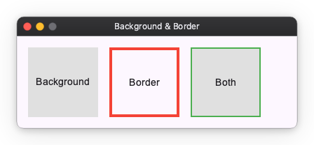
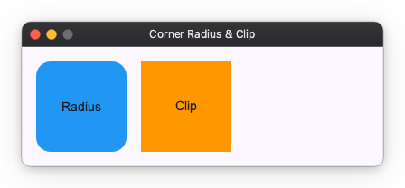
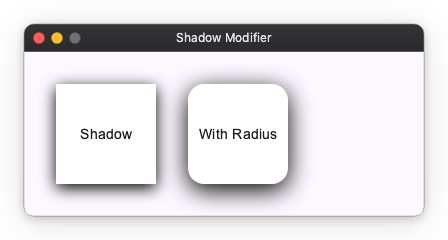

# Decoration Modifiers

Decoration modifiers are used to add visual styling to Widgets, such as background colors, borders, corner radii, clipping, and shadows.

## Background and Border

You can add a background color using the `background` modifier and a border using the `border` modifier.

```python
import nuiitivet.material as nv

# Background only
box1 = nv.Container(child=nv.Text("Background")).modifier(nv.background("#E0E0E0"))

# Border only
box2 = nv.Container(child=nv.Text("Border")).modifier(nv.border(color="#F44336", width=4))

# Both background and border
box3 = nv.Container(child=nv.Text("Both")).modifier(
    nv.background("#E0E0E0") | nv.border(color="#4CAF50", width=2)
)
```



## Corner Radius and Clip

You can round the corners of a Widget using the `corner_radius` modifier. If you want to clip the content of the Widget to its bounds, use the `clip` modifier.

```python
import nuiitivet.material as nv

# Corner radius
box1 = nv.Container(child=nv.Text("Radius")).modifier(
    nv.background("#2196F3") | nv.corner_radius(16)
)

# Clip content
box2 = nv.Container(child=nv.Text("Clip")).modifier(
    nv.background("#FF9800") | nv.clip()
)
```



## Shadow

You can add a drop shadow to a Widget using the `shadows` modifier. It takes a `Shadow` value, a list of them ordered back to front, or `None` for no shadow.

A `Shadow` describes one layer in CSS `box-shadow` terms:

- `color`: the shadow color
- `blur_radius`: the CSS blur-radius in pixels; `0` gives a hard-edged shadow
- `offset`: `(dx, dy)` translation of the shadow
- `spread_radius`: outward inflation of the shadow rect in pixels, applied before the blur; a negative value shrinks it

```python
import nuiitivet.material as nv

# Simple shadow
box1 = nv.Container(child=nv.Text("Shadow")).modifier(
    nv.background("#FFFFFF") | nv.shadows(nv.Shadow("#000000", blur_radius=16, offset=(0, 4)))
)

# Shadow with corner radius
box2 = nv.Container(child=nv.Text("With Radius")).modifier(
    nv.background("#FFFFFF")
    | nv.corner_radius(16)
    | nv.shadows(nv.Shadow("#000000", blur_radius=24, offset=(0, 6)))
)

# A stack: a wide, soft ambient layer under a tight key layer
box3 = nv.Container(child=nv.Text("Stack")).modifier(
    nv.background("#FFFFFF")
    | nv.shadows(
        [
            nv.Shadow(("#000000", 0.15), blur_radius=8, offset=(0, 4), spread_radius=3),
            nv.Shadow(("#000000", 0.30), blur_radius=3, offset=(0, 1)),
        ]
    )
)
```


