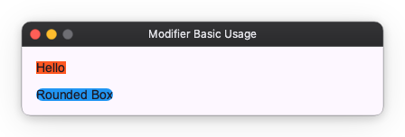

# Modifiers

Modifiers are a mechanism for adding functionality to Widgets.
Use them when you want to add decorations like background color or corner radius to a Widget, or when you want to add interaction like clickability.

## Basic Usage

You can add functionality to a Widget by passing a Modifier to the `modifier()` method that all Widgets have. If you want to attach multiple Modifiers, you can chain them with the `|` operator.

```python
import nuiitivet.material as nv

# Add background color with background
text1 = nv.Text("Hello").modifier(nv.background("#FF5722"))

# Add corner radius with corner_radius
text2 = nv.Text("Rounded Box").modifier(nv.background("#2196F3") | nv.corner_radius(8))
```



It's similar to Modifiers in SwiftUI or Jetpack Compose, but Nuiitivet does not provide layout-related functions in Modifiers. Layout should be handled by Widgets and parameters alone; allowing Modifiers to handle layout would make the code complex.

## Types of Modifiers

Modifiers are categorized into the following types:

- **[Decoration](decoration.md)**: Add visual decorations like background, border, corner radius, clip, and shadow.
- **[Interaction](interaction.md)**: Add interaction capabilities like clickable, hoverable, focusable, and keyboard shortcuts.
- **[Pointer Participation](pointer_participation.md)**: Control which overlapping widget catches a click — `defer_pointer`, `block_pointer`, `absorb_pointer`, and `passthrough_pointer`.
- **[Transform](transform.md)**: Apply paint-only transformations like opacity, rotate, scale, and translate.
- **[Popup](popup.md)**: Attach anchored transient overlays like menus, dropdowns, and tooltips.
- **[Lifecycle](lifecycle.md)**: Run callbacks when a widget is mounted or unmounted, including async tasks.
- **[Others](others.md)**: Other functionalities like on_size_changed, will_pop, and stick.
