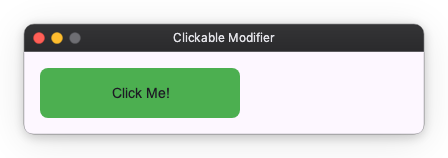
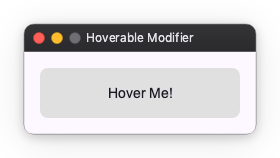
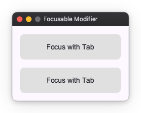
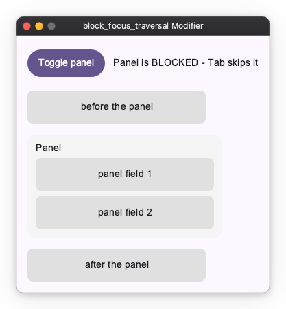

# Interaction Modifiers

Interaction modifiers are used to add interactivity to Widgets, such as clickability, hoverability, and focusability.

## Clickable

You can make a Widget clickable using the `clickable` modifier. It takes an `on_click` callback that is invoked when the Widget is clicked.

```python
from nuiitivet.modifiers import background, clickable, corner_radius

# Clickable box
box = Container(child=Text("Click Me!")).modifier(
    background("#4CAF50")
    | corner_radius(8)
    | clickable(on_click=lambda: print("Clicked!"))
)
```



## Hoverable

You can make a Widget hoverable using the `hoverable` modifier. It takes an `on_hover_change` callback that is invoked when the mouse pointer enters or leaves the Widget.

```python
import nuiitivet as nv
import nuiitivet.material as md
from nuiitivet.modifiers import background, hoverable, corner_radius
from nuiitivet.observable import Observable

class HoverDemo(nv.ComposableWidget):
    def __init__(self):
        super().__init__()
        self.is_hovered = Observable(False)

    def _set_hovered(self, hovered: bool) -> None:
        self.is_hovered.value = hovered

    def build(self):
        bg_color = self.is_hovered.map(lambda h: "#2196F3" if h else "#E0E0E0")

        return nv.Container(
            width=200,
            height=50,
            child=md.Text("Hover Me!"),
            alignment="center",
        ).modifier(
            background(bg_color)
            | corner_radius(8)
            | hoverable(on_hover_change=self._set_hovered)
        )
```



## Focusable

You can make a Widget focusable using the `focusable` modifier. It takes an `on_focus_change` callback that is invoked when the Widget gains or loses focus.

```python
import nuiitivet as nv
import nuiitivet.material as md
from nuiitivet.modifiers import background, focusable, border, corner_radius
from nuiitivet.observable import Observable

class FocusDemo(nv.ComposableWidget):
    def __init__(self):
        super().__init__()
        self.is_focused = Observable(False)

    def _set_focused(self, focused: bool) -> None:
        self.is_focused.value = focused

    def build(self):
        border_color = self.is_focused.map(lambda f: "#2196F3" if f else "#00000000")
        
        return nv.Container(
            width=200,
            height=50,
            child=md.Text("Focus with Tab"),
            alignment="center",
        ).modifier(
            background("#E0E0E0")
            | corner_radius(8)
            | border(color=border_color, width=2)
            | focusable(on_focus_change=self._set_focused)
        )
```



## Blocking focus traversal

`block_focus_traversal()` removes a whole subtree from the Tab sequence while its condition is truthy. Focus held inside the subtree is released, so the focus ring never ends up on something the user cannot reach.

```python
import nuiitivet.material as nv


# TabStop is any focusable widget - see samples/modifiers/interaction/block_focus_traversal.py
class BlockFocusTraversalDemo(nv.ComposableWidget):
    def __init__(self):
        super().__init__()
        self.blocked = nv.Observable(True)

    def _toggle(self) -> None:
        self.blocked.value = not self.blocked.value

    def build(self):
        panel = nv.Column(
            children=[TabStop("panel field 1"), TabStop("panel field 2")],
            gap=8,
            padding=12,
        ).modifier(
            nv.background("#F5F5F5")
            | nv.corner_radius(12)
            | nv.block_focus_traversal(self.blocked)
        )

        return nv.Column(
            children=[
                nv.Button("Toggle panel", on_click=self._toggle),
                TabStop("before the panel"),
                panel,
                TabStop("after the panel"),
            ],
            gap=16,
            padding=16,
        )
```



While `blocked` is `True`, Tab goes from *before the panel* straight to *after the panel*, and focusing a panel field is impossible — focus already inside is released as soon as the subtree becomes blocked.

It only affects keyboard traversal — layout, painting and hit-testing are untouched, so the panel above is still fully visible and clickable while blocked. Use `ignore_pointer()` alongside it to block pointer input as well, or simply use [`visible()`](others.md#visible), which composes both.

## Raw pointer input

`clickable` and `hoverable` are convenience layers: they collapse a press and
release into a single click, and reduce hover to a `bool`. When you need the
individual pointer events — press, move, release, enter, leave and scroll, each
carrying its position, the buttons held and the modifier keys — use
`pointer_input`. It is the low-level "Listener" layer, mirroring Compose's
`Modifier.pointerInput` and Flutter's `Listener`.

Each callback receives a `PointerEvent` and may be sync or async:

```python
import nuiitivet as nv
from nuiitivet.input import BUTTON_LEFT
from nuiitivet.input.pointer import PointerEvent
from nuiitivet.modifiers import corner_radius, pointer_input

def on_press(e: PointerEvent) -> None:
    begin_stroke(e.local_x, e.local_y)

def on_move(e: PointerEvent) -> None:
    if e.buttons & BUTTON_LEFT:      # a button is held — this is a drag, not a hover
        extend_stroke(e.local_x, e.local_y)

surface = nv.Container(width=320, height=240).modifier(
    corner_radius(8)
    | pointer_input(
        on_press=on_press,
        on_move=on_move,
        on_release=lambda e: end_stroke(),
        buttons=(BUTTON_LEFT,),   # only the left button triggers press/release
        capture=True,             # keep delivering move/release off the widget
    )
)
```

### Coordinates: local vs screen

A `PointerEvent` carries two coordinate pairs:

- `local_x` / `local_y` are **widget-relative** — measured from the top-left of
  the widget that received the event. Use these to map a press onto your content.
- `x` / `y` are **screen (window)** coordinates.

For an `Image` that scales its source bitmap, `local_x` / `local_y` are relative
to the displayed rect; mapping them back to source-image pixels (accounting for
your fit / aspect-ratio choice) stays your responsibility.

### Held buttons

`event.buttons` is a bitmask of the buttons currently held down (OR-ed
`BUTTON_*` codes). Because a plain hover move and a drag both arrive as moves,
check `event.buttons` inside `on_move` to tell whether a drag is actually in
progress. `event.button` (singular) is only the button that caused *this*
press/release.

### Capture

With `capture=True` (the default) the pointer is captured on press, so `on_move`
and `on_release` keep arriving even after the pointer leaves the widget bounds —
essential for a drag that runs off the edge. With `capture=False`, moving
outside the bounds delivers `on_leave` and stops `on_move`.

### Reacting to modifier keys while stationary

Reading `event.modifier_keys` handles `Ctrl`+click for free — the mask rides on
every pointer event, so you never track modifier-key state yourself (that state
desyncs on focus change and window deactivation). The one case it misses is the
pointer sitting **still** while the user presses a modifier key: no pointer event
is generated. `on_modifier_keys_change` fills that gap — it fires whenever the
held modifier-key mask changes while the pointer is inside or captured,
delivering a `PointerEvent` synthesized at the current position:

```python
from nuiitivet.input import MOD_ALT

def on_modifier_keys_change(e: PointerEvent) -> None:
    set_cursor(EYEDROPPER if e.modifier_keys & MOD_ALT else BRUSH)

surface.modifier(pointer_input(on_modifier_keys_change=on_modifier_keys_change))
```

It fires during a capture too (i.e. mid-drag, even when the pointer is outside
the widget), and never fires for non-modifier keys or when the pointer is
neither inside nor captured. The runnable
[event-inspector sample](https://github.com/yuksblog/nuiitivet/blob/main/samples/modifiers/interaction/pointer_input.py)
prints the whole stream — event type, local and screen coordinates, held buttons
and modifier-key mask — as it arrives.

`pointer_input` composes with `clickable` on the same widget without either
clobbering the other, so you can keep a semantic click alongside the raw stream.

## Keyboard shortcuts

`focusable(on_key=...)` delivers *raw keys to the focused widget*. A **shortcut**
is a different thing: a key gesture bound to a **command** (`Ctrl+S` → save).
`key_shortcut` binds one:

```python
from nuiitivet.modifiers import key_shortcut

editor.modifier(key_shortcut("Accel+S", on_trigger=self.save))
```

`Accel` is the primary modifier key — **Cmd on macOS, Ctrl everywhere else** — so
one declaration covers every platform. It is resolved when the key is matched,
not when the shortcut is built, so a `Shortcut` value stays portable. Write
`Ctrl`/`Meta` explicitly only when you really mean that one physical key. The
gesture also accepts a typed form, `Shortcut("s", MOD_ACCEL | MOD_SHIFT)`, when
you want to build it from modifier-key masks rather than parse a string.

### A shortcut does not need focus

By default a binding is live whenever its subtree is **displayed** — no focus
required. A paint canvas gets its `Accel+Z` even though nothing in a paint app is
ever focused, and it keeps working while the user types in a toolbar text field.

The focused widget still gets **first refusal** on every key, so a focused
`TextField` keeps eating the keys it uses (`Accel+C`, `Accel+V`, …) before any
shortcut is consulted.

### Typing never fires a shortcut

A bare-letter gesture is the standard paint/vector idiom — `B` for brush, `V` for
select — and it is safe to bind:

```python
canvas.modifier(key_shortcut("b", on_trigger=self.select_brush))
```

While a text field holds focus, the keys it would **type** are withheld from the
shortcut layer entirely. Typing "brush" into a field inserts the letters and
fires nothing. Unfocus the field and `B` selects the brush again.

This covers bare letters, `Shift`+letter, and `Space`. Gestures using the `Accel`
modifier key are unaffected: `Accel+S` produces no text, so it reaches your
binding even while the user is typing.

### Current limitations

Two rough edges, both of which follow from the same thing: whether a key press
will become text cannot be decided from the key and the modifier keys alone.

**`Alt` gestures do not fire while a text field has focus.** `Alt` cannot be
treated as a safe "command" modifier key: on macOS `Option` types characters
(`Option+A` → `å`), and Windows and X11 report `AltGr` as `Ctrl+Alt`, so
`Ctrl+Alt+Q` is how a German layout types `@`. Rather than risk a keystroke
silently running a command while you type, every gesture holding the `Alt`
modifier key — including `Ctrl+Alt` — is treated as text input and withheld.
Prefer `Accel` for commands; if you must bind `Alt`, expect it to be inert while
a field is focused.

**`Enter` reaches a shortcut when the focused field does not use it.** A
`key_shortcut("enter", ...)` fires even with a `TextField` focused, unless that
field claims `Enter` itself — which it only does when an `on_submit` is set. So
whether `Enter` reaches your binding depends on how the *field* was configured,
which is easy to trip over. There is no notion of a dialog "default action" yet;
until there is, do not rely on `Enter` as a shortcut in a screen that also has
text fields.

### Scopes

`scope` decides *when* a binding is live. The three widen in order:

| Scope | Live when | Use for |
| --- | --- | --- |
| `FOCUS` | the subtree contains the focused widget | the same command has several targets **displayed at once** |
| `FOREGROUND` (default) | the subtree is on the topmost interactable layer | almost everything |
| `MOUNT` | the subtree is in the widget tree at all | app-wide commands that must survive navigation |

`FOREGROUND` excludes a subtree that is hidden by `visible(False)`, that sits on a
navigation route another route now covers, or that is behind a modal dialog. In
each case the user cannot act on it, so its commands must not fire.

`MOUNT` is how an **app-wide** command is expressed. `App(content=X)` keeps `X`
mounted for the life of the app — a route push covers it but does not unmount it
— so binding there survives navigation:

```python
App(content=home.modifier(
    key_shortcut("Accel+Q", on_trigger=quit, scope=ShortcutScope.MOUNT)
))
```

### When two panes want the same gesture

`FOREGROUND` bindings have no ordering between them. If two displayed panes both
bind `Accel+S`, that is **ambiguous**: nothing fires, and a warning is logged
rather than picking one arbitrarily.

`FOCUS` is the way to express such a case — and the only case that needs it:
several targets of the same command on screen simultaneously, where only focus
can decide. A dual-pane file manager (`F5` copies from the focused pane), a
split-view editor, a two-list picker:

```python
class TextEditorPane(nv.ComposableWidget):
    def build(self):
        return editor_subtree.modifier(
            key_shortcut("Accel+S", on_trigger=self.save, scope=ShortcutScope.FOCUS)
        )
```

A *tabbed* editor is not one of these: the inactive tab is not displayed, so
`FOREGROUND` already tells the panes apart. And when the command's target *is*
the focused widget itself, `focusable(on_key=...)` already suffices.

When nested subtrees bind the same gesture with `FOCUS`, the **innermost** one
containing focus wins; the outer one does not also fire.

See the runnable
[sample](https://github.com/yuksblog/nuiitivet/blob/main/samples/modifiers/interaction/key_shortcut.py),
which shows a `FOREGROUND` canvas and two `FOCUS` editor panes side by side.

### Bind where the command is owned

**The binding location must follow who owns the command — never "the nearest
convenient widget."**

Saving a painting is a *document* concern. It is not owned by the Canvas (whose
concern is drawing) and not owned by the Save menu item (that item is one *UI
that triggers* the command; menus get unmounted, and `Ctrl+S` must still work).
Both the menu item and the shortcut merely reference the same callback.

The owner decides the scope:

| Owner of the command | Scope |
| --- | --- |
| a subtree, chosen by which pane is active | `FOCUS` |
| a subtree, unambiguous while displayed | `FOREGROUND` |
| the app — must survive navigation (New Window, Quit) | `MOUNT`, on the content root |

The full rationale, including why there is no application-level registry, is in
[docs/design/KEYBOARD_SHORTCUTS.md](../../design/KEYBOARD_SHORTCUTS.md).
