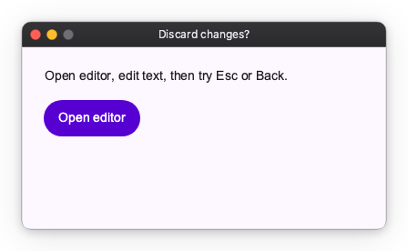
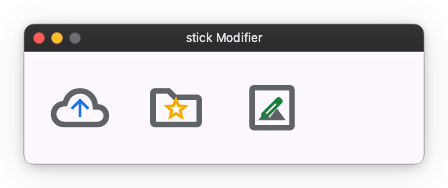
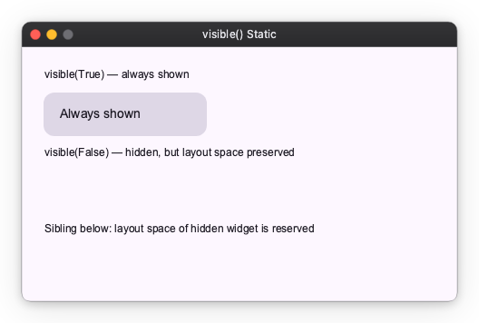
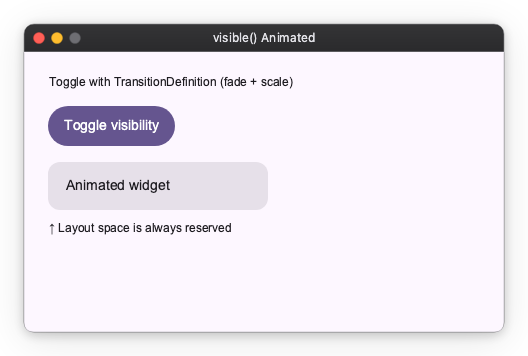

# Other Modifiers

Other modifiers provide additional functionalities to Widgets, such as handling back navigation.

## Will Pop

You can handle back navigation (e.g., pressing the Esc key) using the `will_pop` modifier. It takes an `on_will_pop` callback that returns a boolean indicating whether pop should be allowed.
In this example, an editor screen is pushed on a `Navigator`. Pop is blocked while there are unsaved changes, and allowed after Save or Discard.

```python
import nuiitivet as nv
import nuiitivet.material as md
from nuiitivet.material.buttons import Button
from nuiitivet.material.dialogs import BasicDialog
from nuiitivet.material import Overlay, Navigator
from nuiitivet.material.text_fields import TextField
from nuiitivet.modifiers import will_pop
from nuiitivet.observable import Observable
from nuiitivet.material import ButtonStyle

class HomeScreen(nv.ComposableWidget):
    def build(self):
        def _open_editor() -> None:
            Navigator.root().push(EditScreen())

        return nv.Container(
            padding=24,
            child=nv.Column(
                children=[
                    md.Text("Open editor, edit text, then try Esc or Back."),
                    Button("Open editor", on_click=_open_editor, style=ButtonStyle.filled()),
                ],
                gap=14,
                cross_alignment="start",
            ),
        )

class EditScreen(nv.ComposableWidget):
    def __init__(self) -> None:
        super().__init__()
        self.text = Observable("Hello")
        self._initial_text = str(self.text.value)

    def _is_dirty(self) -> bool:
        return str(self.text.value) != self._initial_text

    def _save(self) -> None:
        self._initial_text = str(self.text.value)

    async def _on_will_pop(self) -> bool:
        if not self._is_dirty():
            return True

        result = await Overlay.root().dialog(
            BasicDialog(
                title="Discard changes?",
                message="You have unsaved changes.",
                actions=[
                    Button("Cancel", on_click=lambda: Overlay.root().close(False), style=ButtonStyle.text()),
                    Button("Discard", on_click=lambda: Overlay.root().close(True), style=ButtonStyle.filled()),
                ],
            ),
            dismiss_on_outside_tap=False,
        )
        return bool(result.value)

    def build(self):
        return nv.Container(
            padding=24,
            child=nv.Column(
                children=[
                    md.Text("Edit text. Back/Esc asks confirmation when unsaved."),
                    TextField.two_way(
                        self.text,
                        width=420,
                        height=52,
                        padding=10,
                    ),
                    nv.Row(
                        children=[
                            Button("Back", on_click=lambda: Navigator.root().pop(), style=ButtonStyle.text()),
                            Button("Save", on_click=self._save, style=ButtonStyle.filled()),
                        ],
                        gap=10,
                    ),
                ],
                gap=14,
                cross_alignment="start",
            ),
        ).modifier(will_pop(on_will_pop=self._on_will_pop))

def main() -> None:
    md.App(
        HomeScreen(),
    ).run()
```



## Stick

The `stick` modifier overlays any widget on top of a target widget at a specified anchor point. Unlike popup modifiers, the overlaid widget is always visible — it is not transient. Because it is a static overlay rather than a dynamic one, it is suited to custom decorations rather than transient indicators like notifications or status updates.

The following example composes a custom symbol by layering a smaller icon over a larger base icon. Because the result is a fixed, decorative composition — not a value that changes at runtime — it is a good fit for `stick`. (Avoid using it for dynamic indicators such as badges or status dots; those represent changing state and belong in transient UI instead.) Any widget can be passed as the overlay.

```python
import nuiitivet as nv
from nuiitivet.material import Icon
from nuiitivet.material.styles.icon_style import IconStyle
from nuiitivet.modifiers import stick

def _base_icon(name: str) -> nv.Widget:
    return Icon(name, size=64, style=IconStyle(color="#5F6368"))

def _overlay_icon(name: str, color: str) -> nv.Widget:
    return Icon(name, size=30, style=IconStyle(color=color))

# cloud + upward arrow = "upload to cloud"
upload = _base_icon("cloud").modifier(
    stick(_overlay_icon("arrow_upward", "#1A73E8"), alignment="center", anchor="center")
)

# folder + star = "favorite folder"
favorite_folder = _base_icon("folder").modifier(
    stick(_overlay_icon("star", "#F9AB00"), alignment="center", anchor="center")
)

# photo + pencil = "edit photo"
edit_photo = _base_icon("photo").modifier(
    stick(_overlay_icon("edit", "#188038"), alignment="center", anchor="center")
)
```



The `alignment` parameter sets the reference point on the **target widget**, and `anchor` sets the reference point on the **overlaid widget** that aligns to it. An optional `offset` tuple provides additional pixel adjustment.

## Visible

The `visible()` modifier conditionally shows or hides a widget.
It is a thin composition of `opacity()`, `block_focus_traversal()` and `ignore_pointer()`:
while hidden the widget is rendered fully transparent, ignores all pointer input and is
skipped by Tab traversal, but it **retains its normal layout space** — the surrounding
layout is not affected.

### Basic usage

Pass a `bool` or an `Observable[bool]` as the condition:

```python
import nuiitivet as nv
import nuiitivet.material as md
from nuiitivet.material import Card, CardStyle
from nuiitivet.modifiers import visible
from nuiitivet.material.styles.text_style import TextStyle


def _panel(label: str) -> nv.Widget:
    return Card(
        child=md.Text(label, style=TextStyle(font_size=14)),
        padding=16,
        width=180,
        style=CardStyle.filled(),
    )


content = nv.Column(
    children=[
        md.Text("visible(True) — always shown", style=TextStyle(font_size=12)),
        _panel("Always shown").modifier(visible(True)),
        md.Text("visible(False) — hidden, but layout space preserved", style=TextStyle(font_size=12)),
        _panel("Never shown").modifier(visible(False)),
        md.Text("Sibling below: layout space of hidden widget is reserved", style=TextStyle(font_size=12)),
    ],
    gap=12,
    cross_alignment="start",
    padding=24,
)
```



To make visibility reactive, pass an `Observable[bool]`:

```python
from nuiitivet.observable import Observable

is_visible: Observable[bool] = Observable(True)

widget.modifier(visible(is_visible))
```

Whenever `is_visible.value` changes, the widget instantly appears or disappears (no animation).

### Animated usage

Pass a `TransitionDefinition` to animate the transition between hidden and shown states.
The example below combines a fade and a scale animation:

```python
import nuiitivet as nv
import nuiitivet.material as md
from nuiitivet.animation import LinearMotion
from nuiitivet.animation.transition_definition import TransitionDefinition
from nuiitivet.animation.transition_pattern import FadePattern, ScalePattern
from nuiitivet.material import Card, CardStyle
from nuiitivet.modifiers import visible
from nuiitivet.material.styles.text_style import TextStyle
from nuiitivet.observable import Observable
from nuiitivet.widgeting.widget import ComposableWidget

_FADE_SCALE = TransitionDefinition(
    motion=LinearMotion(0.25),
    pattern=FadePattern(start_alpha=0.0, end_alpha=1.0)
    | ScalePattern(start_scale_x=0.9, start_scale_y=0.9, end_scale_x=1.0, end_scale_y=1.0),
)


class MyWidget(ComposableWidget):
    is_visible: Observable[bool] = Observable(True)

    def build(self) -> nv.Widget:
        from nuiitivet.material.buttons import Button
        from nuiitivet.material import ButtonStyle

        def toggle() -> None:
            self.is_visible.value = not self.is_visible.value

        panel = Card(
            child=md.Text("Animated widget", style=TextStyle(font_size=14)),
            padding=16,
            width=220,
            style=CardStyle.filled(),
        )

        return nv.Column(
            children=[
                Button("Toggle visibility", on_click=toggle, style=ButtonStyle.filled()),
                panel.modifier(visible(self.is_visible, transition=_FADE_SCALE)),
                md.Text("↑ Layout space is always reserved", style=TextStyle(font_size=12)),
            ],
            gap=12,
            cross_alignment="start",
        )
```



> **Note:** `visible()` never collapses the widget's layout size.
> If you need the widget to also shrink or grow in the layout during the animation,
> use a layout-aware widget instead.
