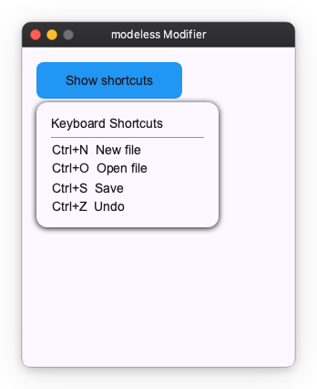
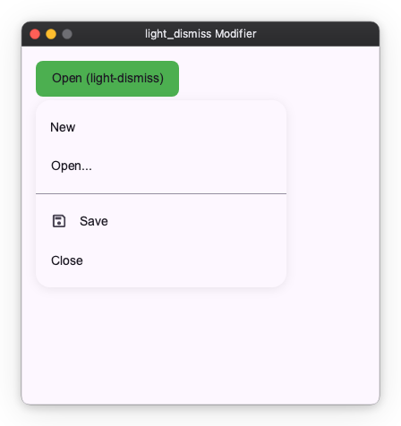
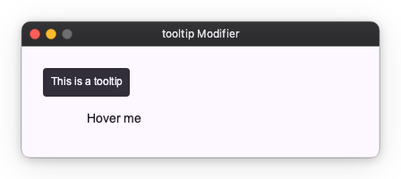

# Popup Modifiers

Popup modifiers attach transient overlay content to a widget. They are useful for menus, dropdowns, and tooltips that appear anchored to a specific widget.

`modeless`, `light_dismiss`, and `tooltip` share the same placement model: a `target_anchor` point on the anchor widget is lined up with a `content_anchor` point on the overlay content, with an optional pixel `offset`. `context_menu` anchors to the click point instead of the widget.

## modeless

The `modeless` modifier opens a floating overlay anchored to the widget. The overlay sits above the widget tree and is not clipped. It does not close when the user clicks outside.

Use `is_open` to control when the overlay is shown. Pass an `Observable[bool]` and toggle it in response to user actions.

```python
import nuiitivet.material as nv

is_open: nv.Observable[bool] = nv.Observable(False)

def toggle() -> None:
    is_open.value = not is_open.value

info_panel = nv.Card(
    child=nv.Column(
        children=[
            nv.Text("Keyboard Shortcuts"),
            nv.HorizontalDivider(padding=(4, 0)),
            nv.Text("Ctrl+N  New file"),
            nv.Text("Ctrl+O  Open file"),
            nv.Text("Ctrl+S  Save"),
            nv.Text("Ctrl+Z  Undo"),
        ],
        gap=6,
        cross_alignment="start",
    ),
    padding=16,
    width=200,
    style=nv.CardStyle.elevated(),
)

anchor = (
    nv.Container(
        width=160,
        height=40,
        child=nv.Text("Show shortcuts"),
        alignment="center",
    )
    .modifier(nv.background("#2196F3") | nv.corner_radius(8) | nv.clickable(on_click=toggle))
    .modifier(
        nv.modeless(
            info_panel,
            is_open=is_open,
            target_anchor="bottom-left",
            content_anchor="top-left",
            offset=(0.0, 4.0),
        )
    )
)
```



## light_dismiss

The `light_dismiss` modifier works the same as `modeless`, but the overlay closes automatically when the user clicks outside of it. This is the recommended choice for dropdown menus and context menus.

```python
import nuiitivet.material as nv

is_open: nv.Observable[bool] = nv.Observable(False)

def toggle() -> None:
    is_open.value = not is_open.value

def close() -> None:
    is_open.value = False

menu = nv.Menu(
    items=[
        nv.MenuItem("New", on_click=lambda: print("New")),
        nv.MenuItem("Open...", on_click=lambda: print("Open")),
        nv.MenuDivider(),
        nv.MenuItem("Save", leading_icon="save", on_click=lambda: print("Save")),
        nv.MenuItem("Close", on_click=close),
    ],
    on_dismiss=close,
)

anchor = (
    nv.Container(
        width=160,
        height=40,
        child=nv.Text("Open (light-dismiss)"),
        alignment="center",
    )
    .modifier(nv.background("#4CAF50") | nv.corner_radius(8) | nv.clickable(on_click=toggle))
    .modifier(
        nv.light_dismiss(
            menu,
            is_open=is_open,
            target_anchor="bottom-left",
            content_anchor="top-left",
            offset=(0.0, 4.0),
        )
    )
)
```



## tooltip

The `tooltip` modifier attaches tooltip behavior to any widget. The tooltip opens automatically when the user hovers or focuses the widget (on desktop) or long-presses it (on touch), and closes automatically after `dismiss_delay` seconds.

Unlike `modeless` and `light_dismiss`, `tooltip` has no external open state. Its lifecycle is managed entirely by pointer and focus events.

```python
import nuiitivet.material as nv

target = nv.Container(
    width=160,
    height=40,
    child=nv.Text("Hover me"),
    alignment="center",
).modifier(
    nv.tooltip(nv.Tooltip("This is a tooltip"), delay=0.0)
)
```



The `content` widget is usually a `Tooltip` or `RichTooltip` from `nuiitivet.material`, but any widget is accepted.

## context_menu

The `context_menu` modifier opens a menu **at the pointer** when the widget is right-clicked (secondary button). It closes on an outside tap.

Where `modeless` and `light_dismiss` anchor to the widget's rect and are driven by an external `is_open`, a context menu is driven by the click itself. The modifier owns both the open state and the transient click coordinate, so neither appears in your code — there is no `Observable` to wire up and no pointer handler to write.

```python
import nuiitivet.material as nv

tile = nv.Container(
    width=160,
    height=110,
    child=nv.Text("Photo"),
    alignment="center",
).modifier(
    nv.background("#90CAF9")
    | nv.corner_radius(12)
    | nv.context_menu(
        nv.Menu(
            items=[
                nv.MenuItem("Open", leading_icon="open_in_new"),
                nv.MenuItem("Rename", leading_icon="edit"),
                nv.MenuDivider(),
                nv.MenuItem("Delete", leading_icon="delete"),
            ],
        )
    )
)
```

`content_anchor` decides which corner of the menu lands on the click point (default `"top-left"`, so the menu hangs down-right of the cursor). There is no `target_anchor`: a point has no extent.

The menu is kept inside the viewport, so a right-click near the right or bottom edge pulls it back into view instead of clipping it.

Because the open menu's light-dismiss layer covers the widget and only the primary button dismisses it, a second right-click elsewhere is swallowed rather than moving the menu — close it with a left click first.

For an imperative variant — placing arbitrary content at a click point without a menu — use [`OverlayPosition.at_pointer()`](../overlay/primitives.md#relative-to-a-point) directly.

### Placement

`modeless`, `light_dismiss`, and `tooltip` accept `target_anchor`, `content_anchor`, and `offset` parameters to control placement relative to the anchor widget. (`context_menu` anchors to a point, so it takes `content_anchor` and `offset` only.)

| Parameter        | Description                                     | Default            |
|------------------|-------------------------------------------------|--------------------|
| `target_anchor`  | Reference point on the **anchor widget**        | See each modifier  |
| `content_anchor` | Reference point on the **overlay content**      | See each modifier  |
| `offset`         | Additional `(dx, dy)` pixel offset              | `(0.0, 0.0)`       |

Common placement strings: `"top-left"`, `"top-center"`, `"top-right"`, `"bottom-left"`, `"bottom-center"`, `"bottom-right"`, `"center"`.

```python
# Place tooltip above the widget, centered
.modifier(
    nv.tooltip(
        nv.Tooltip("Above center"),
        target_anchor="top-center",
        content_anchor="bottom-center",
        offset=(0.0, -4.0),
    )
)
```
