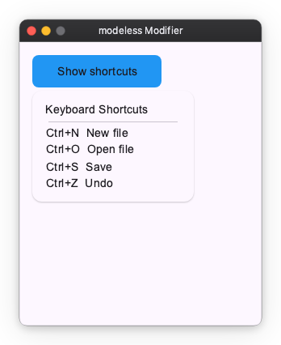

# Popup Modifiers

Popup modifiers attach transient overlay content to a widget — menus, dropdowns, and tooltips that float above the widget tree and are not clipped by it.

Pick the one that matches how the content opens:

| Modifier | Opens when | Anchored to | Closes when |
| --- | --- | --- | --- |
| [`popup`](#popup) | your `Observable[bool]` turns `True` | the widget's rect | you set it back to `False`, or an outside tap |
| [`tooltip`](#tooltip) | the pointer hovers or focus arrives | the widget's rect | the pointer leaves, after a delay |
| [`context_menu`](#context_menu) | the widget is right-clicked | the click point | an outside tap |

## popup

`popup` opens a floating overlay anchored to the widget it modifies. You own the open state: pass an `Observable[bool]` as `is_open` and toggle it.

```python
import nuiitivet.material as nv

is_open: nv.Observable[bool] = nv.Observable(False)

button.modifier(nv.popup(nv.Menu(items=[...]), is_open=is_open))
```

| Parameter | Type | Default | Description |
| --- | --- | --- | --- |
| `content` | `Widget` | required | Widget shown in the overlay |
| `is_open` | `Observable[bool] \| None` | `None` | Open state you control |
| `passthrough` | `bool` | `False` | Whether input reaches the UI behind the popup |
| `dismiss_on_outside_tap` | `bool \| None` | `None` | Whether an outside tap closes it; follows `passthrough` |
| `target_anchor` | placement string | `"bottom-left"` | Reference point on the **anchor widget** |
| `content_anchor` | placement string | `"top-left"` | Reference point on the **content** |
| `offset` | `(float, float)` | `(0.0, 0.0)` | Extra `(dx, dy)` in pixels |
| `flip` | `bool` | `True` | May open against the anchor's opposite edge when short of room |
| `shift` | `bool` | `True` | May slide sideways to stay in view |
| `transition_spec` | `TransitionSpec \| None` | `None` | Entry/exit animation |

### Blocking or floating

Two calls cover almost every case:

| Call | Result |
| --- | --- |
| `popup(x, is_open=…)` | Blocks input behind it and closes on an outside tap — the **menu** shape |
| `popup(x, is_open=…, passthrough=True)` | Lets input through and stays open on an outside tap — the **toast** shape |

You rarely set `dismiss_on_outside_tap` yourself — left at `None` it follows `passthrough`. Set it explicitly only for a blocking popup that must *not* close on an outside tap (`passthrough=False, dismiss_on_outside_tap=False`). Combining `passthrough=True` with `dismiss_on_outside_tap=True` raises `ValueError`: a popup that lets a tap through cannot also observe it.

Leaving `is_open` at `None` is legal, but the modifier then owns the observable and you have nothing to open the popup with. Always pass your own.

### Placement

`target_anchor` names a point on the anchor widget, `content_anchor` names the point on the content that is placed onto it, and `offset` nudges the result. The defaults (`"bottom-left"` → `"top-left"`) hang the content below the widget, left edges aligned.

Both accept `"top-left"`, `"top-center"`, `"top-right"`, `"center-left"`, `"center"`, `"center-right"`, `"bottom-left"`, `"bottom-center"`, `"bottom-right"`.

```python
# Centered above the widget, with a 4 px gap
nv.popup(
    panel,
    is_open=is_open,
    target_anchor="top-center",
    content_anchor="bottom-center",
    offset=(0.0, -4.0),
)
```

The anchor rect is re-read on every layout pass, so the content follows the widget as it moves or resizes.

### Staying on screen

A popup near a window edge may not fit where you anchored it. Two behaviours handle that, both on by default:

| | What it does |
| --- | --- |
| `flip` | No room below the anchor? Open against its **top** edge instead — and mirror left/right the same way. The `offset` is mirrored with it, so a gap stays a gap. If neither side fits, the anchored side is kept and the content overflows. |
| `shift` | Slide the content along the **cross** axis to stay in view — horizontally for a popup below its anchor, vertically for one beside it. |

Neither ever moves the content along the placement axis, so **a popup cannot end up covering its own anchor**.

Turn `flip` off when the content must stay on the side you asked for, and let it overflow the window instead:

```python
field.modifier(nv.popup(calendar, is_open=is_open, offset=(0.0, 2.0), flip=False))
```

`DockedDatePicker` does this — in a short window its calendar stays below the field rather than jumping above it and hiding what you are typing into.

### Example: menu

```python
import nuiitivet.material as nv

is_open: nv.Observable[bool] = nv.Observable(False)

def toggle() -> None:
    is_open.value = not is_open.value

def close() -> None:
    is_open.value = False

menu = nv.Menu(
    items=[
        nv.MenuItem("New", on_click=lambda: print("New")),
        nv.MenuItem("Open...", on_click=lambda: print("Open")),
        nv.MenuDivider(),
        nv.MenuItem("Save", leading_icon="save", on_click=lambda: print("Save")),
        nv.MenuItem("Close", on_click=close),
    ],
    on_dismiss=close,
)

anchor = (
    nv.Container(
        width=160,
        height=40,
        child=nv.Text("Open menu"),
        alignment="center",
    )
    .modifier(nv.background("#4CAF50") | nv.corner_radius(8) | nv.clickable(on_click=toggle))
    .modifier(
        nv.popup(
            menu,
            is_open=is_open,
            target_anchor="bottom-left",
            content_anchor="top-left",
            offset=(0.0, 4.0),
        )
    )
)
```


### Example: pass-through panel

With `passthrough=True` the overlay floats above the UI without blocking it, and an outside click goes to whatever is underneath instead of closing the popup.

```python
import nuiitivet.material as nv

is_open: nv.Observable[bool] = nv.Observable(False)

def toggle() -> None:
    is_open.value = not is_open.value

info_panel = nv.Card(
    child=nv.Column(
        children=[
            nv.Text("Keyboard Shortcuts"),
            nv.HorizontalDivider(padding=(4, 0)),
            nv.Text("Ctrl+N  New file"),
            nv.Text("Ctrl+O  Open file"),
            nv.Text("Ctrl+S  Save"),
            nv.Text("Ctrl+Z  Undo"),
        ],
        gap=6,
        cross_alignment="start",
    ),
    padding=16,
    width=200,
    style=nv.CardStyle.elevated(),
)

anchor = (
    nv.Container(
        width=160,
        height=40,
        child=nv.Text("Show shortcuts"),
        alignment="center",
    )
    .modifier(nv.background("#2196F3") | nv.corner_radius(8) | nv.clickable(on_click=toggle))
    .modifier(
        nv.popup(
            info_panel,
            is_open=is_open,
            passthrough=True,
            target_anchor="bottom-left",
            content_anchor="top-left",
            offset=(0.0, 4.0),
        )
    )
)
```



## tooltip

The `tooltip` modifier attaches tooltip behavior to any widget. The tooltip opens when the user hovers or focuses the widget (on desktop) or long-presses it (on touch), and closes automatically `dismiss_delay` seconds after they leave.

Unlike `popup`, `tooltip` has no open state to wire up — its lifecycle is driven entirely by pointer and focus events. It always floats, so it never blocks the UI underneath.

```python
import nuiitivet.material as nv

target = nv.Container(
    width=160,
    height=40,
    child=nv.Text("Hover me"),
    alignment="center",
).modifier(
    nv.tooltip(nv.Tooltip("This is a tooltip"), delay=0.0)
)
```


The `content` widget is usually a `Tooltip` or `RichTooltip` from `nuiitivet.material`, but any widget is accepted.

`delay` (default `0.5`) is how long the pointer must rest before it opens, `dismiss_delay` (default `1.5`) how long it lingers after leaving. Placement works exactly as in [popup](#placement), with defaults that centre the tooltip above the widget (`target_anchor="top-center"`, `content_anchor="bottom-center"`, `offset=(0.0, -4.0)`).

## context_menu

The `context_menu` modifier opens a menu **at the pointer** when the widget is right-clicked (secondary button). It closes on an outside tap.

Where `popup` anchors to the widget's rect and is driven by an external `is_open`, a context menu is driven by the click itself. The modifier owns both the open state and the transient click coordinate, so neither appears in your code — there is no `Observable` to wire up and no pointer handler to write.

```python
import nuiitivet.material as nv

tile = nv.Container(
    width=160,
    height=110,
    child=nv.Text("Photo"),
    alignment="center",
).modifier(
    nv.background("#90CAF9")
    | nv.corner_radius(12)
    | nv.context_menu(
        nv.Menu(
            items=[
                nv.MenuItem("Open", leading_icon="open_in_new"),
                nv.MenuItem("Rename", leading_icon="edit"),
                nv.MenuDivider(),
                nv.MenuItem("Delete", leading_icon="delete"),
            ],
        )
    )
)
```

There is no `target_anchor` here — a point has no extent, so `content_anchor` alone decides which corner of the menu lands on the click point (default `"top-left"`, so the menu hangs down-right of the cursor). A right-click near the right or bottom edge pulls the menu back into view instead of clipping it.

A second right-click elsewhere dismisses the open menu rather than moving it, because outside-tap dismissal fires for any button.

For an imperative variant — placing arbitrary content at a click point without a menu — use [`OverlayPosition.at_pointer()`](../overlay/primitives.md#relative-to-a-point) directly.
